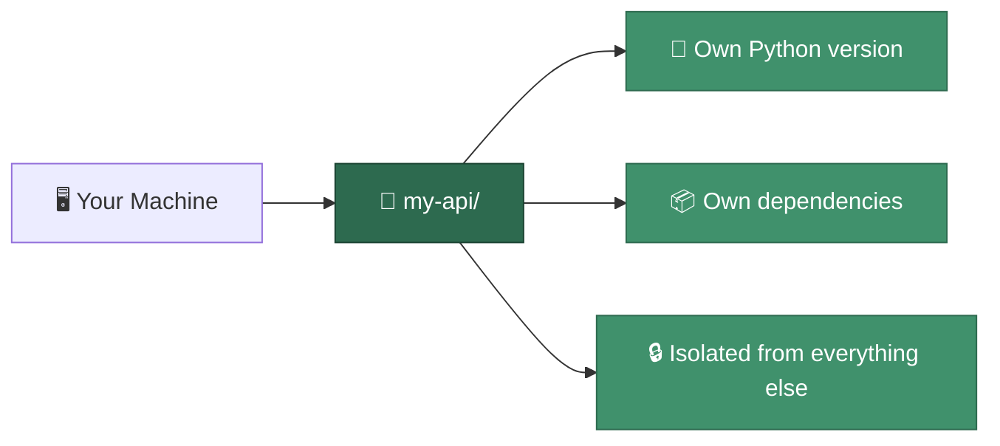
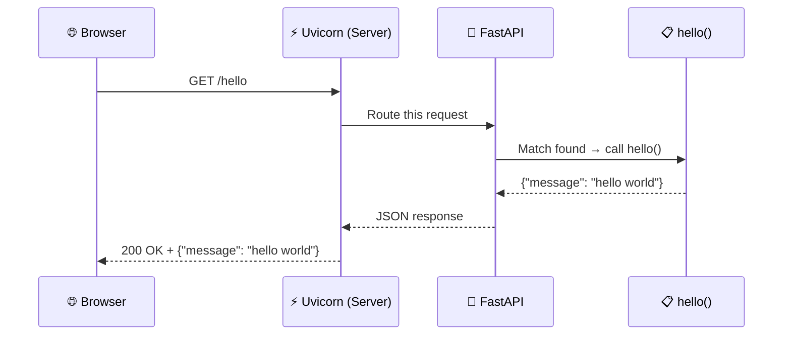
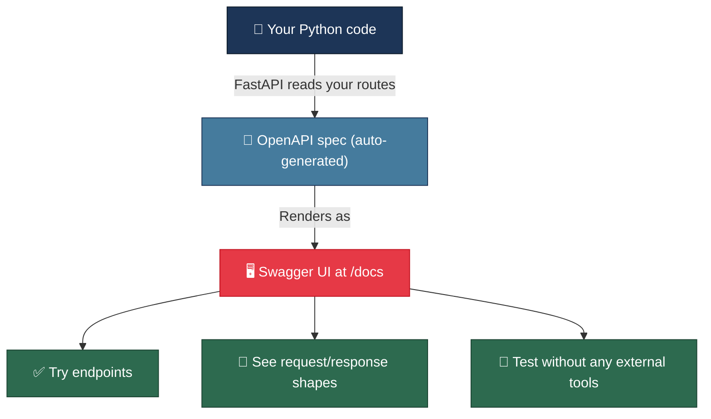

# Build Your First API in 30 Seconds

You just got asked to build a backend API in an interview. No boilerplate. No 40-minute Django tutorial. Three lines of code and a single command.

---

## The Restaurant Analogy

Building an API is like opening a tiny restaurant.

Before you cook anything, you need a kitchen that doesn't share ingredients with every other restaurant on the block. Then you need a chef. Then you write the menu. Then you open the doors.

| Restaurant | Your API | Why it matters |
|---|---|---|
| 🏗️ **Kitchen** | `uv` (isolated environment) | Keeps your ingredients separate from everyone else's |
| 👨‍🍳 **Chef** | FastAPI (the framework) | Catches orders, cooks responses, serves them back |
| 📋 **Menu item** | Endpoint (`GET /hello`) | What customers (clients) can order |
| 📺 **Menu board** | Swagger UI (`/docs`) | Customers can see and test every dish available |

That's the whole picture. Four pieces. Let's build each one.

---

## Step 1 — Build the Kitchen (`uv init`)

```bash
uv init my-api
cd my-api
```

**What just happened?**

`uv` created a clean, isolated project folder. Think of it as setting up a kitchen with its own pantry — nothing you install here leaks out to the rest of your machine, and nothing from outside leaks in.



> **Why do we need isolation?**
> Without it, installing a package for Project A can silently break Project B. You update `requests` to v2.31 for one project and suddenly another project that needed v2.28 starts crashing. Isolation kills this problem entirely.

---

## Step 2 — Hire the Chef (`uv add`)

```bash
uv add "fastapi[standard]"
```

This installs FastAPI and everything it needs to serve requests — including `uvicorn`, the lightning-fast server that actually listens for incoming traffic.

### Why FastAPI and not Django?

| | FastAPI | Django |
|---|---|---|
| **What it is** | Lightweight API framework | Full-stack web framework |
| **Comes with** | API routing, validation, auto-docs | ORM, admin panel, templates, auth, forms |
| **Best for** | Microservices, APIs, ML endpoints | Full web apps with a database-backed UI |
| **Speed** | One of the fastest Python frameworks | Slower — carries more weight |
| **Lines to "hello world"** | 3 | ~15 + settings file |

**The rule:** if you're building an API, reach for FastAPI. If you're building a web app with login pages, admin dashboards, and server-rendered templates, reach for Django.

FastAPI is a scalpel. Django is the entire operating room. Both save lives — but you don't wheel in the full OR for a paper cut.

---

## Step 3 — Write the Menu (Your First Endpoint)

Open `main.py` and write this:

```python
from fastapi import FastAPI

app = FastAPI()

@app.get("/hello")
def hello():
    return {"message": "hello world"}
```

Three lines of actual logic. Here's what each one does:

| Line | What it does |
|---|---|
| `from fastapi import FastAPI` | Import the chef into your kitchen |
| `app = FastAPI()` | Create the application — this is your running restaurant |
| `@app.get("/hello")` | Register a **menu item**: when someone visits `/hello` with a GET request, run the function below |
| `def hello():` | The function that handles the request |
| `return {"message": "hello world"}` | The response — FastAPI automatically converts this Python dict into JSON |

### What actually happens when someone visits `/hello`?



The browser asks. Uvicorn catches it. FastAPI routes it. Your function answers. The response goes back as JSON. The whole trip takes **milliseconds**.

---

## Step 4 — Open for Business

```bash
uv run fastapi dev
```

Your API is now live at **`http://localhost:8000`**.

| Part | Meaning |
|---|---|
| `uv run` | Run this command inside the isolated environment |
| `fastapi dev` | Start FastAPI in **development mode** (auto-reloads when you change code) |

> **What's `localhost:8000`?**
> `localhost` means "this machine" — you're both the restaurant and the customer. Port `8000` is which door to knock on (a machine can run many servers, each on a different port).

---

## Step 5 — The Free Menu Board (`/docs`)

Open your browser and go to:

```
http://localhost:8000/docs
```

FastAPI auto-generates an interactive **Swagger UI** — a visual playground where you can see every endpoint, read what it expects, and **test it right in the browser**. No Postman needed. No curl. Just click "Try it out."



This is one of FastAPI's killer features. You write code, you get documentation for free. Every route, every parameter, every response shape — documented and testable without writing a single line of docs.

---

## The Full Picture

Here's everything you just did, end to end:


**30 seconds. Zero boilerplate. A running API with interactive docs.**

---

## Test

```bash
# Hit your endpoint
curl http://localhost:8000/hello
# → {"message":"hello world"}
```

Or just open `http://localhost:8000/hello` in your browser. JSON comes back.

---

## Where to Go from Here

Now that your restaurant is open, you can start adding to the menu:

```python
@app.get("/users/{user_id}")
def get_user(user_id: int):
    return {"user_id": user_id, "name": "Sayed"}

@app.post("/users")
def create_user(name: str):
    return {"message": f"User {name} created"}
```

Every new function with a decorator = a new endpoint. FastAPI handles validation, serialization, and docs updates automatically.

---

## TL;DR

- **`uv init`** → isolated project. No dependency conflicts, ever.
- **`uv add "fastapi[standard]"`** → installs FastAPI + the server in one shot.
- **3 lines of Python** → a working API endpoint that returns JSON.
- **`uv run fastapi dev`** → starts the server with auto-reload.
- **`/docs`** → free interactive API documentation. Test endpoints in-browser.
- **FastAPI for APIs, Django for full web apps.** Don't bring the whole operating room for a paper cut.
