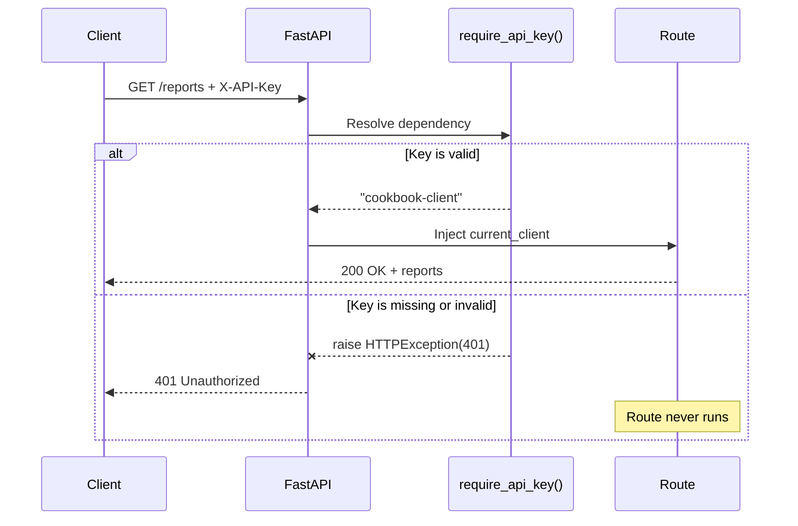

# FastAPI Dependency Injection — Write It Once, Inject It Everywhere

Your API starts with one endpoint. Then it grows to ten, and every route contains the same API-key check. One security change now means editing ten places and hoping you miss none.

Shared request rules should not be copy-pasted into business logic. FastAPI's `Depends()` lets you write the rule once and run it automatically wherever it is needed.

---

## The Copy-Paste Problem

Imagine a building where every office has its own security guard with a separate copy of the guest list. Change one name and you must find every guard, update every list, and trust that none were forgotten.

That is what this code does:

```python
@app.get("/reports-bad")
async def get_reports_bad(x_api_key: str | None = Header(default=None)):
    if x_api_key != DEMO_API_KEY:
        raise HTTPException(status_code=401, detail="Missing or invalid API key")

    return {"reports": ["sales", "traffic"]}
```

Add `/settings`, `/billing`, and `/users`, and the same check gets copied into all of them.

| Copy the check into every route | Use one dependency |
|---|---|
| Security logic is mixed with business logic | Each function has one job |
| A change requires many edits | A change requires one edit |
| One forgotten route can be left unprotected | Every declared route uses the same rule |
| Tests repeat for every copy | Test the dependency once, then test protected routes |

## One Function at the Door

Move the shared check into a normal function:

```python
def require_api_key(
    x_api_key: Annotated[str | None, Header(alias="X-API-Key")] = None,
) -> str:
    if x_api_key != DEMO_API_KEY:
        raise HTTPException(
            status_code=status.HTTP_401_UNAUTHORIZED,
            detail="Missing or invalid API key",
        )

    return "cookbook-client"
```

Then declare that your endpoint depends on it:

```python
@app.get("/reports")
async def get_reports(
    current_client: Annotated[str, Depends(require_api_key)],
):
    return {"client": current_client, "reports": ["sales", "traffic"]}
```

`Depends(require_api_key)` tells FastAPI:

1. Read the `X-API-Key` header.
2. Call `require_api_key()` before the route.
3. If it raises `HTTPException`, return that error immediately.
4. If it succeeds, inject its return value into `current_client`.
5. Only then run the endpoint.

The route handles reports. The dependency handles access. Neither function needs to do both jobs.

## What Happens on Every Request



The dependency is a checkpoint at the building entrance. If access fails there, the request never reaches any office.

## Why Not Call the Function Yourself?

You could call `require_api_key()` inside every route, but then every route still needs to remember the call and pass its inputs correctly.

`Depends()` gives FastAPI control of the dependency graph:

- **Input injection:** FastAPI supplies headers, query parameters, cookies, and other dependencies.
- **Per-request caching:** if multiple parts of one request need the same dependency, FastAPI normally runs it once and reuses the result.
- **Cleanup:** a dependency using `yield` can open a resource before the route and close it afterward.
- **OpenAPI integration:** inputs declared by dependencies, such as `X-API-Key`, appear in `/docs`.
- **Testing:** dependencies can be replaced with `app.dependency_overrides` during tests.

This is more than a shortcut for calling a function. FastAPI owns when it runs, what it receives, and how its result reaches the route.

## What Else Can Be a Dependency?

API-key validation is only the smallest example.

| Dependency | What it can provide |
|---|---|
| Current user | Decode a token, load the user, reject invalid access |
| Database session | Open one connection for the request and close it afterward |
| Pagination | Validate and reuse `page` and `limit` query parameters |
| Permissions | Check whether the current user can perform an action |
| Feature flags | Decide whether a feature is enabled for this user |

**Use dependencies for request prerequisites. Keep business actions inside the endpoint.**

## Routes

| Method | Path | API key required | Description |
|---|---|---|---|
| `GET` | `/reports-bad` | Yes | Broken version with an inline, duplicated check |
| `GET` | `/settings-bad` | Yes | A second copy of the same check |
| `GET` | `/reports` | Yes | Clean version using `require_api_key()` |
| `GET` | `/settings` | Yes | Reuses the same dependency |

## Run

```bash
uv run uvicorn main:app --reload
```

Open [http://localhost:8000/docs](http://localhost:8000/docs) to see the `X-API-Key` input in FastAPI's generated docs.

## Test

**Step 1 — Call a protected route without a key:**

```bash
curl -i http://localhost:8000/reports
```

```text
HTTP/1.1 401 Unauthorized

{"detail":"Missing or invalid API key"}
```

The dependency rejects the request. `get_reports()` never runs.

**Step 2 — Try an invalid key:**

```bash
curl -i http://localhost:8000/reports \
  -H "X-API-Key: wrong-key"
```

The result is the same `401`. Missing and invalid credentials both stop at the shared checkpoint.

**Step 3 — Send the demo key:**

```bash
curl -s http://localhost:8000/reports \
  -H "X-API-Key: sayeddev-secret"
```

```json
{"client":"cookbook-client","reports":["sales","traffic"]}
```

**Step 4 — Reuse the same key on another endpoint:**

```bash
curl -s http://localhost:8000/settings \
  -H "X-API-Key: sayeddev-secret"
```

```json
{"client":"cookbook-client","theme":"light","notifications":true}
```

Both routes use one check. Change `require_api_key()` and both routes get the new behavior.

## In Production

- Store API keys in environment variables or a secrets manager, never directly in source code.
- Compare a hash of the provided key instead of storing raw keys in a database.
- Prefer FastAPI security helpers such as `APIKeyHeader` when you want an explicit OpenAPI security scheme.
- Use `yield` dependencies for resources that need cleanup, such as database sessions.
- Apply a dependency to an `APIRouter` when every route in that group needs the same rule.
- Keep raising clear `HTTPException` responses for expected access failures, as shown in [FastAPI HTTPException](../http-exception-error-handling/).

---

## TL;DR

Do not copy authentication, database setup, pagination, or other request prerequisites into every endpoint. Put each shared rule in one dependency and declare it with `Depends()`. FastAPI runs it before your route, injects its result, rejects failures at the door, and gives every endpoint the update when that one function changes.

---

## Resources

### Docs
- [FastAPI — Dependencies](https://fastapi.tiangolo.com/tutorial/dependencies/)
- [FastAPI — Dependencies with yield](https://fastapi.tiangolo.com/tutorial/dependencies/dependencies-with-yield/)
- [FastAPI — Testing Dependencies with Overrides](https://fastapi.tiangolo.com/advanced/testing-dependencies/)