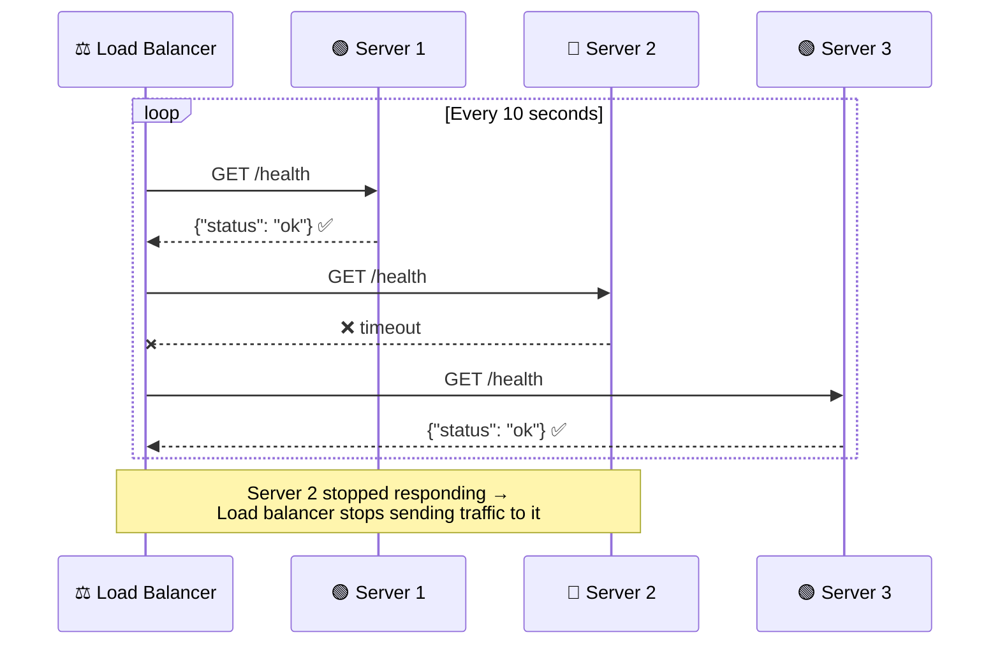

# Health Check — Your API's Pulse

Your API is running. But how do you *know* it's running? Right now, you'd have to call an actual endpoint and hope it works. That's like checking if someone's alive by asking them to run a marathon.

A health check is a two-line endpoint that gives your infrastructure one simple answer: **alive or dead.**

---

## The Idea

A doctor doesn't ask you to solve calculus to confirm you're alive. They check your pulse — the simplest possible sign of life.

A `/health` endpoint is exactly that: the simplest possible sign that your server is alive and responding.

```python
@app.get("/health")
async def health():
    return {"status": "ok"}
```

That's the entire thing. No database call. No authentication. No business logic. Just: "I'm alive."

---

## Why Not Just Hit Any Other Endpoint?

Your real endpoints have *weight*:

```python
@app.get("/users/{user_id}")
async def get_user(user_id: int):
    # Database lookup, auth check, error handling...
    fake_db = {1: "Mo", 2: "Sara", 3: "Ali"}
    if user_id not in fake_db:
        return {"error": "User not found"}
    return {"id": user_id, "name": fake_db[user_id]}
```

If this fails, is the server dead? Or did you just ask for a user that doesn't exist? Is the database slow today? Did auth reject you?

A health check removes all ambiguity. If `/health` fails, the server itself is down. Period.

| Checking with `/users/1` | Checking with `/health` |
|---|---|
| Needs a valid user ID | Needs nothing |
| Touches the database | Touches nothing |
| Can fail for 5 different reasons | Can only fail for 1: the server is dead |
| Slow if DB is slow | Always fast |
| Might need auth headers | Always open |

---

## Who's Checking This Pulse?

Your `/health` endpoint isn't for humans clicking around in a browser. It's for machines pinging your server every few seconds:



| Who | What they do with `/health` |
|---|---|
| **Load balancers** | Stop routing traffic to unhealthy instances |
| **Kubernetes** | Restart the pod if it stops responding |
| **Monitoring tools** | Fire an alert, page the on-call engineer |
| **CI/CD pipelines** | Roll back a deployment if the new version's health check fails |

Your users never see any of this. The health check catches the problem before traffic reaches the broken server.

---

## The Hospital Analogy

Think of your production environment like a hospital ward:

| Hospital | Your Infrastructure |
|---|---|
| 🏥 The ward | Your cluster of servers |
| 🩺 Pulse check every 10 min | `GET /health` every 10 seconds |
| 👨‍⚕️ Nurse doing rounds | Load balancer / Kubernetes |
| 🚨 Patient unresponsive | Server doesn't return `{"status": "ok"}` |
| 🔄 Move patients to another room | Route traffic to healthy servers |
| 📟 Page the doctor | Alert fires → on-call engineer notified |

No one asks the patient to run laps. They check the pulse. Same idea.

---

## Routes

| Method | Path | Auth required | Description |
|---|---|---|---|
| `GET` | `/health` | No | The heartbeat — returns `{"status": "ok"}` |
| `GET` | `/users/{user_id}` | No | A real endpoint with business logic (for comparison) |

---

## Run

```bash
uv run uvicorn main:app --reload
```

---

## Test

**Step 1 — Check the pulse:**

```bash
curl -s http://localhost:8000/health
```

Response: `{"status":"ok"}` — server is alive. Two lines of code, instant answer.

**Step 2 — Hit a real endpoint (works fine):**

```bash
curl -s http://localhost:8000/users/1
```

Response: `{"id":1,"name":"Mo"}` — normal business logic.

**Step 3 — Hit a real endpoint with bad input:**

```bash
curl -s http://localhost:8000/users/999
```

Response: `{"error":"User not found"}` — this failure is **not** a health issue. The server is fine. The data just doesn't exist. That's why you never use business endpoints as health checks.

**Step 4 — Simulate what a load balancer does (rapid polling):**

```bash
for i in $(seq 1 5); do curl -s -o /dev/null -w "Ping $i: HTTP %{http_code}\n" http://localhost:8000/health; done
```

Response: five `HTTP 200`s in a row. The server's pulse is steady. The moment one of these returns a non-200 or times out, the infrastructure knows something is wrong.

---

## In Production

This demo shows the simplest possible health check. In a real system you'd level it up:

- **Liveness vs Readiness** (Kubernetes) — "am I alive?" vs "am I ready to take traffic?" (a server can be alive but still booting up)
- **Deep health checks** — also ping the database, Redis, external APIs. If a critical dependency is down, report unhealthy
- **Response time thresholds** — if `/health` takes > 5 seconds to respond, something is wrong even if it returns 200

This is also step 6 in the [CI/CD Pipeline](../../topics/ci-cd-pipeline/) — health checks gate the rollout. If the new version's `/health` fails after deploy, the platform automatically reverts to the last good version. No human, no panic.

---

## TL;DR

Add a `GET /health` that returns `{"status": "ok"}` with zero logic. It's two lines. Load balancers, Kubernetes, and monitoring tools use it to decide if your server is alive. Never use a real endpoint as a health check — too many reasons for it to fail that have nothing to do with server health. The health check is a pulse, not a stress test.
