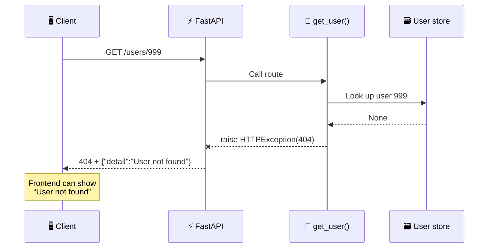

# FastAPI HTTPException — Stop Returning Fake Success

A user does not exist, but your API responds with `200 OK` and `null`. The frontend sees **success**, the body says **nothing**, and your user gets the world's least helpful message: “Something went wrong.”

An API failure should not be a riddle. Give it the right HTTP status and a useful message.

---

## The Delivery Tracking Analogy

Imagine your package never arrived, but the tracking page says **DELIVERED**. Hidden in the delivery notes is the word “missing.”

That is exactly what this response does:

```text
HTTP 200 OK

null
```

Clients read the status first. `200` means “the request succeeded.” Returning an error—or `null`—inside a successful response is like stamping **DELIVERED** on a missing package.

**The status code is the headline. The JSON body is the explanation. They must tell the same story.**

---

## The Broken Endpoint

A common first attempt uses `.get()` for the lookup:

```python
@app.get("/users-bad/{user_id}")
async def get_user_bad(user_id: int):
    return USERS.get(user_id)
```

If user `999` does not exist, `dict.get()` returns `None`. FastAPI serializes that as JSON `null` and—because nothing told it otherwise—sends `200 OK`.

```text
GET /users-bad/999
         ↓
HTTP 200 OK        ❌ says success
null               ❌ explains nothing
```

The server did not crash. That is almost worse: the response is valid JSON but semantically wrong.

## One Import Fixes It

Import `HTTPException`, check the lookup result, and **raise** the error:

```python
from fastapi import HTTPException, status

@app.get("/users/{user_id}")
async def get_user(user_id: int):
    user = USERS.get(user_id)

    if user is None:
        raise HTTPException(
            status_code=status.HTTP_404_NOT_FOUND,
            detail="User not found",
        )

    return user
```

Now the response tells one clear story:

```text
HTTP 404 Not Found

{"detail":"User not found"}
```

Why **raise**, not return? `HTTPException` interrupts the route immediately. FastAPI catches it and builds the HTTP response from its `status_code`, `detail`, and optional `headers`.



No crash page. No fake success. No guessing.

## Pick the Status That Matches the Failure

`HTTPException` is one pattern; the status code tells the client what to do next.

| Status | Meaning | Typical frontend reaction |
|---|---|---|
| `400 Bad Request` | Request breaks a business rule | Show what must be changed |
| `401 Unauthorized` | User is not authenticated | Ask them to sign in |
| `403 Forbidden` | User is authenticated but not allowed | Show “Access denied” |
| `404 Not Found` | Requested resource does not exist | Show an empty/not-found state |
| `409 Conflict` | Request conflicts with current state | Explain the duplicate or conflict |
| `422 Unprocessable Content` | Input failed FastAPI/Pydantic validation | Highlight invalid fields |
| `500 Internal Server Error` | Unexpected server bug | Show a generic retry message; alert the team |

Despite its name, `401 Unauthorized` means **not authenticated**. Bearer authentication should also send `headers={"WWW-Authenticate": "Bearer"}`. Use `403` when you know who the user is but they lack permission. The difference is explained in [Authentication vs Authorization](../../topics/authentication-vs-authorization/).

## Expected Failure vs Actual Bug

Not every Python exception should become an `HTTPException`. A missing user is an expected `404`; a crashed database driver is an unexpected `500` that should be logged.

**Do not catch every exception and rename it “404.”** That hides real bugs. Use `HTTPException` for failures you expect and can explain. Handle unexpected failures with logging and a global exception handler, as covered in the [Backend API Deployment Checklist](../../topics/backend-api-deployment-checklist/).

## Routes

| Method | Path | Description |
|---|---|---|
| `GET` | `/users-bad/{user_id}` | Broken version: missing user becomes `200 + null` |
| `GET` | `/users/{user_id}` | Fixed version: missing user becomes `404 + detail` |

## Run

```bash
uv run uvicorn main:app --reload
```

## Test

Use `-i` so curl shows both the HTTP status and JSON body.

**Step 1 — Find a user that exists:**

```bash
curl -i http://localhost:8000/users/1
```

```text
HTTP/1.1 200 OK

{"id":1,"name":"Mo"}
```

**Step 2 — Watch the broken endpoint lie:**

```bash
curl -i http://localhost:8000/users-bad/999
```

```text
HTTP/1.1 200 OK

null
```

**Step 3 — Ask the fixed endpoint for the same user:**

```bash
curl -i http://localhost:8000/users/999
```

```text
HTTP/1.1 404 Not Found

{"detail":"User not found"}
```

Now the frontend can branch on `404` and display a useful not-found state instead of guessing from random response shapes.

## In Production

- Keep client messages useful but safe: `"User not found"`, not database queries or stack traces.
- Log unexpected `500` errors with a request ID so the frontend report can be matched to server logs.
- Use one consistent error shape across the API; custom exception handlers can standardize it later.
- Document expected errors in OpenAPI so frontend developers know which statuses each route can return.
- Let [Pydantic validation](../pydantic-validation/) produce field-level `422` responses instead of manually checking every input.

---

## TL;DR

Never return `200 OK` with an error hidden in the body. For expected failures, raise `HTTPException` with the status that tells the truth and a `detail` message the client can use. Reserve `500` for unexpected bugs, log those server-side, and never leak their internals. **Status is the headline; detail is the explanation. Make them agree.**

---

## Resources

### Docs
- [FastAPI — Handling Errors](https://fastapi.tiangolo.com/tutorial/handling-errors/)
- [MDN — HTTP Response Status Codes](https://developer.mozilla.org/en-US/docs/Web/HTTP/Reference/Status)
