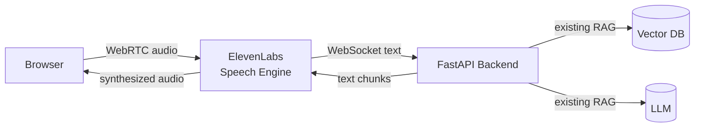
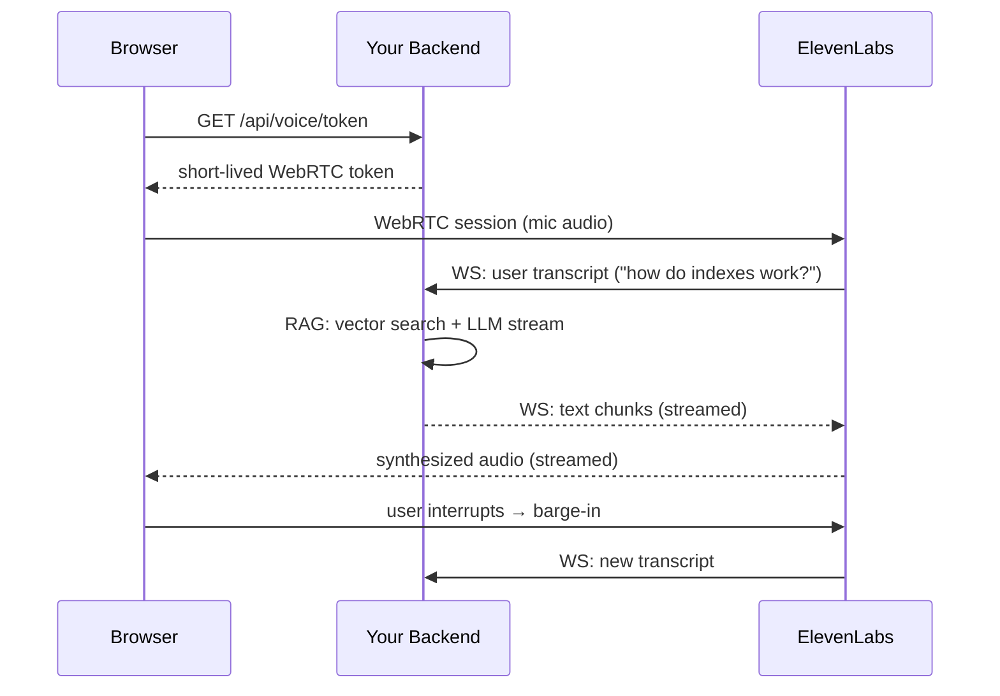

# Add Real-Time Voice to a RAG Web App

> **Building this yourself? Start here →** [**Sign up for ElevenLabs**](https://try.elevenlabs.io/28690257lzqh)
> Free credits to spin up your Speech Engine, follow this guide end-to-end, and ship a voice feature this week.

---

> "Add a human-grade, interruptible voice to your RAG chatbot. You have a sprint. Go."

The instinct: tear the backend apart. Add a streaming STT pipeline. Add a TTS service. Add audio-frame WebSockets. Add a turn-taking state machine. Re-architect everything because *voice is its own stack.*

The real answer is the one the interview wants: **don't rebuild — wrap.** Your existing RAG pipeline already takes a question and streams text chunks back. That's the whole contract the voice layer needs. Everything else — microphone capture, transcription, speech synthesis, interruption, turn-taking — belongs to a service that does only that.

This piece is the working integration. Two backend endpoints, one frontend component, your RAG code untouched.

---

## The Idea

The naive design pipes audio through your backend: browser → your server → STT → RAG → TTS → your server → browser. Every byte of audio crosses your fleet twice. You own four hard problems (capture, transcription, synthesis, turn-taking) on top of the one you already had (RAG).

The right design pipes audio **around** your backend. The browser talks to ElevenLabs directly over WebRTC. ElevenLabs talks to you over a *text* WebSocket. You never see an audio byte.

| Layer | Protocol | Payload | Who handles it |
|---|---|---|---|
| Browser ↔ ElevenLabs | WebRTC | Audio frames | ElevenLabs |
| ElevenLabs ↔ Your backend | WebSocket | Text transcripts + text chunks | You |
| Your backend ↔ Vector DB / LLM | Whatever you already had | Unchanged | You (already done) |

**Analogy — the simultaneous interpreter.** At a UN session, your delegate doesn't learn the other language. An interpreter sits between, listens to the foreign speaker, hands you the text, takes your reply, speaks it back. Your delegate only ever sees text. ElevenLabs is that interpreter for voice.

---

## How It Fits Together



Per turn, here's what actually happens:



The trick: your backend's WebSocket handler only ever sees **text in, text out**. Interruption, voice quality, turn-taking — all owned by ElevenLabs.

---

## Routes

| Method | Path | Who calls it | Description |
|---|---|---|---|
| `GET` | `/api/voice/token` | Browser | Mints a short-lived WebRTC token for the voice session |
| `WS` | `/api/voice/ws` | ElevenLabs | Receives transcripts; streams back RAG text chunks |

---

## The Backend (FastAPI)

`voice.py` — the only new backend file you need:

```python
from fastapi import APIRouter, HTTPException, WebSocket, WebSocketDisconnect
from elevenlabs import AsyncElevenLabs
from elevenlabs.speech_engine.resource import verify_speech_engine_jwt
from elevenlabs.speech_engine.session import SpeechEngineSession

from myapp.config import settings
from myapp.db import async_session
from myapp.rag import stream_rag_response  # your existing async generator

router = APIRouter(prefix="/api/voice", tags=["voice"])


def _client() -> AsyncElevenLabs:
    if not settings.elevenlabs_api_key or not settings.elevenlabs_speech_engine_id:
        raise HTTPException(503, "Voice not configured")
    return AsyncElevenLabs(api_key=settings.elevenlabs_api_key)


@router.get("/token")
async def get_voice_token():
    client = _client()
    resp = await client.conversational_ai.conversations.get_webrtc_token(
        agent_id=settings.elevenlabs_speech_engine_id,
    )
    return {"token": resp.token}


@router.websocket("/ws")
async def voice_ws(websocket: WebSocket):
    await websocket.accept()

    # Prove the connection came from ElevenLabs, not a random WS client.
    auth = websocket.headers.get("x-elevenlabs-speech-engine-authorization")
    if auth:
        try:
            verify_speech_engine_jwt(auth, settings.elevenlabs_api_key)
        except ValueError:
            await websocket.close(code=1008, reason="Unauthorized")
            return

    session = SpeechEngineSession(websocket)

    async def on_transcript(transcript):
        last_user_msg = next((m for m in reversed(transcript) if m.role == "user"), None)
        if not last_user_msg:
            return

        async with async_session() as db:
            async def text_chunks():
                async for event_type, data in stream_rag_response(db, last_user_msg.content):
                    if event_type == "delta" and data:
                        yield data

            await session.send_response(text_chunks())

    session.on("user_transcript", on_transcript)
    try:
        await session.run()
    except WebSocketDisconnect:
        pass
```

The whole integration is `stream_rag_response(...)` — your existing RAG generator. It already streamed text to your chat UI; now it streams the same text to ElevenLabs.

---

## The Frontend (React)

```bash
npm install @elevenlabs/react
```

```tsx
import { useCallback, useState } from "react";
import { ConversationProvider, useConversation } from "@elevenlabs/react";

function VoiceInner() {
  const [error, setError] = useState<string | null>(null);
  const conversation = useConversation({
    onConnect: () => setError(null),
    onError: (msg: string) => setError(msg),
  });

  const start = useCallback(async () => {
    try {
      await navigator.mediaDevices.getUserMedia({ audio: true });
      const { token } = await fetch("/api/voice/token").then((r) => r.json());
      conversation.startSession({ conversationToken: token });
    } catch (e) {
      setError(e instanceof Error ? e.message : String(e));
    }
  }, [conversation]);

  const connected = conversation.status === "connected";
  return (
    <>
      <button onClick={connected ? conversation.endSession : start}>
        {connected ? "End voice" : "Start voice"}
      </button>
      {error && <p>{error}</p>}
    </>
  );
}

export default function VoicePanel() {
  return (
    <ConversationProvider>
      <VoiceInner />
    </ConversationProvider>
  );
}
```

That's the entire frontend. No audio handling, no WebSocket plumbing, no STT/TTS.

---

## Run

**1. Backend env (`.env`):**

```env
ELEVENLABS_API_KEY=sk-...
ELEVENLABS_SPEECH_ENGINE_ID=     # filled in step 4
```

**2. Install + start backend:**

```bash
pip install fastapi uvicorn elevenlabs python-dotenv
uvicorn main:app --reload --port 8000
```

**3. Expose backend (dev only):**

```bash
ngrok http 8000
# → grab the wss://...ngrok.io URL
```

**4. Register your speech engine with ElevenLabs (one-time per ngrok URL):**

```python
# register_speech_engine.py
import asyncio, os, sys
from dotenv import load_dotenv
from elevenlabs import AsyncElevenLabs

load_dotenv()

async def main():
    ws_url = sys.argv[1]  # wss://<ngrok-host>/api/voice/ws
    client = AsyncElevenLabs(api_key=os.getenv("ELEVENLABS_API_KEY"))
    engine = await client.speech_engine.create(
        name="My Voice Agent",
        speech_engine={"ws_url": ws_url},
    )
    print("ELEVENLABS_SPEECH_ENGINE_ID=", engine.engine_id)

asyncio.run(main())
```

```bash
python register_speech_engine.py wss://<ngrok-host>/api/voice/ws
# → paste the returned engine ID into .env, restart backend
```

**5. Start the frontend, click "Start voice", talk.**

---

## Test

- `GET /api/voice/token` → returns `{"token": "..."}` (200)
- Click *Start voice* → browser asks for mic permission → status flips to `connected`
- Ask a question your RAG knows → hear it answered in real time
- Interrupt mid-sentence → it stops, you can ask the next thing

---

## In Production

| Concern | What to do |
|---|---|
| **Auth on `/api/voice/token`** | Gate it behind your normal session auth. Otherwise anyone can mint voice tokens against your engine quota. |
| **Verify the WS caller** | Keep the `verify_speech_engine_jwt` check on. Without it, anything can connect to `/api/voice/ws` and trigger your RAG. |
| **ngrok is dev-only** | In prod, your backend has a real hostname. Re-register the speech engine once with the real `wss://` URL — engine ID is stable from then on. |
| **API key handling** | Server-side only. Never in the React bundle. Rotate on any leak. |
| **Token TTL** | The WebRTC token is short-lived by default. Don't try to "cache" it on the frontend. |
| **Tenant isolation** | The transcript drives a DB query. Scope `stream_rag_response` to the authenticated user's tenant so a voice session can't read another tenant's docs. |
| **Cost ceilings** | Voice minutes burn credits fast. Set a per-user daily cap in your backend before opening `send_response`. |

---

## The Key Insight

The bad version of this problem owns four stacks: capture, STT, TTS, turn-taking — *plus* your RAG. The good version owns one: text in, text out.

Every time you're tempted to add a system to your backend, ask whether the problem is actually **about your data** or **about the channel**. RAG is about your data — you keep it. Voice is about the channel — you rent it. The win is recognizing which is which, and refusing to rebuild what an API can wrap.

---

## TL;DR

- **Don't rebuild the backend.** Add a thin wrapper: one HTTP route to mint a voice token, one WebSocket route that hands transcripts to your existing RAG generator and streams text chunks back.
- **Browser ↔ ElevenLabs over WebRTC** (audio), **ElevenLabs ↔ your backend over WebSocket** (text). Your servers never carry audio bytes.
- Your `stream_rag_response(...)` generator is the entire integration surface. If it already worked for your chat UI, it works for voice.
- **In production**: gate `/api/voice/token` behind session auth, keep JWT verification on the WS route, scope RAG queries to the authenticated tenant, cap voice minutes per user.

When the interview asks "add voice to a RAG app," the answer isn't "ElevenLabs." It's **"wrap the existing pipeline with a token endpoint and a text WebSocket — the RAG code doesn't change."** That sentence is the whole design.

---

## Resources

### Docs
- [ElevenLabs — Speech Engine](https://elevenlabs.io/docs/conversational-ai/overview)
- [ElevenLabs — `@elevenlabs/react` SDK](https://www.npmjs.com/package/@elevenlabs/react)
- [FastAPI — WebSockets](https://fastapi.tiangolo.com/advanced/websockets/)
- [ngrok — Getting started](https://ngrok.com/docs/getting-started/)
