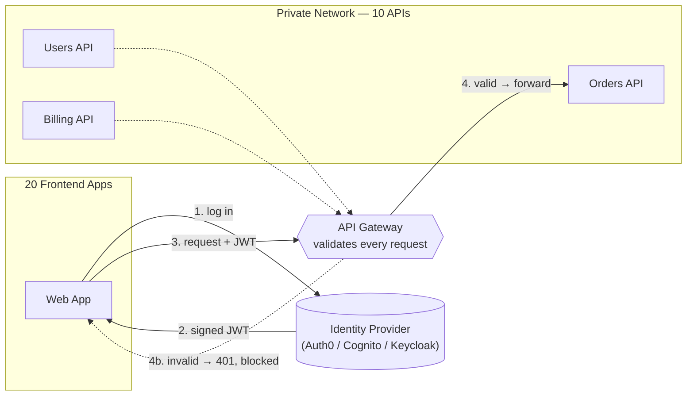
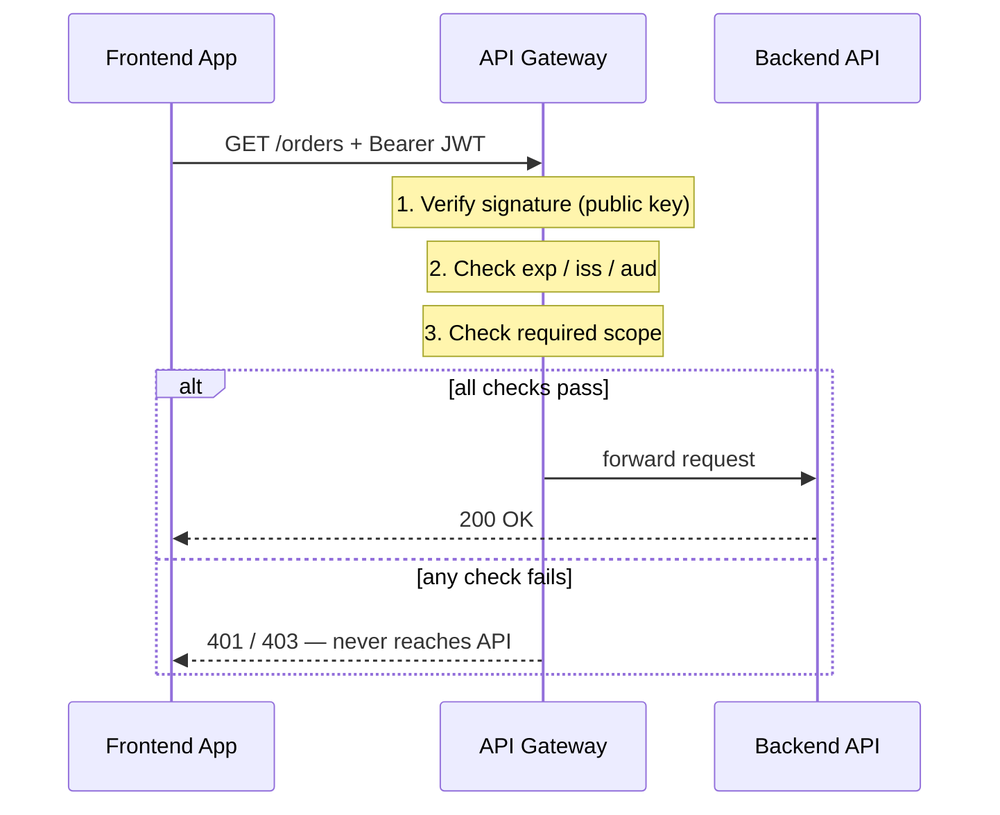

# API Gateway Authentication — Stopping Unauthorized Traffic

## The Interview Question

> "You have 20 frontend web apps talking to 10 different backend APIs. How do you stop unauthorized traffic?"

The trap here is solving it at the wrong layer. The instinct is to bolt authentication onto each API — write the token-checking code, drop it into all 10 services, ship it. It works in the demo.

Then the follow-up arrives:

> "Now you rotate your signing key. How many places do you change it? And when one of those 10 services forgets to check the token's audience, who finds out — you, or the attacker?"

Validating tokens *inside* every API means you've copied your security logic 10 times, and your security is now only as strong as the laziest service. The right answer moves the check to **one place every request must pass through first**: an **API Gateway**. The apps authenticate once and carry a signed token; the gateway inspects every request at the edge and drops anything that doesn't check out — before it ever touches your backend.

---

## The Office Lobby Analogy

Picture a corporate building with 10 floors of offices.

The amateur version: every office door has its own guard. To change the badge policy, you brief 10 guards and hope all 10 got the memo. One guard waves people through without looking — and now the whole floor is exposed, but the building still *feels* secure.

The professional version: **one security desk in the lobby.** Everyone entering the building stops there, shows their badge, gets checked once, and only then takes the elevator up. The offices upstairs don't have guards — they don't need them, because **the only way to reach them is through the lobby.**

That's an API Gateway:

- The **lobby security desk** is the **API Gateway**
- The **badge** is a signed token — a **JWT** issued by your identity provider
- The **offices upstairs** are your **backend APIs**
- The reason the offices can skip their own guards: **the building has no other entrance.** (Hold onto that — it's the part everyone forgets, and we'll come back to it.)

---

## What the Gateway Actually Does

The pattern has two halves: apps get a token from a central authority, then every request flows through the gateway, which validates that token before forwarding.

1. The app sends the user to the **Identity Provider (IdP)** to authenticate. (This is the same machinery behind [Single Sign-On](../single-sign-on/) — one central authority everyone trusts.)
2. The IdP returns a **signed JWT**.
3. Every API call the app makes carries that token in an `Authorization: Bearer <token>` header.
4. The gateway intercepts the request, validates the token, and either **forwards it** to the right backend or **rejects it with a 401** — without the backend ever seeing it.

The backends do *one* thing well: business logic. They never touch a public key, never parse a token, never get bothered by traffic that was going to be rejected anyway.

---

## Anatomy of the "Quick Validation Check"

"The gateway validates the JWT" sounds like a single yes/no. It's actually a short checklist, and skipping any item is how real breaches happen. Here's what a correct gateway check covers:

| Check | What it confirms | What happens if you skip it |
|---|---|---|
| **Signature** | The token was issued by *your* IdP and hasn't been tampered with | Anyone can forge a token by editing the payload |
| **Expiry (`exp`)** | The token is still within its lifetime | A token stolen months ago still works forever |
| **Issuer (`iss`)** | It came from the IdP you trust, not some other one | A token from an unrelated system gets accepted |
| **Audience (`aud`)** | This token was meant for *your* APIs specifically | A valid token minted for a *different* service gets reused against yours |
| **Scopes / claims** | This caller is allowed to do *this specific thing* | A logged-in user with no permissions can hit admin endpoints |

That last row is the one most people miss, and it's worth naming the distinction precisely:

- A valid signature + unexpired token answers **"who are you?"** — that's **authentication**.
- Scopes and claims answer **"are you allowed to do this?"** — that's **authorization**.

**Stopping unauthorized traffic needs both.** A token can be 100% authentic and still have no business calling `DELETE /users`. The gateway checks the signature to know *who's knocking*, and checks the scopes to know *which doors they're allowed through*. The signature is necessary; it is not sufficient.

---

## What a JWT Actually Is

A JWT (JSON Web Token) is three Base64 chunks joined by dots: `header.payload.signature`.

- **Header** — which signing algorithm was used (e.g. `RS256`).
- **Payload** — the claims: who the user is (`sub`), who issued it (`iss`), who it's for (`aud`), when it expires (`exp`), and what they can do (`scope`).
- **Signature** — the header and payload, cryptographically signed with the IdP's **private key**.

The magic is in that last part. The IdP signs with a private key only it holds. The gateway verifies with the matching **public key** — usually fetched once from a well-known URL (`/.well-known/jwks.json`) and cached. Because verification uses public-key crypto, **the gateway can check a token without calling the IdP on every request.** No network round-trip, no shared session store. The trust is baked into the math.

This is why the pattern scales to 20 apps and millions of requests: validation is **local and stateless.** Change one character in the payload and the signature no longer matches — the token is rejected instantly. (For how these tokens are kept short-lived and revocable, see [JWT Refresh — Token Rotation](../../live-coding/jwt-refresh/).)

---

## "What If an App Tries to Bypass the Gateway?"

This is the question that separates a real answer from a diagram. A gateway only stops traffic that **goes through it.** If a client can open a connection straight to `orders-api.internal:8080`, the gateway is a suggestion, not a wall — like a building with a guarded lobby and an unlocked loading dock around the back.

So the gateway is only half the design. The other half is **network isolation**:

| Control | What it does |
|---|---|
| **Private network / VPC** | Backends have no public IP. They live on an internal network the open internet can't route to at all. |
| **Gateway is the only public door** | The gateway holds the only public-facing address. It's the single ingress point — by topology, not by politeness. |
| **Backends only accept gateway traffic** | Firewall / security-group rules let the APIs accept connections *from the gateway's address only*. Anything else is dropped at the network layer. |
| **mTLS between gateway and services** | The gateway and each backend present certificates to each other, so a service will only talk to a caller that proves it's the real gateway — even inside the private network. |

Put together: an unauthorized app can't bypass the gateway because **there is no other route to the backend.** The token check stops bad requests that *reach* the gateway; the network topology guarantees every request *must* reach the gateway first. You need both — a token check with no isolation is a lock on a door that's standing in an open field.

---

## Why Not Just Validate in All 10 APIs?

You *can*. The question is what it costs you over time.

| | **Validate in every API** | **Validate at the gateway** |
|---|---|---|
| **Where the logic lives** | Copied into 10 services | One place |
| **Rotating the signing key** | Update + redeploy 10 services | Update one config |
| **Adding a new API** | Reimplement auth again, correctly | Put it behind the gateway — done |
| **Weakest link** | The one service that checks sloppily | The gateway, which you harden once |
| **Backend code** | Tangled with security plumbing | Pure business logic |

**Centralize the check.** Duplicated security logic doesn't just cost effort — it guarantees drift, and the service that drifts is the one you find out about from an incident report. One hardened gateway beats ten hopeful ones.

The honest tradeoff: the gateway becomes a critical path and a potential single point of failure, so it has to be highly available (run several instances behind a load balancer). That's a price worth paying — you're concentrating the thing you *want* concentrated: the security boundary.

---

## Production Considerations

| Decision | What to think about |
|---|---|
| **Cache the JWKS** | Fetch the IdP's public keys once and cache them. Don't hit the IdP per request — but do refresh on key rotation (honor `kid` in the token header). |
| **Keep access tokens short-lived** | 5–60 minutes. A leaked token should be dangerous for an hour, not forever. Pair with refresh-token rotation. |
| **Decide where authorization lives** | Coarse checks (valid token, basic scope) at the gateway; fine-grained, data-level rules ("can this user edit *this* order?") usually still belong in the service. The gateway can't know your domain. |
| **Pass identity downstream** | After validating, the gateway forwards the verified user/claims to the backend (e.g. an `X-User-Id` header over the trusted internal network) so services don't re-parse the token. |
| **Don't roll your own gateway auth** | Use Kong, Apigee, AWS API Gateway, Azure API Management, or an Envoy/Istio setup. JWT validation has subtle traps (`alg: none`, audience confusion). Use the battle-tested ones. |
| **Plan for gateway failure** | It's on the critical path. Run multiple instances, health-check them, and load-balance — see [How Global Apps Keep You Logged In](../how-global-apps-keep-you-logged-in/) for the layer underneath. |

---

## TL;DR

- **Don't validate tokens in all 10 APIs** — you copy your security 10 times and inherit the weakest copy. Put one **API Gateway** in front and validate there.
- **Apps authenticate once** at a central identity provider and carry a **signed JWT**; the gateway verifies it on every request using the IdP's public key — locally, statelessly, no per-request call to the IdP.
- **"Validation" is a checklist, not a yes/no:** signature, `exp`, `iss`, `aud`, **and scopes.** Signature/expiry = *who you are* (authentication); scopes = *what you're allowed to do* (authorization). You need both to actually stop unauthorized traffic.
- **The gateway only works if it's the only way in.** Put backends on a private network, let them accept traffic from the gateway only, and use mTLS. A token check with no network isolation is a lock in an open field.
- **The payoff:** centralized security, one place to harden and rotate keys, and backends that do nothing but business logic. The cost: the gateway is a critical path — make it highly available.

When the interview asks how you stop unauthorized traffic, don't say "check the token." Say: "central identity tokens, validated once at a gateway that's the only route in — and the validation checks scopes, not just signatures."

---

## Related

- [Single Sign-On (SSO)](../single-sign-on/) — where the centralized identity token comes from, and why every service can trust one authority's signature
- [How Global Apps Keep You Logged In](../how-global-apps-keep-you-logged-in/) — the session + load-balancer layer the gateway sits on top of
- [JWT Refresh (Token Rotation)](../../live-coding/jwt-refresh/) — keeping those access tokens short-lived and revocable, with runnable code

---

## Resources

### YouTube
- [What is an API Gateway? — IBM Technology](https://www.youtube.com/watch?v=6ULyxuHKxg8)
- [JWT Authentication, explained — Web Dev Simplified](https://www.youtube.com/watch?v=mbsmsi7l3r4)

### Docs
- [JWT — RFC 7519](https://datatracker.ietf.org/doc/html/rfc7519)
- [OAuth 2.0 — RFC 6749](https://datatracker.ietf.org/doc/html/rfc6749)
- [JWKS — RFC 7517](https://datatracker.ietf.org/doc/html/rfc7517)
- [Kong Gateway — JWT Plugin](https://docs.konghq.com/hub/kong-inc/jwt/)
- [AWS API Gateway — JWT Authorizers](https://docs.aws.amazon.com/apigateway/latest/developerguide/http-api-jwt-authorizer.html)
