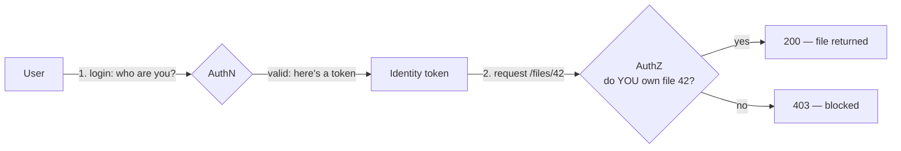

# Authentication vs Authorization

## The Interview Question

> "What's the difference between authentication and authorization?"

Everyone has the one-liner ready: *authentication is who you are, authorization is what you're allowed to do.* Correct, and the interviewer has heard it 500 times. It tells them you memorized a flashcard, not that you've ever shipped access control.

The real question is hiding in the follow-up: *"Where do teams get this wrong, and what does it cost them?"* Because mixing these two up isn't a vocabulary slip — it's the **single most common serious vulnerability on the web.** The gap between "I checked you're logged in" and "I checked you're allowed to touch *this*" is where data breaches live.

---

## The Office Badge Analogy

Picture an office building.

**Authentication** is getting past the main entrance. You tap your badge, the turnstile reads it, the lobby confirms *you are a real employee* and lets you in. One check, at one door, when you arrive.

**Authorization** is which doors inside the building that badge actually opens. Being in the building doesn't mean you can walk into the server room, the CFO's office, or the HR filing cabinet. Every interior door re-checks your badge against *its own* rules.

The trap is assuming the front door is the whole story. **Getting inside is not permission to enter every room.** A building where the lobby turnstile is the only check — and every interior door is propped open — is exactly the bug we're about to name.

---

## The Two Are Different Jobs at Different Times

| | **Authentication (AuthN)** | **Authorization (AuthZ)** |
|---|---|---|
| **Question it answers** | *Who are you?* | *What are you allowed to touch?* |
| **When it runs** | Once, at login | On every single request |
| **Produces** | An identity (a token/session) | An allow / deny decision |
| **Proven by** | Password, MFA, SSO, certificate | Roles, ownership, permissions, scopes |
| **Failure looks like** | "Wrong password" → can't log in | "You logged in, but you saw someone else's data" |

The order is fixed: **you authenticate first, then authorize.** You can't decide what someone may access until you know who they are. But — and this is the whole lesson — authentication happening *once* does not mean authorization happens *once*.



---

## A Real App: Google Drive

You log into Google Drive. That's **authentication** — Google now knows you're you, and hands your browser a token that proves it on future requests.

Then you open a file. Behind that click, Drive runs **authorization**: *is this person the owner of this file, or was it explicitly shared with them?* The answer is computed **per file, per request** — your identity is the input, but the decision is specific to *this object*. Owning a valid Google account doesn't grant you every file on Google's servers; it grants you a token that each file then checks against its own sharing rules.

That per-object check is the part developers forget. (See [Designing Google Drive](../design-google-drive/) for how the storage and sharing model underneath actually works.)

---

## Where It Goes Wrong: Broken Access Control

Here's the bug, concretely. A developer builds a "view file" endpoint and writes this check:

```
GET /api/files/123
→ Is the user logged in?  ✅ Yes → return the file
```

They authenticated. They never authorized. So a logged-in user changes the URL:

```
GET /api/files/124   ← someone else's file
→ Is the user logged in?  ✅ Yes → return the file  😱
```

The token was valid. The user was real. And they just read a stranger's data by typing a different number. This is called **IDOR** (Insecure Direct Object Reference), a flavor of **Broken Access Control** — and it has sat at **#1 on the OWASP Top 10** because it's so easy to ship and so devastating when you do. The correct check is one line longer and changes everything:

```
GET /api/files/124
→ Is the user logged in?         ✅ Yes
→ Does THIS user own file 124?   ❌ No → 403 Forbidden
```

Authentication confirmed *who knocked*. Authorization is what checks *whether this door is theirs to open* — and it has to run on the door, every time, for the specific object being requested.

---

## The Core Rule: Authenticate Once, Authorize Every Request

This is the sentence to walk out of the interview with.

- **Authenticate once.** Logging in is expensive (password, MFA, redirects). You do it at the start and carry a token afterward, so you're not re-entering credentials on every click. (How that token is verified cheaply on each request is the [API Gateway](../api-gateway-auth/) story — and the token itself comes from your [SSO](../single-sign-on/) provider.)
- **Authorize every request.** The token proves *who you are*. It says **nothing** about whether you may touch the specific record this request names. So every request that returns data must re-ask: *given this identity, is this particular action on this particular object allowed?* No exceptions, no "they already logged in so they're fine."

The asymmetry is the entire insight: **identity is established once; permission is checked continuously.**

---

## How Authorization Actually Gets Decided

"Check ownership" is the simplest case. Real systems use a few standard models:

| Model | How it decides | Good for |
|---|---|---|
| **Ownership / object-level** | Does this user own (or have a share on) this exact record? | Drive files, your orders, your messages |
| **RBAC** (Role-Based) | What role does the user have? (admin, editor, viewer) | Dashboards, internal tools, team apps |
| **ABAC** (Attribute-Based) | Rules over attributes (department = finance AND region = EU) | Fine-grained enterprise policy |
| **Scopes** (OAuth) | What did this token get granted? (`read:files`) | Third-party API access, [gateways](../api-gateway-auth/) |

Most production apps combine them: a gateway checks coarse **scopes** at the edge, and the service does the fine-grained **ownership** check on the specific object — because only the service knows its own data and rules.

---

## TL;DR

- **AuthN = who you are. AuthZ = what you're allowed to touch.** Everyone knows this line; the value is knowing what happens when you skip the second half.
- **Order and frequency differ:** authenticate **once** (login → token), authorize **every request** (per action, per object). The token proves identity, never permission.
- **The #1 failure is Broken Access Control / IDOR:** checking that a user is logged in but not that they *own the thing they're requesting*. Changing `/files/123` to `/files/124` shouldn't return a stranger's file.
- **Authorize on the object, in the service.** Coarse scope checks can live at the gateway, but "does this user own *this* record?" must run where the data lives, every time.
- **The rule to memorize:** *Authenticate once. Authorize every request.*

When the interview asks, don't stop at "who vs what." Say: "Authentication runs once and hands me an identity; authorization runs on every request and checks that identity against *this specific object* — and forgetting the second one is exactly how IDOR breaches happen."

---

## Related

- [API Gateway Authentication](../api-gateway-auth/) — where coarse authorization (token + scopes) gets enforced at the edge, before requests hit your services
- [Single Sign-On (SSO)](../single-sign-on/) — the authentication half: one provider proves who you are for every app
- [Designing Google Drive](../design-google-drive/) — the per-file ownership/sharing model that object-level authorization protects

---

## Resources

### YouTube
- [Authentication vs Authorization — ByteByteGo](https://www.youtube.com/watch?v=fyZHboud-Wc)

### Docs
- [OWASP Top 10 — A01: Broken Access Control](https://owasp.org/Top10/A01_2021-Broken_Access_Control/)
- [OWASP — Insecure Direct Object Reference (IDOR)](https://owasp.org/www-community/attacks/Insecure_Direct_Object_Reference)
- [Auth0 — Authentication vs Authorization](https://auth0.com/docs/get-started/identity-fundamentals/authentication-and-authorization)
