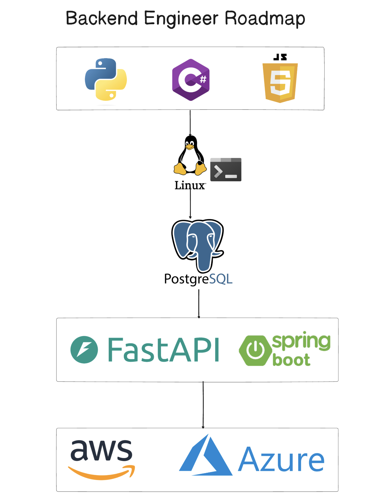

# Backend Engineer Roadmap 2026



Backend in 2026 is **less about the newest library and more about how reliably and quickly you can move data**. Most juniors fail interviews not because they don't know the latest framework — but because they can't explain what an index does, how a request actually reaches their server, or what their language does when two things happen at once.

This roadmap is the order that prevents that. Five layers. Each one earns you the right to move to the next. Skip a layer and you'll write code that works on 10 rows and dies on 10 million.

---

## The Roadmap

### Step 1 — Pick One Language and Actually Master It

The mistake: "learning" four languages just enough to write a `Hello, World`. The win: picking one and going deep enough to explain **how it handles concurrency, memory, and async tasks**. That's the part interviews probe, and it's the part that decides whether your code survives load.

You need to be able to answer:
- What does my language do when two requests hit at the same time?
- How is memory allocated and freed? What's a leak look like?
- What does `async` actually do under the hood — is there a real thread or is it cooperative?
- How do I profile a slow function?

Pick one and commit:

| Language | Why pick it | Default web framework |
|---|---|---|
| **Python** | Easiest entry, huge ecosystem, dominant in AI-adjacent backends | **FastAPI** (async, modern), Django (batteries-included) |
| **TypeScript / Node.js** | Same language as the frontend, massive job market, great for I/O-heavy services | **NestJS** (structured), Express (minimalist), Fastify (fast) |
| **Go** | Built for backends — Docker, Kubernetes, and Terraform are all written in it. Tiny binaries, real concurrency via goroutines | **Gin**, **Fiber**, or the standard library |
| **Java / Kotlin** | The enterprise gold standard — banks, insurance, large e-commerce | **Spring Boot** |
| **Rust** | When safety and performance both matter (fintech, infra, systems backends) | **Axum**, **Actix Web** |

**Opinionated default — Python with FastAPI.** Fastest to ship, modern async support, the ecosystem around AI and data is unmatched. If you're aiming at infra or high-throughput trading, pick **Go**. If you're targeting traditional enterprise, pick **Java + Spring Boot**.

> Don't language-hop. Six months deep in one language beats six weeks in five.

### Step 2 — Get Comfortable in the Terminal & Linux

If you can't SSH into a box, list running processes, fix a permission issue inside a Docker container, or read a log file without a GUI — production will eat you alive. Every real backend runs on Linux. Every CI runner. Every container.

What to learn:
- **File system & permissions** — `ls`, `cd`, `chmod`, `chown`, ownership and the `rwx` model
- **Processes & resources** — `ps`, `top`, `htop`, `kill`, `lsof`, `nice`
- **Networking from the shell** — `ssh`, `scp`, `curl`, `dig`, `netstat`/`ss`, `tcpdump` basics
- **Bash scripting** — variables, loops, pipes, redirection, exit codes
- **Editors that work over SSH** — `vim` or `nano` to the level where you won't panic
- **systemd & journals** — `systemctl`, `journalctl`, what a service is and how it restarts itself
- **Docker debugging** — `docker exec -it`, `docker logs`, why your container exits immediately

> Stop using only the IDE's UI. Anything you'd click, do it in the terminal until it feels native.

### Step 3 — Master SQL (and Postgres) Before Touching NoSQL

This is the layer that decides whether your app is fast or slow. If your queries are slow, your whole app is slow — no caching trick saves you long-term. **Master Postgres first**, then add Redis, DynamoDB, or Cosmos DB *for specific use cases* — not because they're trendy.

What to learn (in this order):

1. **Schema & relationships** — primary keys, foreign keys, normalization, when to denormalize
2. **Indexes** — B-tree, composite indexes, when an index helps vs. hurts (see [Database Indexes](../database-indexes/) and [Composite Indexes](../composite-indexes/))
3. **Joins** — inner, left, anti-joins; what makes them slow
4. **Transactions & ACID** — atomicity, isolation levels, what a deadlock looks like
5. **Query plans** — `EXPLAIN ANALYZE`, reading a plan, recognizing a seq scan you didn't want
6. **Connection pooling** — PgBouncer or your framework's pool
7. **Bulk operations** — see [Bulk Loads & Indexes](../bulk-loads-and-indexes/)

**Then, and only then, add specialty stores:**

| Tool | Add when… |
|---|---|
| **Redis** | You need a hot cache, rate limiting, pub/sub, or short-lived state |
| **DynamoDB / Cosmos DB** | You need predictable single-digit-ms reads at massive scale and your access pattern is simple key/value or partition-key based — see [Designing Netflix's Continue Watching](../design-continue-watching/) |
| **Elasticsearch / OpenSearch** | You need real full-text search, not `LIKE '%term%'` |
| **ClickHouse / BigQuery** | You're doing analytics over billions of rows |

> Postgres is the default. Reach for NoSQL when you can name the *specific* scaling problem Postgres can't solve for you.

### Step 4 — APIs & Networking

Most of your job is moving data between services. You need to know how, and you need to know how it breaks.

**Protocols** — know when to use which:

| Protocol | Use when |
|---|---|
| **REST over HTTP** | The default. Public APIs, browser clients, anything where simplicity wins |
| **gRPC** | Service-to-service inside your own infrastructure — binary, fast, strongly typed |
| **WebSockets** | Real-time, bidirectional — chat, collaborative editing, live dashboards (see [Designing Google Docs](../design-google-docs/)) |
| **GraphQL** | Frontends that need flexible, nested data in one round-trip |
| **Server-Sent Events (SSE)** | One-way streaming from server to client (LLM token streams, live feeds) |

**The HTTP fluency every backend engineer needs**:
- **Methods** — `GET`, `POST`, `PUT`, `PATCH`, `DELETE` and what each *means*, not just what it does
- **Status codes** — `2xx` vs `4xx` vs `5xx`; never return `200 OK` with `"error": ...` in the body
- **Headers** — `Authorization`, `Content-Type`, `Cache-Control`, `CORS`, request IDs
- **Idempotency** — which methods are safe to retry, and how to make `POST` idempotent
- **Pagination** — cursor vs offset; why offset dies at scale
- **Rate limiting** — token bucket, leaky bucket (see [Rate Limiting](../../live-coding/rate-limiting/))
- **Authentication & authorization** — sessions vs JWT (see [How Global Apps Keep You Logged In](../how-global-apps-keep-you-logged-in/)), OAuth/OIDC, [SSO](../single-sign-on/), and refresh-token rotation (see [JWT Refresh](../../live-coding/jwt-refresh/))

> If you can't draw the request/response lifecycle from "user clicks button" to "row in database" on a whiteboard, you're not done with this step.

### Step 5 — Cloud & Infrastructure as Code

In 2026, the bar is high. "Senior backend engineer" means you can deploy, scale, and roll back your service — not just write its code. Pick one cloud and one IaC tool and go deep.

**Pick a cloud**:

| Cloud | Why pick it |
|---|---|
| **AWS** | Biggest market share, deepest service catalog, most jobs |
| **Azure** | Dominant in enterprise and AI (OpenAI partnership, Microsoft shops) |
| **GCP** | Strong in data/ML; smaller but loved by engineers |

**Pick an IaC tool**:

| Tool | Works with | Language |
|---|---|---|
| **Terraform / OpenTofu** | Any cloud | HCL — the cloud-agnostic default |
| **Bicep** | Azure only | Bicep — best Azure-native experience |
| **Pulumi** | Any cloud | Python, TypeScript, Go, C# — IaC in real code |
| **CloudFormation** | AWS only | YAML/JSON — verbose but native |

**What to actually learn at this step**:
- Containerize your service with **Docker**
- Push to a registry (ECR, ACR, GHCR)
- Deploy to a managed runtime: AWS ECS/Fargate or App Runner, Azure App Service or Container Apps, or Cloud Run on GCP
- Wire up a managed database (RDS / Azure Database for Postgres)
- Add a load balancer, TLS, and a CDN
- Define **all of the above** in Terraform or Bicep — clicking through the console is for learning, not for production
- Set up CI/CD: GitHub Actions runs tests, builds the image, applies your IaC
- Add logging, metrics, and a health check — see the [Pre-Deployment Checklist](../pre-deployment-checklist/) and [Backend API Deployment Checklist](../backend-api-deployment-checklist/)

> If you can't redeploy your entire stack from scratch with one command, you don't have infrastructure as code — you have notes.

---

## The Full Picture

```
Language fluency (Python / Go / TS / Java)
            ↓
Terminal & Linux (SSH, processes, Docker debugging)
            ↓
SQL & Postgres (indexes, transactions, ACID)
   + specialty stores (Redis / Dynamo / Cosmos) when needed
            ↓
APIs & Networking (REST / gRPC / WebSockets, auth, rate limiting)
            ↓
Cloud & IaC (AWS or Azure + Terraform or Bicep)
```

Each layer depends on the one below it. Don't skip ahead — every "I'll come back to that fundamental later" turns into a senior interview you bomb three years from now.

---

## One Last Thing — Build, Don't Just Watch

Watching tutorials is not learning. For every layer above, **ship something**:

- **Language** — write a small CLI or a real script that does something for you
- **Linux** — rent a $5 VPS, SSH in, run a service, break it, fix it
- **SQL** — design the schema for a side project; load 10M fake rows; make a query fast
- **APIs** — build a small service, add auth, rate-limit it, document it with OpenAPI
- **Cloud** — deploy that service end-to-end with Terraform or Bicep, then tear it down

The gap between "I watched the tutorial" and "I can do this in production" closes only by doing.

---

## TL;DR

Backend engineering in 2026 is about **moving data reliably and quickly**, not about chasing libraries. The path:

1. **Pick one language** (Python + FastAPI is the safest default) and go deep on concurrency, memory, async
2. **Linux & the terminal** — SSH, processes, permissions, Docker debugging
3. **SQL first (Postgres)** — indexes, transactions, ACID — then add Redis / DynamoDB / Cosmos for specific use cases
4. **APIs & networking** — REST, gRPC, WebSockets, status codes, rate limiting, auth
5. **Cloud + IaC** — AWS or Azure, automated with Terraform or Bicep

Master those five layers and you're already competing for senior roles. Skip any of them and you're a juniors-tier engineer with a fancy framework on your résumé.

---

## Resources

### Docs

**Languages**
- [Python — Official docs](https://docs.python.org/3/)
- [FastAPI — Official docs](https://fastapi.tiangolo.com/)
- [Go — Learn Go](https://go.dev/learn/)
- [Node.js — Learn Node](https://nodejs.org/en/learn/getting-started/introduction-to-nodejs)
- [Spring Boot — Reference](https://docs.spring.io/spring-boot/index.html)
- [Rust — The Rust Book](https://doc.rust-lang.org/book/)

**Linux & Bash**
- [The Linux Command Line — William Shotts (free book)](https://linuxcommand.org/tlcl.php)
- [Bash reference manual](https://www.gnu.org/software/bash/manual/bash.html)

**Databases**
- [PostgreSQL — Official docs](https://www.postgresql.org/docs/)
- [Use The Index, Luke! — practical SQL indexing guide](https://use-the-index-luke.com/)
- [Redis — Official docs](https://redis.io/docs/)
- [DynamoDB — Best practices for partition keys](https://docs.aws.amazon.com/amazondynamodb/latest/developerguide/bp-partition-key-design.html)
- [Azure Cosmos DB — Partitioning overview](https://learn.microsoft.com/azure/cosmos-db/partitioning-overview)

**APIs & Networking**
- [MDN — HTTP](https://developer.mozilla.org/en-US/docs/Web/HTTP)
- [MDN — WebSockets](https://developer.mozilla.org/en-US/docs/Web/API/WebSockets_API)
- [gRPC — Official docs](https://grpc.io/docs/)
- [OWASP — API Security Top 10](https://owasp.org/API-Security/)

**Cloud & IaC**
- [AWS — Getting started](https://aws.amazon.com/getting-started/)
- [Azure — Architecture Center](https://learn.microsoft.com/azure/architecture/)
- [Terraform — Tutorials](https://developer.hashicorp.com/terraform/tutorials)
- [Bicep — Microsoft Learn](https://learn.microsoft.com/azure/azure-resource-manager/bicep/)
- [Docker — Official docs](https://docs.docker.com/)

### YouTube channels worth subscribing to

- **NetworkChuck** — Linux from zero
- **TechWorld with Nana** — Docker, Kubernetes, DevOps fundamentals
- **ArjanCodes** — production-grade Python and FastAPI patterns
- **The Net Ninja** — Node, Express, JavaScript
- **Hussein Nasser** — backend deep-dives, databases, networking
- **freeCodeCamp** — long-form crash courses on basically every topic above
