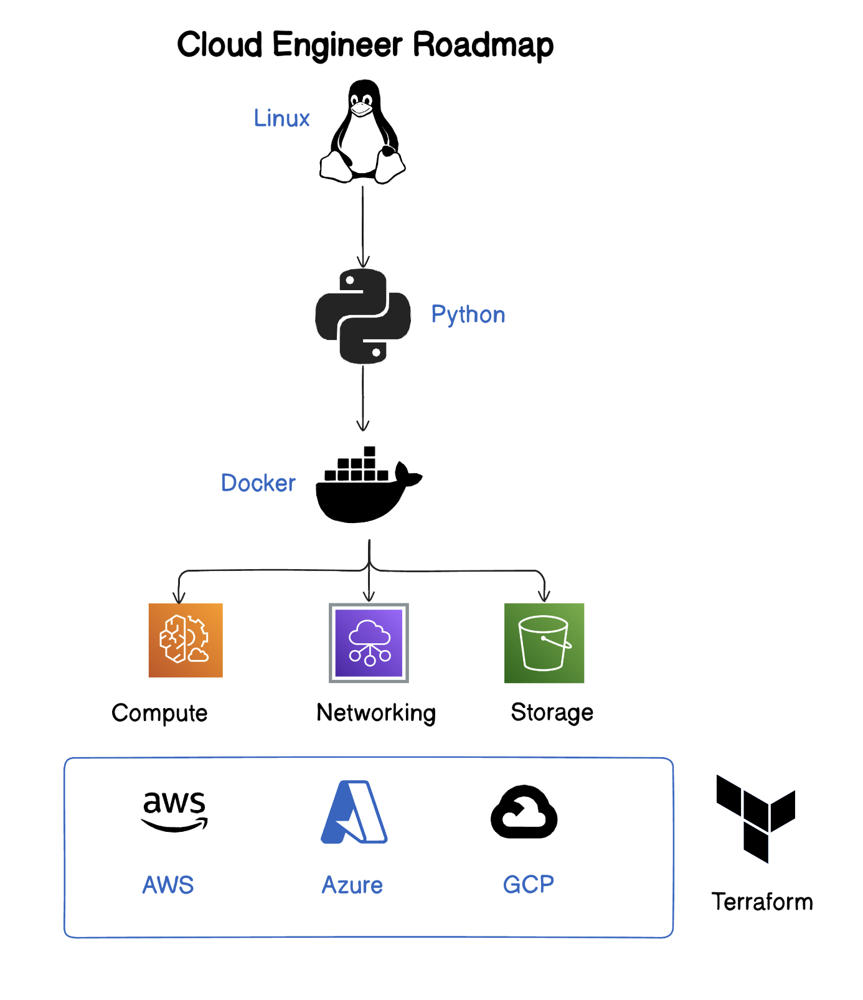

# Cloud Engineer Roadmap 2027

## Resources

### YouTube Videos
- [NetworkChuck's Free Linux Series](https://www.youtube.com/watch?v=VbEx7B_PTOE&list=PLIhvC56v63IJIujb5cyE13oLuyORZpdkL&index=1)
- [Python for DevOps — Nana](https://www.youtube.com/watch?v=6u5NE1GiQDk)
- [Docker Crash Course — Nana](https://www.youtube.com/watch?v=3c-iBn73dDE&t=16s)
- [IBM Cloud Series](https://www.youtube.com/watch?v=O-XBhVv2pgE)
- [AWS Cloud Practitioner — freeCodeCamp](https://www.youtube.com/watch?v=NhDYbskXRgc)
- [Azure AZ-900 Series — Adam](https://www.youtube.com/watch?v=NPEsD6n9A_I&list=PLGjZwEtPN7j-Q59JYso3L4_yoCjj2syrM)
- [Terraform for Beginners — KodeKloud](https://www.youtube.com/watch?v=YcJ9IeukJL8)

---

How do I actually become a Cloud Engineer by 2027? If you are truly serious, here is the exact roadmap you need to follow.

## 1. Master Linux & Networking

Start with the foundation. Master Linux and networking first.

- [NetworkChuck's Free Linux Series](https://www.youtube.com/watch?v=VbEx7B_PTOE&list=PLIhvC56v63IJIujb5cyE13oLuyORZpdkL&index=1)

## 2. Learn Python

I highly recommend knowing one programming language like Python.

- [Python for DevOps — Nana](https://www.youtube.com/watch?v=6u5NE1GiQDk)

## 3. Understand Containerization (Docker)

You need to understand how modern applications are packaged.

- [Docker Crash Course — Nana](https://www.youtube.com/watch?v=3c-iBn73dDE&t=16s)

## 4. Learn Core Cloud Concepts

Learn the core cloud concepts first: **Compute**, **Networking**, and **Storage**.

- [IBM Cloud Series](https://www.youtube.com/watch?v=O-XBhVv2pgE)

## 5. Pick a Cloud Provider

Once you know how those work, pick your platform:

- **AWS** — [freeCodeCamp's Cloud Practitioner Course](https://www.youtube.com/watch?v=NhDYbskXRgc)
- **Azure** — [Adam's AZ-900 Series](https://www.youtube.com/watch?v=NPEsD6n9A_I&list=PLGjZwEtPN7j-Q59JYso3L4_yoCjj2syrM)

## 6. Learn Infrastructure as Code (Terraform)

Companies deploy everything with code. You must learn Infrastructure as Code.

- [Terraform for Beginners — KodeKloud](https://www.youtube.com/watch?v=YcJ9IeukJL8)

## TL;DR

Becoming a cloud engineer is basically: mastering **Linux**, scripting in **Python**, containerizing with **Docker**, learning a **cloud provider**, and automating it all with **Infrastructure as Code**. And that's literally it.
