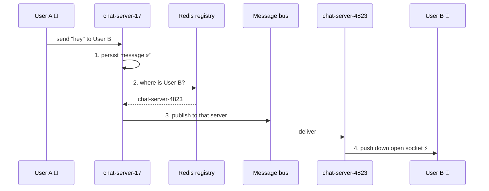
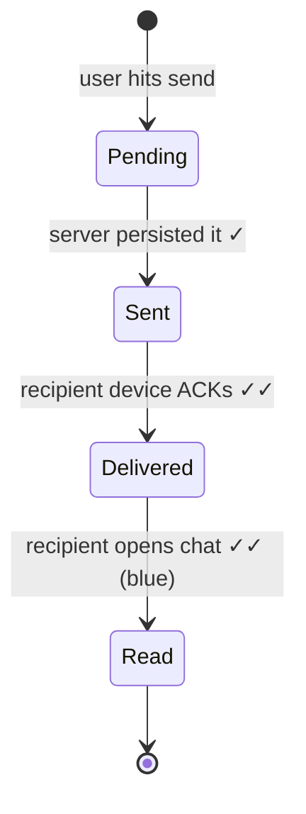

# Designing WhatsApp

## The Interview Question

> "Design a real-time chat service like WhatsApp."

The instinct is to reach for the stack you already know:

> "REST API and Postgres. Sending a message is `POST /messages`. To receive messages, the app polls `GET /messages?since=...` every three seconds."

It works. You could build it this afternoon. And it falls apart on the first follow-up:

> "You have 2 billion users. At one poll every 3 seconds, that's **~660 million requests per second** — and 99% of them return an empty array."

You've built a system whose dominant cost is asking a question the answer to which is almost always "no."

But polling is the *easy* problem, and fixing it is the part everyone gets right. The question that actually separates candidates comes two steps later: **what happens when the person you're messaging has their phone in a drawer?**

---

## "Are We There Yet?" — Why Polling Fails

Polling is the kid in the back seat asking *"are we there yet?"* every three seconds. The parent has to answer every single time. Almost every answer is "no." The kid learns nothing, the parent is exhausted, and the car doesn't arrive any sooner.

Worse, it's simultaneously **wasteful and slow**:

| | Cost |
|---|---|
| Requests per user per day | ~28,800 (one every 3s) |
| Useful responses | Maybe a few dozen |
| Wasted responses | **99.9%** |
| Worst-case delivery delay | 3 seconds — an eternity in a chat |
| Cost per request | New TCP + TLS handshake, auth check, DB query |

You pay for every "no," and you *still* haven't got instant delivery. Shortening the interval to 1 second triples your infrastructure bill to reduce the delay to... 1 second. There's no interval that wins. **The polling model is wrong, not badly tuned.**

---

## The Open Phone Line — WebSockets

Stop asking. Get told.

Polling is texting *"any news?"* every three seconds. A **WebSocket** is keeping a phone line open — nobody talks until there's something to say, but the moment there is, it's instant. One connection, opened once, stays open, and either side can speak at any time.

```
POLLING                              WEBSOCKET
client → "anything?" → server        client ⟷ server   (open, silent)
client → "anything?" → server                ↓
client → "anything?" → server        server → "msg from Ana"  ← instant
client → "anything?" → server                ↓
        (28,800× per day)                 (1 connection)
```

Now sending a message is: User A pushes it up the open socket, the server pushes it straight down User B's open socket. No polling. No delay. Delivery in tens of milliseconds.

> **Real-world note:** WhatsApp actually runs a customised **XMPP** over persistent TCP (on Erlang, famously handling ~2M connections per server). For an interview, WebSockets are the right answer — the concept is identical: *one long-lived, bidirectional connection instead of repeated requests.* Same as how [Google Docs](../design-google-docs/) uses QUIC where you'd say WebSockets.

---

## The Hard Part: Which Server Holds That Socket?

Here's where the easy answer runs out — and this is the real interview.

You don't have *a* server. You have **thousands**, behind a load balancer. User A's phone is connected to `chat-server-17`. User B's phone is connected to `chat-server-4823`. When `chat-server-17` receives a message addressed to User B, it looks at its own list of open sockets and... User B isn't there. It has no idea where User B is.

**Stateless services scale trivially. WebSocket servers are stateful** — the connection *is* the state, and it lives in one specific process's memory.

Note that you can't solve this the way Google Docs does. There, everyone editing document X is routed to the same instance by hashing `documentId`. That works because a document is a small, closed room. **A WhatsApp user is in hundreds of chats at once** — you can't hash them all to one place. So you need two pieces:

**1. A session registry** — a fast key-value store (Redis) mapping *user → the server holding their socket*:

```
user:B  →  chat-server-4823
user:C  →  chat-server-17
user:D  →  (absent = offline)
```

Written on connect, deleted on disconnect, with a short TTL so crashed servers don't leave ghosts.

**2. A message bus** — so `chat-server-17` can hand the message to `chat-server-4823` without knowing anything about it. Each server subscribes to its own channel; the sender publishes to the recipient's server channel.



That's the core of the architecture. Everything else is detail.

---

## The Real Question: What If User B Is Offline?

Their phone is in a drawer. The socket is closed. The registry lookup returns nothing.

The naive fix is "try to send, and if it fails, save it." **That's backwards, and it's the single most important thing to get right in this design.**

### The mental model flip: messages go to a mailbox, not to a person

You don't hand a letter directly to someone and hope they're home. You put it in their **mailbox**. They collect it whenever they show up — in a minute, or next Tuesday. The mailbox is the system; the handover is just a lucky shortcut when they happen to be standing there.

So the rule is:

> **Persist first, then deliver. The socket is an optimization — the database is the source of truth.**

Every message is written to storage **before** any delivery is attempted, whether the recipient is online, offline, or their phone died mid-transmission. Delivery is a *best-effort push on top of a durable write*.

Get this backwards — deliver first, persist only on failure — and you lose messages in the gap: the socket looked alive, the write hadn't happened, the phone dropped off the network. A chat app that loses messages is not a chat app.

### So the flow becomes

| User B's state | What happens |
|---|---|
| **Online** | Persist → registry hit → push over the socket → instant ⚡ |
| **Offline** | Persist → registry miss → send a **push notification** (APNs / FCM) to wake the phone |
| **Reconnects later** | Phone opens a socket, asks *"what did I miss since message N?"* → server streams the backlog from the database |

The offline path and the online path share the same first step. That's what makes it robust: **there is only one way a message enters the system.**

---

## The Checkmarks Are a State Machine

WhatsApp made its delivery guarantees *visible*, and it's the best teaching aid in any consumer app. Those ticks aren't decoration — they're the message's lifecycle rendered on screen:

| What you see | What it means | Who confirmed it |
|---|---|---|
| 🕐 Clock | Not yet on the server | Nobody — it's still on your phone |
| ✓ One grey tick | **Server has persisted it** | The server |
| ✓✓ Two grey ticks | **Delivered to their device** | Their phone's ACK |
| ✓✓ Two blue ticks | **They opened the chat** | Their app, on read |



Each arrow is an **acknowledgement travelling back**. The recipient's app doesn't just receive a message — it sends an ACK, which the server persists and relays to the sender so their UI updates.

This is why "did the send succeed?" is a real engineering question: the network can fail at *any* of those four arrows. Which leads directly to the next problem.

---

## Ordering and Duplicates

**Never trust the client's clock.** Phones have skewed clocks, timezone bugs, and users who set the date to 2033. If you sort a chat by device timestamp, messages arrive out of order and the conversation reads like nonsense.

Use a **server-assigned sequence number per conversation**. The server is the single ordering authority — messages are numbered in the order it accepts them, and every client renders in that order. It also gives clients a cheap way to sync: *"I have up to #4471, give me everything after."*

**Duplicates come from retries.** A phone sends a message, the network dies before the ACK arrives, the app retries. Without protection the message appears twice.

The fix is a **client-generated UUID** attached at compose time. If the server sees the same UUID twice, it's the same message — store once, re-send the ACK. This makes sending **idempotent**, which is what lets clients retry aggressively (exactly what you want on a flaky mobile network).

```json
{
  "clientMessageId": "9f3a...-uuid",   ← dedup key, generated on the phone
  "chatId": "chat_88213",
  "senderId": "user_A",
  "seq": 4472,                          ← assigned by the server, not the phone
  "body": "<encrypted blob>",
  "sentAt": "2026-07-27T09:14:02Z"      ← server time
}
```

---

## Storage: Why Not Postgres

The write pattern is brutal: **append-only, enormous volume, never updated, almost always read as "the most recent messages in one chat."**

That's the exact shape a wide-column store like **Cassandra** is built for — high write throughput, linear horizontal scaling, and rows physically clustered on disk in the order you'll read them.

```
Partition key:     chat_id          ← all of one chat lives together
Clustering key:    seq DESC         ← newest first, already sorted on disk
```

Loading a chat becomes a **single-partition read of the first 50 rows** — no sorting, no joins, no scatter-gather, regardless of whether the database holds a billion messages.

Why partition by `chat_id` and not `user_id`? Because the query that matters is *"give me this conversation."* Partition by the thing you read together. (For the full treatment of why this one decision makes or breaks a NoSQL design, see [Designing Netflix's Continue Watching](../design-continue-watching/).)

The catch to mention before the interviewer does: **group chats.** A 1,000-member group is a hot partition — one chat, one worker, heavy traffic. Real systems cap group size (WhatsApp: 1,024) precisely because this cost is structural.

---

## The Full Picture

```
                            ┌──────────────┐
   User A 📱 ══socket══▶     │ chat-server  │ ──1──▶ ┌────────────┐
                            │     #17      │        │ Cassandra  │  persist FIRST
                            └──────┬───────┘        └────────────┘
                                   │ 2. where is B?
                                   ▼
                            ┌──────────────┐
                            │ Redis        │  user → server
                            │ registry     │
                            └──────┬───────┘
                          online   │   offline
                    ┌──────────────┴───────────────┐
                    ▼                              ▼
            ┌──────────────┐              ┌──────────────────┐
            │ Message bus  │              │ Push notification│
            └──────┬───────┘              │  (APNs / FCM)    │
                   ▼                      └────────┬─────────┘
            ┌──────────────┐                       │ wakes phone
            │ chat-server  │                       │
            │    #4823     │                       ▼
            └──────┬───────┘              reconnect → fetch backlog
                   ▼                                from Cassandra
              User B 📱 ⚡
```

Both paths start at the same place — **the write**. That's the design.

---

## Production Considerations

| Concern | What to say |
|---|---|
| **Connection storms** | A regional network blip drops 5M sockets, and all of them reconnect at once. Use **randomised exponential backoff** or you DDoS yourself. |
| **Heartbeats** | TCP connections die silently. Ping/pong every ~30s to detect dead sockets and clear stale registry entries — otherwise you push messages into the void. |
| **Auth on connect** | Validate the token during the **handshake**, not per message. Once open, the socket carries an authenticated identity. See [JWT](../jwt/). |
| **Load balancing** | WebSockets need **sticky, long-lived** connections. Balance by *connection count*, not requests/sec — and expect slow, uneven drain during deploys. |
| **Media** | Never send photos/video over the socket. Upload to blob storage, send a **reference**. Same pre-signed URL pattern as [Google Drive](../design-google-drive/). |
| **End-to-end encryption** | Real WhatsApp encrypts on-device (Signal protocol) — the server relays **opaque blobs** it cannot read, and deletes them once delivered. Storage is a queue, not an archive. |
| **Fan-out for groups** | One send → N deliveries. Do it **asynchronously via the bus**, never in the sender's request path. |

---

## TL;DR

- **Polling is wrong, not slow.** 99.9% of responses are empty, and you *still* eat a multi-second delay. Use a **persistent connection** (WebSocket) so the server pushes instead of the client asking.
- **The real problem is stateful routing.** With thousands of servers, the sender's server has no idea where the recipient's socket lives. Solve it with a **Redis session registry** (`user → server`) plus a **message bus** between servers.
- **Persist first, deliver second.** The database is the source of truth; the open socket is just a fast path. Do it the other way round and you lose messages in the gap.
- **Offline isn't an edge case, it's the default path.** Message lands in storage → push notification wakes the phone → on reconnect the client syncs the backlog. Messages go to a **mailbox**, not to a person.
- **Server assigns order; client assigns identity.** A per-conversation **sequence number** (never the phone's clock) fixes ordering; a **client-generated UUID** makes retries idempotent and kills duplicates.
- **Store in Cassandra, partitioned by `chat_id`, clustered by `seq DESC`** — loading a chat is one single-partition read of pre-sorted rows.

When the interviewer asks "what if the recipient is offline?", don't say "then we save it to the database." Say: **"We always saved it to the database. Delivery is an optimization on top of a durable write — offline just means the fast path didn't fire."**

---

## Related

- [Designing Google Docs](../design-google-docs/) — the other real-time WebSocket design; contrast how it routes (hash by document) with how chat must route (registry per user)
- [Designing Netflix's Continue Watching](../design-continue-watching/) — the full deep-dive on partition keys and hot partitions
- [Real-Time Collaboration App — Pre-Launch Checklist](../real-time-collaboration-checklist/) — the operational checklist for shipping anything WebSocket-based
- [How Global Apps Keep You Logged In](../how-global-apps-keep-you-logged-in/) — authenticating a user across thousands of stateless servers
- [Designing Google Drive](../design-google-drive/) — the pre-signed URL pattern for the media path

---

## Resources

### Docs
- [The WebSocket Protocol — RFC 6455](https://www.rfc-editor.org/rfc/rfc6455.html)
- [WebSockets API — MDN](https://developer.mozilla.org/en-US/docs/Web/API/WebSockets_API)
- [Cassandra Data Modeling — Apache Cassandra](https://cassandra.apache.org/doc/latest/cassandra/developing/data-modeling/intro.html)
- [Signal Protocol — WhatsApp Encryption Overview](https://www.whatsapp.com/security/WhatsApp-Security-Whitepaper.pdf)
