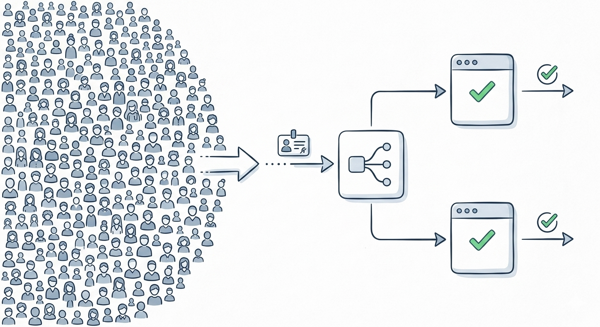

# How Global Apps Keep You Logged In

## The Interview Trap

The question sounds easy:

> "How do you keep millions of users logged in across a massive global app?"

Most people first think: "Store a session ID in the server's memory."

That works on a single backend server. It breaks the moment you put multiple servers behind a load balancer.

## Why In-Memory Sessions Fail at Scale

Imagine this flow:

1. You log in and Server A stores your session in its RAM
2. Your next request goes through the load balancer
3. This time it lands on Server B
4. Server B has never seen your session before
5. You look logged out even though you just authenticated

That is the core scaling problem.

If the authentication state only exists in one server's memory, your login is tied to that single machine.

## The Two Real Solutions

At scale, teams usually do one of these:

1. **Stateful sessions with a shared session store**
2. **Stateless authentication with signed tokens like JWTs**

Your script is pointing at the second one.

## What a JWT Actually Does

JWT stands for **JSON Web Token**.

Instead of the server remembering you in RAM, the server gives the client a signed token that contains identity data such as:

- user ID
- token expiration time
- roles or permissions

The token is then sent back with future requests, usually in an **HTTP-only cookie** or an `Authorization` header.

Every backend server can verify the token signature using the same secret key or public key. That means any server in any region can validate who you are without first checking its own memory.

## Why This Works Behind a Load Balancer

With JWT-based auth, the flow becomes:

1. User logs in
2. Auth service issues a signed JWT
3. Client stores the token
4. Every request includes that token
5. Any backend server verifies the signature and reads the claims
6. The request is accepted without needing a local session lookup

Now it does not matter whether the request hits Server A, Server B, or Server Z in another region. They all see the same signed proof of identity.

That is what people mean when they say the system is **stateless**.

## What "Stateless" Really Means

Stateless does **not** mean the app stores no data anywhere.

It means the server handling your request does not need to remember your login in its own local memory between requests.

Each request carries enough information for the server to verify the user again.

## Why Engineers Like JWTs for Massive Systems

- **Horizontal scaling is easier** because any server can validate the user
- **Load balancers stay simple** because requests can go to any healthy backend
- **Cross-region traffic works better** because auth is not pinned to one machine
- **Database reads can be reduced** because identity is often verified from the token alone

This is why stateless auth is a common answer in system design interviews.

## But JWTs Are Not Magic

This is the part people skip.

JWTs solve the **"which server knows me?"** problem, but they introduce tradeoffs:

- **Logout is harder** because a token may remain valid until it expires
- **Revoking access is harder** unless you keep a denylist or use short-lived tokens
- **Permissions can become stale** if roles change after the token was issued
- **Large tokens increase request size** if you put too much data inside them

So in real systems, teams often use this pattern:

1. A **short-lived JWT access token** for fast stateless verification
2. A **refresh token** to get a new access token when it expires
3. A database or auth store only when renewal, revocation, or logout must be enforced

That gives you the scale benefits of stateless auth without pretending state never exists.

## JWT vs Traditional Server Sessions

| | Server-side Sessions | JWT-based Auth |
|---|---|---|
| **Where auth state lives** | On the server | In a signed token held by the client |
| **Needs shared storage at scale** | Usually yes | Not for basic verification |
| **Works easily across many servers** | Only with extra infrastructure | Yes |
| **Logout / revoke immediately** | Easier | Harder |
| **Best for** | Simpler apps, strong session control | Large distributed systems, APIs, multi-region apps |

## The Interview Answer in One Sentence

If the app has many backend servers behind a load balancer, storing sessions in one server's memory will fail. You either need a **shared session store** or **stateless authentication with JWTs**, and JWTs are often preferred when you want easier horizontal scaling.

## TL;DR

The wrong answer is: **"Store the session in the server's RAM."**

The scalable answer is: **"Make authentication stateless so any server can verify the user."**

JWTs do that by turning identity into a **cryptographically signed token** instead of something only one server remembers.