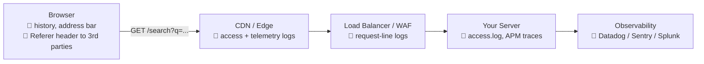

# HTTP QUERY — The First New HTTP Method in 16 Years

## The Interview Question

> "Your search endpoint is `POST /orders/search`. Why POST? You're not creating anything."

Most candidates shrug and say "because the filters don't fit in a URL." That's the right instinct and the wrong conclusion — because the follow-up is brutal: *"So you told every cache, proxy, and retry layer on the internet that this request changes data. What did that cost you?"*

Here's the uncomfortable truth: **every `POST /search` in your codebase is a lie.** You're using a method whose contract says *"this may create or modify state, do not repeat it, do not cache it"* to do the single most read-only thing an API can do. We all did it because HTTP left us no choice.

In **June 2026, [RFC 10008](https://www.rfc-editor.org/rfc/rfc10008.html) shipped the `QUERY` method** — the first genuinely new general-purpose HTTP method since `PATCH` landed in 2010. Sixteen years. This is the fix.

---

## The Envelope Analogy

A URL is the **outside of an envelope**. A request body is the **letter inside**.

Everyone who touches your envelope on the way to its destination reads the outside — the mail carrier, the sorting machine, the front desk at the office. That's their job; the address is *how* they route it. So they write it down. They log it.

Now imagine writing `Re: my HIV test results, account #4471, salary $92,000` on the outside of the envelope, in Sharpie, because the letter inside "wasn't allowed to have content."

That's `GET /search?diagnosis=hiv&account=4471&salary_min=92000`.

`QUERY` is the method that finally says: **put it in the letter.**

---

## The Three Bad Options We Had Before

### Option 1 — `GET` with a monster query string

```http
GET /orders?status=pending,shipped,returned&region=eu-west,eu-north
    &created_after=2026-01-01&created_before=2026-07-01&min_total=500
    &sku=A1,B2,C3,D4,...(400 more)&sort=-created_at&limit=100 HTTP/1.1
Host: api.example.com
```

Correct semantics — safe, idempotent, cacheable. And it explodes:

| Where it breaks | Typical limit |
|---|---|
| HTTP spec *recommendation* (RFC 9110 §4.1) | senders/recipients should handle **≥ 8,000 octets** — that's a floor, not a promise |
| nginx request line buffer | ~8 KB default → **414 URI Too Long** |
| Many CDNs / API gateways | ~8 KB, often lower |
| Legacy clients & tooling | as low as ~2 KB |

**You cannot know the limit ahead of time**, because your request crosses systems you don't own. That's the actual killer — not the number, the *unknowability*. A dashboard filter that works in dev returns `414` from a proxy in Frankfurt.

There's a second, subtler cost: encoding a complex object into a URI is ugly and lossy, and it turns **every combination of filters into a distinct resource** as far as the network is concerned.

### Option 2 — `GET` with a JSON body

```http
GET /orders HTTP/1.1
Content-Type: application/json

{ "status": ["pending"], "min_total": 500 }
```

Seductive. Broken.

RFC 9110 says GET content has **"no defined semantics"** — a server is free to reject it. Which means the entire chain gets to improvise:

- Some proxies and CDNs **strip the body** before forwarding
- Some servers **ignore it** and return unfiltered results (the worst outcome — silent wrong data)
- Browsers' `fetch()` **refuses outright**: `Request with GET/HEAD method cannot have body`

You aren't writing HTTP anymore, you're writing a dialect and hoping every hop speaks it.

### Option 3 — `POST` (what everyone actually shipped)

```http
POST /orders/search HTTP/1.1
Content-Type: application/json

{ "status": ["pending"], "min_total": 500 }
```

It works. It's also a semantic lie, and the lie has a price:

- **Not safe** → crawlers, prefetchers and link-checkers must avoid it
- **Not idempotent** → a client library that auto-retries a dropped connection *can't*, because for all it knows the first attempt charged a credit card
- **Effectively uncacheable** → a CDN can't serve two identical searches from cache
- **Invisible intent** → nothing on the wire tells an intermediary "this is a read." Your WAF, your audit log, and your rate limiter all see a write

You bought a body and paid for it with every optimization HTTP gives reads.

---

## What QUERY Actually Is

```http
QUERY /orders HTTP/1.1
Host: api.example.com
Content-Type: application/json
Accept: application/json

{
  "status": ["pending", "shipped"],
  "region": ["eu-west", "eu-north"],
  "created_after": "2026-01-01",
  "min_total": 500,
  "sort": "-created_at",
  "limit": 100
}
```

That's it. **A body like POST. A contract like GET.**

The whole spec fits in one table:

| | `GET` | `QUERY` | `POST` |
|---|---|---|---|
| **Safe** (read-only) | ✅ yes | ✅ **yes** | ⚠️ potentially no |
| **Idempotent** (retry-able) | ✅ yes | ✅ **yes** | ⚠️ potentially no |
| **Cacheable** | ✅ yes | ✅ **yes** | only for later GET/HEAD |
| **Request body** | ❌ no defined semantics | ✅ **expected** | ✅ expected |
| **Params in the URL** | ✅ required | ❌ **not needed** | ❌ not needed |

**Safe** and **idempotent** aren't vibes — they're a contract the whole internet reads. Safe means "no client-visible state change was requested," which unlocks prefetching and crawling. Idempotent means "replay this freely," which unlocks automatic retries on a dropped TCP connection. `POST` forfeits both. `QUERY` keeps both *and* gets a body.

---

## The Privacy Problem Nobody Talks About

This is the part of the RFC people underrate, and it's the strongest argument in an interview.

**URLs get logged. Bodies mostly don't.** Not by one system — by every system in the path, by default, forever.



Every one of those boxes writes the **full request line** — path *and* query string — to disk in plain text, and ships it to a vendor. Now put a real search in there:

```
GET /patients?diagnosis=hiv_positive&dob=1991-04-02          ← now in 6 log stores
GET /accounts?ssn=123-45-6789                                ← now in 6 log stores
GET /docs?token=eyJhbGciOiJI...                              ← congratulations
```

HTTPS doesn't save you here. [HTTPS encrypts the URL in transit](../http-vs-https/) — it does nothing about the plaintext copy your own CDN and your own APM wrote down at both ends. And you'll discover this during a compliance audit, not before.

Move it to a body and it's gone from the request line, out of browser history, out of the `Referer` header, and out of default log formats.

> **Stance:** if sensitive terms end up in your search filters, "it's HTTPS" is not an answer. Get them out of the URI. That alone justifies `QUERY`.

---

## The Caching Trick That Makes It Real

"Cacheable with a body" sounds impossible. Here's how the spec pulls it off:

**The cache key includes the request content.** Same URL + same body + same `Content-Type` = cache hit. Caches are even allowed to normalize semantically-insignificant differences (whitespace in JSON, content encoding) before hashing — so `{"a":1}` and `{ "a": 1 }` can share an entry.

But reading a full body to compute a cache key is real work at the edge. So the spec adds an escape hatch — the server can hand back a plain URL for the same query:

```http
QUERY /orders HTTP/1.1
Content-Type: application/json

{ "status": ["pending"], "min_total": 500 }
```
```http
HTTP/1.1 200 OK
Content-Type: application/json
Location: /orders/stored-queries/42          ← GET this to re-run the same query
Content-Location: /orders/results/17         ← GET this for *these exact* results
ETag: "42-1"
```

- **`Location`** → a URL that **re-runs the query** on every GET (live results, no body needed)
- **`Content-Location`** → a URL holding **this specific result set** (a snapshot)

The client sends the heavy body **once**, then switches to cheap, boring, edge-cacheable `GET`s with `If-None-Match` for 304s. Complex search, plain-URL caching. That's the payoff.

---

## Discovering Support: `Accept-Query`

The RFC also registers a response header so clients don't have to guess:

```http
OPTIONS /orders HTTP/1.1
```
```http
HTTP/1.1 200 OK
Allow: GET, QUERY, OPTIONS, HEAD
Accept-Query: "application/json", "application/sql"
```

`Accept-Query` advertises **which query formats the resource speaks** — JSON, SQL, JSONPath, XSLT, whatever. If a client sends an unsupported one, the server answers `415 Unsupported Media Type` and lists the options.

The status codes are pleasantly precise:

| Situation | Status |
|---|---|
| No `Content-Type` on the request | `400 Bad Request` |
| Query format not supported | `415 Unsupported Media Type` |
| Valid syntax, impossible query (unknown table/field) | `422 Unprocessable Content` |
| Can't produce the `Accept`ed response type | `406 Not Acceptable` |

Note the server **must not sniff** the body to guess a missing `Content-Type`. Declare it or get rejected.

---

## Writing One Today

### Server — FastAPI

FastAPI's decorators only cover the classic verbs, but the underlying router takes any method token:

```python
from fastapi import FastAPI
from pydantic import BaseModel, Field

app = FastAPI()

class OrderQuery(BaseModel):
    status: list[str] = Field(default_factory=list)
    region: list[str] = Field(default_factory=list)
    min_total: float | None = None
    limit: int = Field(default=50, le=500)

async def query_orders(q: OrderQuery):
    return {"results": run_search(q)}   # MUST stay read-only

app.router.add_api_route(
    "/orders",
    query_orders,
    methods=["QUERY"],          # QUERY, not POST
    response_model=None,
)
```

The one rule you must not break: **the handler must not mutate state.** You just promised the entire internet it's safe *and* idempotent. If it writes, retries and prefetchers will find out for you.

### Client — curl

```bash
curl -X QUERY https://api.example.com/orders \
  -H 'Content-Type: application/json' \
  -d '{"status": ["pending"], "min_total": 500}'
```

### Client — fetch

```js
const res = await fetch("https://api.example.com/orders", {
  method: "QUERY",
  headers: { "Content-Type": "application/json" },
  body: JSON.stringify({ status: ["pending"], minTotal: 500 }),
});
```

### Feature detection + fallback

Support is new — code defensively rather than optimistically:

```js
async function search(url, filters) {
  const body = JSON.stringify(filters);
  const headers = { "Content-Type": "application/json" };

  try {
    const res = await fetch(url, { method: "QUERY", headers, body });
    if (res.status !== 405 && res.status !== 501) return res;   // 405/501 → not supported
  } catch {
    /* runtime rejected the method token — fall through */
  }
  return fetch(`${url}/search`, { method: "POST", headers, body }); // legacy path
}
```

---

## Production Considerations

- **CORS preflight is mandatory.** `QUERY` is not a CORS-safelisted method, so every cross-origin call costs an `OPTIONS` round trip first. Set a long `Access-Control-Max-Age` and make sure your gateway echoes `QUERY` in `Access-Control-Allow-Methods`.
- **Your middleboxes are the real gate.** WAFs, corporate proxies, older gateways and some SDKs allowlist known verbs and answer unknown ones with `405`/`501`. Test the *whole* path — laptop → CDN → LB → app — not just localhost.
- **Don't rip out POST.** Run both: `QUERY /orders` as the new path, `POST /orders/search` as the fallback, same handler underneath. Retire the POST route when your telemetry says nobody's using it.
- **Idempotency is now a code review rule.** No write-on-read side effects. "Log the search to a table" is fine (server-side bookkeeping); "increment a credit counter" is not.
- **Cache keys are only as good as your bodies.** Serialize filters deterministically — sorted keys, stable array order — or every client generates a unique key and your hit rate is zero.
- **Internal-first is the low-risk rollout.** Service-to-service APIs, where you own both ends and every hop, are where `QUERY` is deployable today.

---

## When to Reach for It

### ✅ Good candidates

| Scenario | Why |
|---|---|
| Analytics dashboards with deep filter objects | Body has no practical size ceiling |
| [Elasticsearch-style search APIs](../elasticsearch-autocomplete/) | Query DSL is nested JSON — was never URL-shaped |
| [Vector / semantic search](../vector-database/) | You're shipping an embedding array, not a keyword |
| GraphQL-ish read endpoints | Finally a truthful method for query-in-body |
| Anything with PII in the filters | Keeps it out of six log stores |

### ❌ Poor candidates

| Scenario | Why |
|---|---|
| `GET /users/42` and other simple reads | `GET` is perfect. Don't get clever |
| Short filters that fit comfortably in a URL | The RFC itself says just use `GET` |
| Public endpoints you need shareable/bookmarkable | A body isn't a link — use `GET`, or hand back a `Location` |
| Anything that writes | That's `POST`/`PUT`/`PATCH`. Still. Forever |

---

## TL;DR

- **Use `QUERY` when your read needs a body** — big filter objects, nested query DSLs, embedding vectors. It's `POST`'s body with `GET`'s guarantees: **safe, idempotent, cacheable**.
- **Stop shipping `POST /search`.** It tells every cache and retry layer that your read might charge a credit card, and you lose caching, prefetching, and automatic retries for nothing.
- **Never send a `GET` with a JSON body.** It has no defined semantics — CDNs strip it, servers ignore it, browsers refuse it. It's a dialect, not a protocol.
- **The privacy argument is the strongest one.** Query strings get written to browser history, `Referer` headers, CDN telemetry, access logs, and your APM vendor. HTTPS doesn't clean up any of that. Bodies aren't logged by default.
- **Roll it out behind a fallback.** Advertise via `Accept-Query`, detect `405`/`501`, keep the POST route alive, and start with internal service-to-service APIs where you control every hop.

When the interviewer asks why HTTP needed a tenth method, don't say "long URLs." Say: **"Because reads with complex inputs had no honest method. `GET` couldn't carry the payload and `POST` couldn't tell the truth. `QUERY` is a body with a read contract — and it keeps sensitive filters out of everybody's logs."**

---

## Related

- [HTTP vs HTTPS](../http-vs-https/) — why TLS does *not* protect a URL from your own access logs
- [Elasticsearch — The Autocomplete AHA Moment](../elasticsearch-autocomplete/) — the search DSL that never fit in a query string
- [Vector Databases](../vector-database/) — semantic search sends an embedding array, the canonical body-shaped read
- [CDN Anycast Routing](../cdn-anycast-routing/) — the edge layer that finally gets to cache your searches

---

## Resources

### Docs
- [RFC 10008 — The HTTP QUERY Method](https://www.rfc-editor.org/rfc/rfc10008.html)
- [RFC 9110 — HTTP Semantics (safe, idempotent, cacheable)](https://www.rfc-editor.org/rfc/rfc9110.html#name-common-method-properties)
- [RFC 9111 — HTTP Caching](https://www.rfc-editor.org/rfc/rfc9111.html)
- [HTTP request methods — MDN](https://developer.mozilla.org/en-US/docs/Web/HTTP/Reference/Methods)
- [IANA HTTP Method Registry](https://www.iana.org/assignments/http-methods/http-methods.xhtml)
