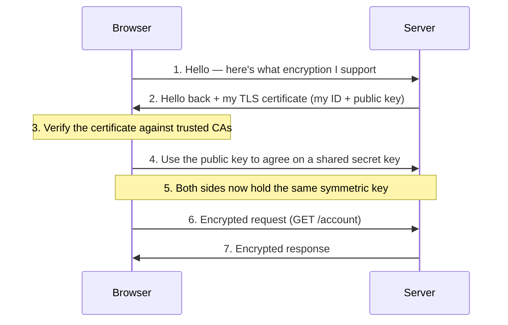

# HTTP vs HTTPS

## The Interview Question

> "What is the difference between HTTP and HTTPS?"

The throwaway answer is "the S stands for secure." True, and it gets you nowhere — it's the answer of someone who's read the acronym, not someone who knows what happens on the wire. The interviewer is waiting for the follow-up that trips most people: *"secure how, exactly — and how does your browser know the server on the other end is actually who it claims to be?"*

Because HTTPS isn't doing one thing. It's doing **two** things that people blur together: it **encrypts** your data so nobody in the middle can read it, *and* it **proves identity** so you know you're talking to the real server and not an impostor. Miss either half and you don't understand HTTPS — you understand a padlock icon.

---

## The Postcard vs the Armored Truck

**HTTP is a postcard.** You write your message — a password, a credit card number — in plain text and drop it in the mail. Every person who handles it on the way (the mail carrier, the sorting office, the hacker on the same coffee-shop Wi-Fi) can flip it over and read the whole thing. Nothing is hidden. It was never meant to be.

**HTTPS is an armored truck.** Your message goes inside a locked, reinforced vehicle. Someone watching the road can see *that* a truck is driving from you to the bank — they can see it moving — but they can't get inside, can't read what's in it, and can't swap the cargo without breaking the lock.

Hold onto that last line: **they can see the truck moving.** It's the part the padlock icon doesn't tell you, and we'll come back to it — because HTTPS hides *what* you send, not always the fact *that* you're sending it.

---

## What the "S" Actually Does: TLS

The "S" is **TLS** (Transport Layer Security). You'll hear people say "SSL certificate" — SSL is TLS's deprecated ancestor, dead since 2015. The name stuck the way "dialing" a phone did. It's TLS doing the work.

TLS wraps HTTP in two guarantees:

| Guarantee | What it means | Without it |
|---|---|---|
| **Encryption** | Data is scrambled in transit; only the two ends hold the key | Anyone on the path reads your password (the postcard) |
| **Authentication** | The server proves its identity with a certificate | You could be handing your password to an impostor |
| **Integrity** | Tampering is detectable | An attacker could silently alter the page or inject code |

Encryption alone isn't enough — you could encrypt a perfect conversation *with the wrong person*. That's why the certificate matters as much as the lock.

---

## The Handshake — How a Locked Truck Gets Built in Milliseconds

When you connect to `https://bank.com`, your browser and the server run a **TLS handshake** before any real data moves:

Two ideas make this work, and naming them is what wins the interview:

1. **The certificate carries the server's public key and its identity.** The browser uses asymmetric crypto (public/private key pairs) *just long enough* to safely agree on a shared secret.
2. **Then it switches to symmetric encryption** for the actual data. Symmetric is far faster, and now both sides hold the same key that nobody in the middle ever saw.

So asymmetric crypto solves the hard problem — *how do two strangers agree on a secret over a public wire?* — and symmetric crypto does the fast bulk work once they have it. (TLS 1.3 trimmed this to a single round trip, which is why modern HTTPS feels instant.)

---

## "How Does the Browser Know It's the Right Server?"

This is the certificate's real job, and it runs on a chain of trust.

A **Certificate Authority (CA)** — DigiCert, Let's Encrypt, Google Trust Services — is a trusted third party. Before issuing a certificate, the CA verifies you actually control `bank.com`, then signs the certificate with *its* private key. Your operating system and browser ship with a built-in list of CAs they trust.

So when the server presents its certificate, the browser checks: *was this signed by a CA I trust, is it for this exact domain, and is it still valid?* If yes, green padlock. If the certificate is **missing, expired, self-signed, or for the wrong domain**, the browser throws up the full-page **"Your connection is not private"** wall and blocks you.

This is exactly the same trust model behind [Single Sign-On](../single-sign-on/) and [API Gateway auth](../api-gateway-auth/): *one authority signs, everyone else verifies the signature with a public key.* Learn it once, you see it everywhere.

---

## What HTTPS Does NOT Hide

Back to the truck you can see moving. HTTPS encrypts the **content** of your request — the URL path, headers, body, cookies, passwords. But some metadata still leaks:

| Visible to a network observer | Hidden by HTTPS |
|---|---|
| The **server's IP address** | The specific page/path you requested |
| The **domain name** (via SNI, sent early in the handshake) | Your form data, passwords, cookies |
| The rough **size and timing** of traffic | The response content |

So a snooper on the café Wi-Fi can tell you visited `bank.com` — they just can't see your username, password, or balance. That's the difference between *"someone walked into a bank"* and *"here's their account number."* (Newer features like Encrypted Client Hello aim to hide even the domain, but it's not universal yet.) For hiding the destination itself, you'd reach for a [VPN](../vpn-vs-proxy/).

---

## "Doesn't Encryption Make It Slower?"

It's a myth — and the truth is the opposite.

- Modern CPUs have **dedicated hardware** for encryption (AES-NI). The per-byte cost is negligible.
- **TLS 1.3** cut the handshake to one round trip (0-RTT on resumption), erasing most of the old latency complaint.
- The kicker: **HTTP/2 and HTTP/3 require HTTPS in every browser.** Their big speed wins — multiplexing many requests over one connection, and HTTP/3 running on QUIC with no head-of-line blocking — are only available over TLS.

So choosing HTTP doesn't buy you speed. It costs you speed *and* security. There is no scenario in 2026 where plaintext HTTP is the right call for a real site.

---

## HTTP vs HTTPS at a Glance

| | **HTTP** | **HTTPS** |
|---|---|---|
| **Encryption** | None — plain text | TLS-encrypted |
| **Default port** | 80 | 443 |
| **Server identity** | Unverified | Proven by CA-signed certificate |
| **Tampering** | Undetectable | Detected (integrity check) |
| **Browser label** | "Not Secure" | Padlock |
| **HTTP/2, HTTP/3** | Not supported by browsers | Required |
| **Right answer for a real site** | Never | Always |

---

## TL;DR

- **HTTPS = HTTP + TLS**, and TLS gives you two things, not one: **encryption** (nobody reads your data) *and* **authentication** (you're talking to the real server, proven by a CA-signed certificate). Naming both halves is what separates a real answer from "S means secure."
- **The handshake** uses slow asymmetric crypto once — to safely agree on a shared key — then fast symmetric crypto for everything after. That's why it's secure *and* instant.
- **The certificate is a trust chain:** a CA you already trust vouches for the server. Missing/expired/wrong-domain cert → the browser blocks you.
- **HTTPS hides the content, not the metadata.** A snooper still sees the domain and IP — just not your password. For hiding the destination, that's a VPN's job.
- **Encryption isn't slower — it's the fast path.** HTTP/2 and HTTP/3 require HTTPS, so security and speed now come together. **Serve HTTPS, always.**

When the interview asks, don't stop at "S means secure." Say: "HTTPS wraps HTTP in TLS, which encrypts the data *and* proves the server's identity with a CA-signed certificate — a locked armored truck with verified plates, not a postcard."

---

## Related

- [Single Sign-On (SSO)](../single-sign-on/) — the same "one authority signs, everyone verifies the signature" trust model, applied to login
- [API Gateway Authentication](../api-gateway-auth/) — JWT signature verification is public-key crypto, just like the TLS certificate check
- [VPN vs Proxy](../vpn-vs-proxy/) — for hiding the *destination* HTTPS still leaks (domain + IP)

---

## Resources

### YouTube
- [HTTPS, SSL, TLS & Certificates explained — ByteByteGo](https://www.youtube.com/watch?v=j9QmMEWmcfo)

### Docs
- [What is HTTPS? — Cloudflare](https://www.cloudflare.com/learning/ssl/what-is-https/)
- [How TLS works — Cloudflare](https://www.cloudflare.com/learning/ssl/what-is-a-tls-handshake/)
- [TLS 1.3 — RFC 8446](https://datatracker.ietf.org/doc/html/rfc8446)
- [Let's Encrypt — Free Certificate Authority](https://letsencrypt.org/)
