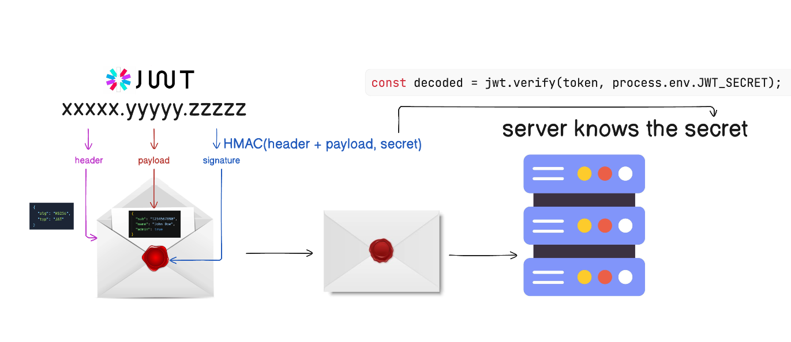

# JWT — The Signed Envelope Servers Trust Without a Database



## The Interview Question

> "What actually *is* a JWT?"

Most people answer "a token for login" and then freeze on the follow-up: *how does the server trust it without looking anything up in a database?* The whole concept fits in one analogy — and once it clicks, the storage, expiry, and revocation decisions fall out of it naturally.

---

## The Envelope Analogy

A JWT is a sealed envelope. You drop the user's data inside — their ID, their role — and seal it with a wax stamp that **only the server knows how to make**.

Here's the key property: anyone can hold the envelope up to the light and *read* what's inside (the data isn't secret), but only the server can prove the **seal** is genuine. So any server holding the secret can confirm the envelope is authentic — without calling a database to ask "is this person really logged in?" That seal is the entire trick.

---

## What's Actually Inside: Three Parts

A JWT is three Base64URL chunks joined by dots — `xxxxx.yyyyy.zzzzz`:

```
header  .  payload  .  signature
─────      ───────     ─────────────────────────────────
{"alg":    {"sub":     HMAC( base64(header) + "." +
 "HS256",   "12345",         base64(payload),  secret )
 "typ":     "role":
 "JWT"}     "admin"}
```

- **Header** — the algorithm and token type.
- **Payload** — the *claims*: user ID (`sub`), role, expiry (`exp`), etc.
- **Signature** — an HMAC of the header + payload, hashed with the server's secret.

> ⚠️ The header and payload are **Base64-encoded, not encrypted.** Anyone can decode and read them. Never put a password, an API key, or anything sensitive in the payload.

---

## How the Server Trusts It — This Is "Stateless"

Every time a request arrives, the server takes the header and payload you sent, **re-hashes them with its secret**, and checks the result against the signature on the envelope:

```js
const decoded = jwt.verify(token, process.env.JWT_SECRET);
```

If the math matches, the server trusts the claims inside — **no database row consulted.** If an attacker edited the payload to flip `"role": "user"` into `"role": "admin"`, the recomputed seal no longer matches the signature, and the token is rejected.

That's what **stateless** means: your identity rides *inside the token*, so the server doesn't need to remember you in its own memory between requests. Any server with the secret can verify you — which is exactly why JWTs scale so cleanly across many machines.

> Sibling piece: [How Global Apps Keep You Logged In](../how-global-apps-keep-you-logged-in/) goes deep on *why* this statelessness is what lets you sit behind a load balancer across regions.

---

## Where Do You Store It? An `httpOnly` Cookie.

Not `localStorage`. This is the mistake you'll see everywhere.

- **`localStorage`** is readable by any JavaScript on the page. One **XSS** hole and a rogue script reads the token straight out and ships it to an attacker.
- An **`httpOnly` cookie** physically cannot be touched by JavaScript. The browser stores it and attaches it to requests for you, behind the scenes.

Set three flags and the browser does your security:

| Flag | What it does |
|---|---|
| `HttpOnly` | JavaScript can't read it — kills XSS token theft |
| `Secure` | Only sent over HTTPS — no plaintext interception |
| `SameSite=Strict` | Not sent on cross-site requests — blocks CSRF |

> For the full localStorage-vs-cookie debate (and why a Redis denylist is "stateless theater"), see [JWT vs Session Cookies](../jwt-vs-session-cookies/).

---

## The Catch: You Can't Un-Issue a Token

Statelessness has a price. Once that envelope is sealed and handed out, it's valid until it expires — there's no central "is this still good?" switch. So the strategy is: **make tokens die fast, and rotate the thing that keeps you logged in.**

### Short-lived access token

Keep the **access token to 15 minutes, max.** If one is stolen, it's useless almost immediately.

### Rotating refresh token

Pair it with a longer-lived **refresh token** whose only job is minting new access tokens. And rotate it:

```
login            ->  access (15 min)  +  refresh
access expires   ->  present refresh  ->  NEW access  +  NEW refresh
                                          (old refresh is killed)
old refresh
shows up again   ->  🚨 it was stolen  ->  revoke the ENTIRE session
```

**Every time the refresh token is used, the server issues a fresh one and kills the old.** If a dead refresh token ever reappears, someone copied it — so you nuke the whole session. It's a tripwire: the attacker's stolen token and the user's real one can't both survive.

> The runnable version of exactly this flow lives in [`live-coding/jwt-refresh`](../../live-coding/jwt-refresh/).

---

## Logout & Revocation

| Token | On logout / compromise |
|---|---|
| **Access token** | For most apps, just let it expire — the window is ≤15 min. |
| **Refresh token** | Tracked server-side. **Revoke it in Redis** so the attacker can't mint new access tokens. |
| **Access token (banking-grade)** | Go further and **blacklist it too** — a denylist check on every request for instant kill. |

This is the honest part nobody mentions: *real* revocation needs *some* state. The craft is keeping that state minimal — just the refresh tokens — until a high-security app genuinely forces you to track access tokens as well.

---

## The Whole Setup in One Breath

**A JWT inside an `httpOnly` + `Secure` + `SameSite` cookie, short-lived access tokens, rotating refresh tokens, and Redis to revoke refresh tokens on logout.** That's the production-grade pattern.

---

## TL;DR

- A JWT is a **signed envelope** (`header.payload.signature`); the server trusts it by **re-hashing with its secret** — no DB lookup.
- Header and payload are Base64, **not encrypted** — never put secrets in the payload.
- Store it in a **`Secure`, `httpOnly`, `SameSite` cookie**. Never `localStorage`.
- **Access token ≤15 min**, paired with a **rotating refresh token**; a reused refresh token means it was stolen → kill the session.
- Revoke refresh tokens in **Redis** on logout. Banking-grade? Blacklist the access token too.

---

## Resources

### Tools
- [jwt.io](https://jwt.io) — paste a token and see the three decoded parts

### Docs
- [JSON Web Token Cheat Sheet — OWASP](https://cheatsheetseries.owasp.org/cheatsheets/JSON_Web_Token_for_Java_Cheat_Sheet.html)
- [Session Management Cheat Sheet — OWASP](https://cheatsheetseries.owasp.org/cheatsheets/Session_Management_Cheat_Sheet.html)
