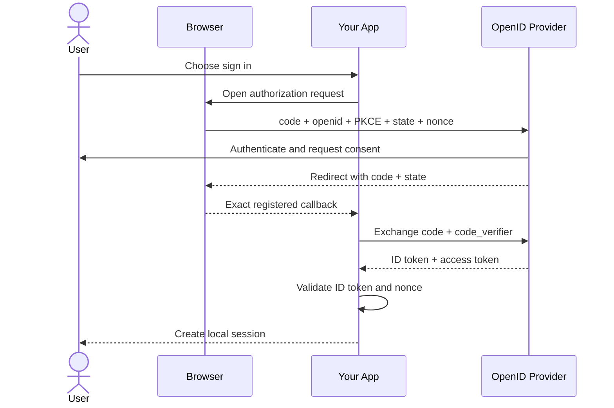

# OAuth Login Security Checklist

An OAuth login can appear to work while accepting the wrong issuer, leaking a code, or attaching the attacker's identity to the victim's session. The happy path is the easy part. The security checks around it are what make it a real login system.

**For standards-based login, use OpenID Connect (OIDC), the Authorization Code Flow, PKCE, and strict validation. Never assume generic OAuth proves identity.**

## OAuth and OIDC Solve Different Problems

| Protocol | Question it answers | Main artifact | Intended consumer |
|---|---|---|---|
| **OAuth 2.0** | What may this client access? | Access token | Resource server / API |
| **OpenID Connect** | Who authenticated, and for which client? | ID token | Client application |

OAuth 2.0 is an authorization framework; it does not define how a client authenticates an end user. OIDC adds that identity layer, requested with the `openid` scope. If a provider offers only OAuth, login depends on that provider's documented identity contract rather than generic OAuth behavior.

## The Safe Flow

Only the short-lived authorization code and correlation values such as `state` travel through the browser callback. The tokens come from the token endpoint after the code exchange.

## 1. Use OIDC for Standards-Based Login

**What it means.** When the provider supports OIDC, request the `openid` scope and use the returned ID token as its signed statement about the authentication event. An access token authorizes calls to an API; it is not proof by itself that a particular user authenticated to your client. For an OAuth-only provider, follow its explicit identity API contract and keep the integration provider-specific.

**Why it matters before deploy.** Treating any OAuth access token or profile response as login invents an authentication protocol the provider did not promise. OIDC gives you defined issuer, subject, audience, time, and replay checks.

## 2. Use Authorization Code Flow with PKCE `S256`

**What it means.** Use `response_type=code`. Generate a fresh PKCE verifier for every attempt, send its SHA-256 challenge, and present the verifier only at the token endpoint. Public clients must use PKCE; current OAuth security guidance recommends it for confidential clients too. A confidential client must still authenticate at the token endpoint using its registered method; prefer asymmetric client authentication such as `private_key_jwt` or mTLS when supported.

**Why it matters before deploy.** A stolen code is useless without the verifier, and an injected code will not match the current transaction. Do not use the Implicit Flow or the Resource Owner Password Credentials grant for new login integrations.

## 3. Lock Down Every Redirect URI

**What it means.** Pre-register the complete redirect URI and require exact string matching: no wildcards, loose prefixes, or open redirectors. Production web callbacks use HTTPS. Native apps follow RFC 8252: use an external browser, prefer claimed HTTPS redirects, and allow the defined private-scheme or loopback exceptions. Only a native loopback redirect may vary its port during exact matching. Keep callback pages free of third-party content and use a restrictive referrer policy so codes and `state` values do not leak.

**Why it matters before deploy.** If an attacker can alter the callback destination, the provider can send the authorization code to the attacker instead of your app.

## 4. Keep PKCE, `state`, and `nonce` in Their Own Lanes

| Value | Bound to | Primary job |
|---|---|---|
| PKCE verifier | Authorization code | Stops stolen or injected code redemption |
| `state` | Browser transaction | Correlates the callback and prevents login CSRF |
| `nonce` | Client session and ID token | Detects token replay and code injection |

**What it means.** Generate high-entropy, transaction-specific values, bind them to the browser session and chosen provider, and reject mismatches. Validate them before using any token, then consume the pending transaction so it cannot be replayed. PKCE can provide CSRF protection when provider support is guaranteed, but keeping a one-time `state` check is straightforward defense in depth.

**Why it matters before deploy.** These controls solve different attacks. A valid signature does not prove that a token belongs to the login attempt currently finishing in this browser.

## 5. Validate the ID Token; Never Just Decode It

**What it means.** Use a maintained OIDC library, start from an allowlisted issuer, and require discovered metadata to report that exact issuer. Before reading identity claims, verify:

- The signature with an allowed algorithm and a key from that issuer's discovered JWKS
- Exact `iss` match against the configured issuer
- `aud` contains your client ID, plus `azp` when applicable
- The required `sub` claim is present
- `exp` is still valid and `iat` is reasonable for your policy
- `nonce` matches the value stored for this transaction
- `auth_time` when you requested a maximum authentication age

If you call UserInfo, its `sub` must exactly match the ID token's `sub`.

**Why it matters before deploy.** Base64 decoding proves nothing. Without all validation checks, an expired, forged, replayed, wrong-client, or wrong-provider token can become a local session.

## 6. Identify Users by `(iss, sub)`, Not Email

**What it means.** Store the exact issuer and subject pair as the external account key. OIDC guarantees that this pair identifies the user; it does not guarantee that email is unique, permanent, or identical across providers. `email_verified=true` means the provider verified control of that address, not that it is a safe global account ID.

**Why it matters before deploy.** Automatic email-based linking can merge different people's accounts. Make account linking an explicit, authenticated action that proves control of both accounts.

## 7. Keep Every Token in Its Own Lane

| Credential | Purpose | Where it goes |
|---|---|---|
| ID token | Proves an authentication event to your client | OIDC client only |
| Access token | Authorizes a scoped API request | Intended resource server via `Authorization: Bearer ...` |
| Refresh token | Obtains replacement access tokens | Token endpoint only |

**What it means.** Request only the scopes and resources the feature needs. Never use an ID token as an API access token or an access token as user identity. Keep access, ID, and refresh tokens out of normal application URLs, redact them from logs, and never send an access token to a resource server outside its intended audience. Use audience-restricted and, when supported, sender-constrained access tokens such as DPoP or mTLS-bound tokens.

**Why it matters before deploy.** Bearer tokens grant power to whoever possesses them. Narrow scope, audience, lifetime, and exposure limit the damage of a leak.

## 8. Store Credentials for the Platform You Actually Run

**What it means.** Keep provider tokens server-side for server-rendered web apps, protect secrets at rest, and give the browser an application session cookie with `Secure`, `HttpOnly`, and an intentional `SameSite` policy. Prefer a backend-for-frontend when a browser app does not need direct token access. Native apps use the system browser for authorization and OS-protected storage such as Keychain or Keystore.

**Why it matters before deploy.** There is no universal "secure storage" API. A server secret embedded in a public SPA or native binary is not confidential, while a token exposed to JavaScript is exposed to successful XSS.

## 9. Separate Expiration, Refresh, Revocation, and Logout

**What it means.** These are separate controls:

- Keep access tokens short-lived
- Issue refresh tokens only when ongoing access is required
- For public clients, use refresh-token rotation or sender-constrained refresh tokens
- Expire inactive refresh tokens and handle replay by revoking the active token family
- Clear the local application session during logout
- Use OIDC RP-Initiated Logout when provider-session logout is required and supported
- Revoke tokens and remove the provider link during account disconnection when supported

**Why it matters before deploy.** Clearing your cookie does not revoke provider tokens, and revoking a token does not necessarily end the provider's browser session. Test each outcome independently.

## 10. Isolate and Test Every Provider

**What it means.** Allowlist provider issuers and bind the chosen issuer to the pending transaction. For clients supporting multiple providers, validate issuer identification in the authorization response or use distinct redirect URIs as the fallback mix-up defense. Never choose discovery or token endpoints from untrusted callback data.

Test denied consent, provider errors, reused codes, missing or wrong `state`, `nonce`, and PKCE verifiers, wrong issuer or audience, expired tokens, signing-key rotation, refresh replay, revocation, logout, and disconnection.

**Why it matters before deploy.** Providers differ at the edges, including which OAuth and OIDC features they support. A successful happy-path login does not prove that failure paths reject unsafe input.

---

## TL;DR

Before deploying login:

1. Prefer **OIDC** for login; never treat generic OAuth as proof of identity.
2. Use **Authorization Code Flow with PKCE `S256`**.
3. Require **exact redirect URI matching** and HTTPS for web callbacks.
4. Generate and validate fresh **PKCE, `state`, and `nonce`** values.
5. Verify the ID token's **signature, issuer, audience, time claims, and nonce**.
6. Key external accounts by **`(iss, sub)`**, never email alone.
7. Keep **ID, access, and refresh tokens** in their intended lanes.
8. Minimize scopes, token lifetime, storage exposure, and logging.
9. Test refresh, revocation, local logout, provider logout, and disconnection separately.
10. Bind every transaction to its provider and test every rejection path.

If any one of these checks is missing, the login working is not evidence that the login is secure.

---

## Resources

### Docs

- [OAuth 2.0 Security Best Current Practice - RFC 9700](https://www.rfc-editor.org/rfc/rfc9700.html)
- [OpenID Connect Core 1.0](https://openid.net/specs/openid-connect-core-1_0.html)
- [OAuth 2.0 for Native Apps - RFC 8252](https://www.rfc-editor.org/rfc/rfc8252.html)
- [OAuth 2.0 Bearer Token Usage - RFC 6750](https://www.rfc-editor.org/rfc/rfc6750.html)
- [OpenID Connect RP-Initiated Logout 1.0](https://openid.net/specs/openid-connect-rpinitiated-1_0.html)