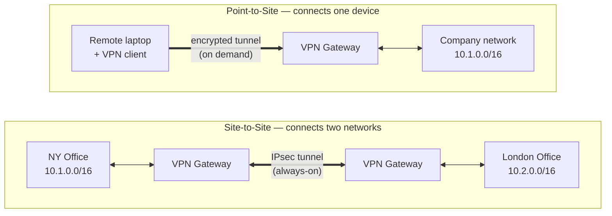

# Point-to-Site vs Site-to-Site VPN

## The Interview Question

> "Explain the difference between a Point-to-Site and a Site-to-Site VPN."

Most people answer "they're both VPNs, they both encrypt traffic" and stall. That's true and useless — it's like saying a motorbike and a freight train both have engines. The interviewer isn't testing whether you know what a VPN is. They're testing whether you know **what's on each end of the tunnel.**

The whole distinction collapses to one question: *are you connecting a **person** or a **place**?* Get that, and every follow-up — who installs what, who authenticates, what scales — falls out on its own.

---

## The Skyscraper Analogy

Picture a company's private network as a highly secure skyscraper. The good stuff lives inside, and the walls keep the public internet out.

**Site-to-Site** is a **private skybridge built directly between two skyscrapers** — the New York office and the London office. The routers on each end handle everything; employees just walk across. Most of them don't even know the bridge exists. The *buildings* are connected, so everyone inside them is too, automatically.

**Point-to-Site** is for the engineer working from a coffee shop. They're not in the building. So they order a **personal armored Uber**: they launch a VPN client on their specific laptop, and it encrypts their data and drives it safely through the public internet into the skyscraper's secure basement. One person, one car, one trip.

That's the entire idea: **a skybridge connects two buildings; an armored car brings one person in.** Now let's look at what's actually happening under the asphalt.

---

## What's Actually on Each End of the Tunnel

A VPN is just an encrypted tunnel. The only thing that changes between these two is **what sits at each end** — and that one fact drives everything else.

**Site-to-Site:** the tunnel runs **gateway to gateway** — a VPN device (router/firewall) at each site. The tunnel is **always on**, and it links entire subnets. No individual laptop has VPN software; the gateways do all the work, so to an employee in NY, a server in London just looks like another machine on the network. You're stitching two networks into one.

**Point-to-Site:** the tunnel runs **client to gateway** — software on one device dials into the company's VPN gateway **on demand**. It connects exactly one machine to the network. Close the laptop, the tunnel's gone. Open it at the coffee shop tomorrow, you build a fresh one.

---

## The Differences That Actually Matter

| | **Site-to-Site** | **Point-to-Site** |
|---|---|---|
| **What it connects** | Two whole networks (place ↔ place) | One device (person ↔ place) |
| **Tunnel endpoints** | Gateway ↔ gateway | Client software ↔ gateway |
| **Client install** | None — transparent to users | VPN client on every device |
| **Lifetime** | Persistent, always-on | On-demand, per-session |
| **Who authenticates** | The *site* (shared key / gateway cert) | The *user/device* (certs, credentials, MFA) |
| **Typical protocol** | IPsec / IKEv2 | WireGuard, OpenVPN, IKEv2, SSTP |
| **Scales with** | Number of offices (a handful) | Number of remote people (hundreds/thousands) |
| **Classic use** | Branch office ↔ HQ, office ↔ cloud | Remote worker, contractor, you at a café |

The line that wins the interview: **Site-to-Site connects two networks; Point-to-Site connects one device to a network.** Everything in the table is a consequence of that.

---

## The Detail Most People Miss: *Who* Authenticates

This is the follow-up that separates "watched a video" from "understands it."

- In **Site-to-Site**, the two **gateways** authenticate *each other* — usually with a pre-shared key or certificates exchanged once during setup. After that, every employee behind the gateway is trusted by association. The network vouches for the people; nobody logs in individually.
- In **Point-to-Site**, the **individual device/user** authenticates — certificates, credentials, often MFA. This is why P2S pairs naturally with your identity provider (see [Single Sign-On](../single-sign-on/)): each person proves who they are before the armored car picks them up.

That's a real security difference, not trivia. With Site-to-Site, the trust boundary is the *building* — anyone inside the NY office gets London access. With Point-to-Site, the trust boundary is the *person*. When a contractor leaves, you revoke one certificate; you don't touch the skybridge.

---

## When to Use Each

### ✅ Reach for Site-to-Site when…

| Scenario | Why |
|---|---|
| Connecting a branch office to HQ | Everyone at the branch needs everything at HQ, always. Persistent and transparent wins. |
| Linking your office to a cloud VNet/VPC | Servers on both sides should see each other as one network, no per-app config. |
| Two data centers that must replicate | Always-on, high-throughput, gateway-managed. |

### ✅ Reach for Point-to-Site when…

| Scenario | Why |
|---|---|
| Remote employees / work-from-anywhere | Per-device, on-demand, per-user auth. The classic case. |
| Contractors needing temporary access | Issue a cert, revoke it when they're done. No infra changes. |
| An admin occasionally connecting to prod | You don't build a permanent bridge for an occasional visitor. |

**The honest answer is "both."** A real company runs Site-to-Site between its offices and cloud, *and* Point-to-Site for its remote staff. They're not competitors — they solve different sentences: *connect these two places* vs *let this one person in.*

---

## Production Considerations

| Decision | What to think about |
|---|---|
| **Split tunneling (P2S)** | Decide whether *all* the laptop's traffic goes through the tunnel, or only company-bound traffic. Full-tunnel is more secure but routes Netflix through HQ too. |
| **High availability (S2S)** | The gateway is a single point of failure for a whole site. Run redundant gateways / dual tunnels — if the skybridge drops, the office is cut off. |
| **Overlapping IP ranges** | Two sites both using `10.0.0.0/24` can't be bridged cleanly. Plan non-overlapping subnets *before* you connect them. |
| **VPN is a perimeter, not a policy** | Once inside, a device often sees the whole network. Pair VPN with network segmentation — or move toward Zero Trust, where every request is authorized regardless of "inside vs outside." |
| **Prefer modern protocols** | WireGuard for P2S where supported (fast, simple, smaller attack surface). IPsec/IKEv2 remains the workhorse for S2S. Avoid legacy PPTP entirely. |

---

## TL;DR

- **One question decides it:** are you connecting a **place** or a **person**? Place → Site-to-Site. Person → Point-to-Site.
- **Site-to-Site** = gateway-to-gateway tunnel linking two whole networks. Always-on, no client on user devices, the *site* authenticates. Use it for office↔HQ and office↔cloud.
- **Point-to-Site** = client-to-gateway tunnel for a single device. On-demand, VPN app required, the *user* authenticates (often with MFA). Use it for remote workers and contractors.
- **The security difference is the trust boundary:** S2S trusts the building, P2S trusts the individual — which is why revoking access is one cert in P2S and a topology change in S2S.
- **Most companies run both.** They're not rivals; they answer different sentences.

When the interview asks, don't say "they both encrypt traffic." Say: "Site-to-Site connects two networks gateway-to-gateway; Point-to-Site connects one device through a client — a skybridge versus an armored car."

---

## Related

- [VPN vs Proxy](../vpn-vs-proxy/) — the consumer-side question: when you even need a VPN versus a proxy
- [Single Sign-On (SSO)](../single-sign-on/) — how Point-to-Site VPNs authenticate the individual user behind the device
- [How Global Apps Keep You Logged In](../how-global-apps-keep-you-logged-in/) — the broader "who are you and can you be here" layer

---

## Resources

### YouTube
- [What is a VPN and How Does it Work? — PowerCert](https://www.youtube.com/watch?v=R-JbDc1zQYg)

### Docs
- [Azure VPN Gateway — Point-to-Site vs Site-to-Site](https://learn.microsoft.com/en-us/azure/vpn-gateway/vpn-gateway-about-vpngateways)
- [AWS Site-to-Site VPN](https://docs.aws.amazon.com/vpn/latest/s2svpn/VPC_VPN.html)
- [WireGuard — Protocol Overview](https://www.wireguard.com/)
- [IPsec — RFC 4301](https://datatracker.ietf.org/doc/html/rfc4301)
