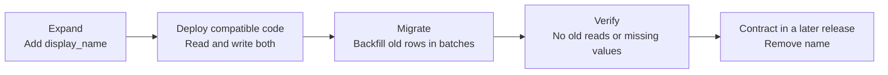

# Production Database Migration Checklist — Change the Schema Without Taking Down the App

The migration worked in development, so you run the same `ALTER TABLE` in production. Then it waits on a lock, application requests pile up behind it, replicas fall behind, and the rollback script cannot recover the rows you already changed.

A production database migration is like repairing a busy road **while traffic is still moving**. The goal is not merely to reach the new schema. The old and new application versions must keep working throughout the journey, and you need a rehearsed exit at every stage.

We will use one example throughout: renaming `users.name` to `users.display_name` without taking the API offline.

## The Safe Shape: Expand → Migrate → Contract

Do not rename or drop the old column in one release. Give the application a period where both schemas can coexist.



| Phase | Database | Application |
|---|---|---|
| **Expand** | `name` and `display_name` both exist | Old version still uses `name` |
| **Migrate** | Existing rows are copied gradually | New version writes both and reads `display_name`, falling back to `name` |
| **Contract** | `name` is removed later | Every running version uses only `display_name` |

That overlap is not wasted work. It is what makes gradual deployment and application rollback possible.

## 1. Define Success and Stop Conditions Before You Start

**What it means.** Write down the expected duration, affected rows, acceptable database load, and the exact signals that will pause or stop the migration. A vague plan like “watch the dashboard” is not a stop condition.

**Why it matters before the migration.** During an incident, people negotiate with bad metrics because stopping feels like failure. Decide while calm: for example, pause if lock waits exceed 5 seconds, API error rate rises above 1%, or replica lag exceeds 30 seconds. Your numbers will differ, but they must exist before the first production batch.

## 2. Prove the Backup Can Be Restored

**What it means.** Restore the latest backup into an isolated database, run integrity checks, and time the complete process. Confirm both **RPO** (how much recent data you could lose) and **RTO** (how long recovery would take) are acceptable.

**Why it matters before the migration.** A backup file is only evidence that a backup job ran. It does not prove the file is complete, the key can decrypt it, the restore command works, or recovery finishes before the business runs out of patience. A backup you have never restored is a hope, not a recovery plan.

## 3. Rehearse on Production-Sized Data

**What it means.** Run the exact migration against a recent, sanitized copy with similar row counts, indexes, and data distribution. Record runtime, locks, temporary disk use, transaction log growth, and replica impact. Check your database engine and version because the same statement can behave differently across them.

**Why it matters before the migration.** Adding a column may finish instantly on 1,000 development rows and rewrite a 500-million-row production table. Building a new index may require space for the old table, the index under construction, and extra WAL or binlog data at the same time. Production scale changes the operation.

> “The SQL is valid” and “the SQL is safe under production load” are different claims.

## 4. Understand the Lock Before Running the Statement

**What it means.** Identify which lock each schema statement requests, how long it holds that lock, and whether your engine offers an online or concurrent alternative. Set a short lock timeout so the migration fails instead of waiting indefinitely and creating a queue behind it.

**Why it matters before the migration.** Even a fast metadata change can be dangerous: it may wait behind one long-running query, then block every request queued after it. For large indexes, use the database's online option where available, such as PostgreSQL's `CREATE INDEX CONCURRENTLY`, and rehearse its failure and cleanup behavior too.

## 5. Expand First, Then Deploy Compatible Code

**What it means.** Add the new structure without deleting the old one. For our example, add a nullable `display_name` column. Then deploy code that writes both columns in one transaction and reads the new value with a fallback:

```text
write: name = value AND display_name = value
read:  display_name if present, otherwise name
```

**Why it matters before the migration.** Rolling, canary, and blue-green deployments temporarily run old and new application versions together. If the migration renames `name` immediately, old instances crash. During expand-and-contract, either version can serve traffic, and rolling the application back does not require reversing the schema.

## 6. Backfill Existing Rows in Small, Resumable Batches

**What it means.** Copy old values into the new column a small group at a time. Commit each batch, save a checkpoint such as the last processed primary key, make the operation idempotent, and sleep or throttle between batches when database load rises.

```text
repeat until no rows remain:
    load the next 1,000 rows after the checkpoint
    copy name → display_name where display_name is still empty
    commit and save the new checkpoint
    pause if a stop condition is reached
```

**Why it matters before the migration.** One giant update creates a long transaction, holds locks, generates a burst of replication data, and may need to restart from zero after failure. Small commits release pressure quickly. Checkpoints make pause and resume ordinary operations rather than emergency inventions.

## 7. Roll Out Gradually and Watch the Whole System

**What it means.** Start during a quiet period with one small batch or tenant, inspect the result, then increase the rate in steps. Watch the database, application, replicas, and migration worker together.

| Watch | What trouble looks like |
|---|---|
| **Lock waits** | Requests queue behind migration work |
| **Query latency and errors** | Users are paying for the migration |
| **Replication lag** | Read replicas or failover targets are falling behind |
| **CPU, I/O, and connections** | The database has no headroom left |
| **Free storage** | Indexes, table copies, or logs may fill the disk |
| **Backfill progress** | Throughput stalls or the remaining-row count stops falling |

**Why it matters before the migration.** “The migration process is still running” does not mean the system is healthy. Gradual execution limits the blast radius, while explicit stop conditions turn monitoring into an action: pause, investigate, and resume only when the system recovers.

## 8. Contract Only After Compatibility Is Proven

**What it means.** Verify every row has `display_name`, compare old and new values, confirm no deployed code reads `name`, and observe the new path for a full release cycle. Only then enforce new constraints, stop dual writes, and remove the old column in a separate migration.

**Why it matters before the migration.** Dropping data is the point where a simple application rollback stops working. Keep two recovery paths: roll back the application while the old schema remains, or ship a tested forward fix if the data transformation itself is wrong. Restoring the whole database is the last resort because it can discard valid writes made after the backup.

## TL;DR

Before a production database migration, walk the checklist:

1. **Set stop conditions** — decide exactly when to pause before pressure changes your judgment.
2. **Restore the backup** — prove recovery works and measure how long it takes.
3. **Rehearse at production scale** — measure runtime, locks, disk, logs, and replication impact.
4. **Know the lock** — use timeouts and online or concurrent operations where available.
5. **Expand first** — keep old and new application versions compatible.
6. **Backfill in batches** — checkpoint, commit, throttle, pause, and resume safely.
7. **Roll out gradually** — watch user impact and database health, not just job status.
8. **Contract later** — delay destructive changes until compatibility and data are proven.

Never make “apply the schema, transform every row, and delete the old structure” one production event. Expand, migrate, verify, then contract in a later release.

---

## Resources

### Related in this cookbook
- [Database Indexes](../database-indexes/) — why index creation changes write cost and disk usage
- [Bulk Loads & Indexes](../bulk-loads-and-indexes/) — how large writes interact with indexes and production traffic
- [The CI/CD Pipeline That Earns a One-Word Deploy](../ci-cd-pipeline/) — where versioned migrations fit into deployment

### Docs
- [PostgreSQL — Explicit Locking](https://www.postgresql.org/docs/current/explicit-locking.html)
- [PostgreSQL — Building Indexes Concurrently](https://www.postgresql.org/docs/current/sql-createindex.html#SQL-CREATEINDEX-CONCURRENTLY)
- [Prisma Data Guide — The Expand and Contract Pattern](https://www.prisma.io/dataguide/types/relational/expand-and-contract-pattern)