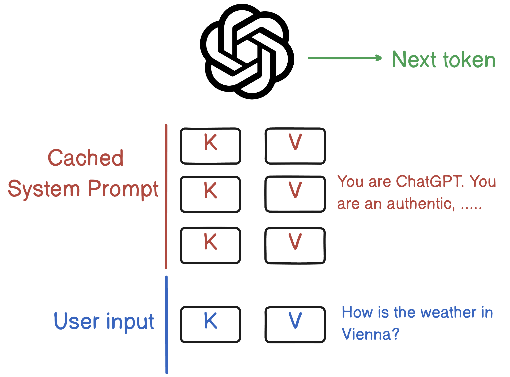

# Prompt Caching — Stop Paying to Re-Read the Same System Prompt



## The Interview Question

> "Your chatbot sends the same 2,000-token system prompt on every single request. Is that efficient?"

No — and understanding *why* it's wasteful, and how prompt caching fixes it, means understanding one thing about how transformers actually generate text. Once that clicks, the optimization is obvious.

---

## The Setup: Every Chatbot Has a Hidden Preamble

When you build on an LLM, you don't just send the user's message. You prepend a **system prompt** — the instructions that shape every reply: *"You are a support agent for Acme. Be concise. Never reveal internal pricing…"* It can be hundreds or thousands of tokens, and it's **identical on every request.**

The user's question changes. The system prompt does not. So if you send both, in full, every time — you're paying to process the exact same preamble over and over.

---

## Why That's Expensive: the KV Cache

Here's the part the image shows. To produce the next token, a transformer runs **attention**: for every token in the input, it computes a **Key (K)** and a **Value (V)** vector. The model attends over all those K/V pairs to decide what comes next.

```
"You are ChatGPT. You are ..."   →  [K,V] [K,V] [K,V] ...   ← system prompt
"How is the weather in Vienna?"  →  [K,V]                    ← user input
                                          ↓
                                     next token
```

Computing those K/V pairs is the **expensive step** (the "prefill"). And here's the waste: the K/V pairs for the system prompt are **exactly the same every request**, because the text is the same. You're recomputing an identical result, burning compute and adding latency, on every single call.

---

## The Fix: Cache the K/V Pairs for the Stable Prefix

**Prompt caching stores the computed K/V pairs for the unchanging prefix so the model skips recomputing them.** On the next request, it loads the system prompt's K/V from cache and only computes K/V for the *new* user question.

That's the whole idea, straight from the script:

> Save the Key/Value pairs for the system prompt, compute them only for the user question → save a huge amount of computation every single time.

You get two wins:
- **Cheaper** — cached input tokens are billed at a fraction of the normal rate (on Claude, cache reads are ~10% of the base input price).
- **Faster** — skipping the prefill for thousands of tokens cuts time-to-first-token dramatically.

---

## The One Rule: It's a Prefix Match

Caching works on the **prefix** — the model reuses cached K/V only up to the first byte that differs. Change one character early in the prompt and everything after it must be recomputed.

**So order your prompt stable → volatile:**

| Put first (cache this) | Put last (changes every request) |
|---|---|
| System prompt / instructions | The user's question |
| Few-shot examples | Retrieved RAG chunks for *this* query |
| Tool definitions | Timestamps, request IDs, session data |

⚠️ The silent killer: interpolating something like `Current time: 14:32:07` into the *top* of your system prompt. It looks harmless, but it changes the prefix every request — so **nothing caches.** Keep the volatile bits at the end.

---

## The Fine Print

- **Minimum size** — prefixes below ~1,000–2,000 tokens (provider-dependent) won't cache. Caching shines on *large*, reused context.
- **It expires** — cached entries have a short TTL (commonly ~5 minutes), refreshed on each hit. Great for active conversations; a cold first request still pays full price.
- **Write cost** — the first request *writes* the cache at a small premium (~1.25× on Claude), then every subsequent read is cheap. It pays for itself after about two hits.
- **Widely available** — Anthropic (Claude), OpenAI, and Google all offer it; the mechanism is the same, the knobs differ.

---

## TL;DR

- A transformer computes **Key/Value pairs** for every input token to generate the next one — and that prefill is the expensive part.
- Your system prompt is **identical every request**, so recomputing its K/V pairs is pure waste.
- **Prompt caching** stores the K/V for the stable prefix and recomputes only the new user input — cheaper (cache reads ~10× cheaper) and faster (lower time-to-first-token).
- It's a **prefix match**: put stable content (system prompt, examples, tools) first and volatile content (the question, timestamps) last — one early change busts the whole cache.

---

## Resources

### Docs
- [Prompt caching — Anthropic](https://platform.claude.com/docs/en/build-with-claude/prompt-caching)
- [Prompt caching — OpenAI](https://platform.openai.com/docs/guides/prompt-caching)
- [Context caching — Google Gemini](https://ai.google.dev/gemini-api/docs/caching)
