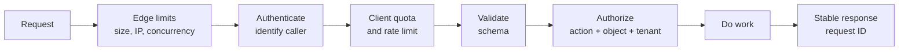

# Public API Launch Checklist

Your API works in Postman. Then real clients arrive: one changes `customer_id`, another retries a timed-out payment, and a third asks for one million rows. A public API is not ready when the happy path works. It is ready when unsafe requests fail predictably and normal clients can recover safely.

**Treat the API as a contract strangers will automate against. Authorize every protected action, bound every input, make retries explicit, and never break clients silently.**



## 1. Authorize the Action, Object, and Tenant

**What it means.** A valid token proves who called; it does not grant every record. Every protected operation must check the requested action and resource. In a multi-tenant API, derive the tenant from the verified identity, never from a client-controlled body or query parameter. Apply the same rules to lists, nested routes, bulk actions, exports, and individual records.

```python
statement = select(Order).where(
    Order.id == order_id,
    Order.tenant_id == principal.tenant_id,
)
order = session.scalar(statement)

if order is None:
    raise HTTPException(status_code=404, detail="Order not found")

require_permission(principal, "orders:read", order)
```

Filtering by tenant prevents a cross-tenant row from entering application logic. The permission check then handles roles, ownership, and sharing inside that tenant. Returning `404` for an inaccessible object can avoid revealing whether another tenant's record exists.

**Why it matters before launch.** Changing `/orders/123` to `/orders/124` must never reveal somebody else's order. This is Broken Object Level Authorization, not an authentication failure. See [Authentication vs Authorization](../authentication-vs-authorization/) for the full model.

## 2. Validate Every Input Boundary

**What it means.** Validate path parameters, query parameters, headers, and bodies before business logic. Enforce types, ranges, lengths, formats, allowed values, and allowed fields. Put a request-body limit at the server or gateway before parsing, and enforce response serialization against explicit schemas so internal fields cannot leak.

```python
from pydantic import BaseModel, ConfigDict, EmailStr, Field

class CreateUserRequest(BaseModel):
    model_config = ConfigDict(extra="forbid", strict=True)

    email: EmailStr
    age: int = Field(ge=18, le=120)
    display_name: str = Field(min_length=1, max_length=80)
```

An OpenAPI `format` can be documentation rather than an enforced check, depending on the validator. Verify that your runtime library actually validates the formats you depend on. For writes, rejecting unknown fields blocks overposting such as a hidden `"role": "admin"`.

Use parameters for data values instead of building SQL strings:

```python
db_cursor.execute(
    "SELECT id, email FROM users WHERE email = %s",
    (payload.email,),
)
```

Placeholder syntax varies by database driver. Table names, column names, and sort directions usually cannot be bound as values, so choose those from a server-side allowlist. Go deeper with [Pydantic Validation](../../live-coding/pydantic-validation/) and [SQL Injection](../sql-injection/).

**Why it matters before launch.** Validation protects your business rules and resource limits; parameterization protects the query structure. You need both.

## 3. Stop Abuse Before Expensive Work

**What it means.** Use layered limits because each control answers a different question.

| Control | What it limits | Good key |
|---|---|---|
| Edge limit | Anonymous floods, body size, connections | Trusted client IP or connection |
| Rate limit | Requests in a short window | API client, user, or tenant |
| Quota | Total use in a billing or service period | Subscription or tenant |
| Concurrency limit | Expensive work running at once | Endpoint and tenant |

Authenticate early enough to identify the caller, then enforce client and tenant limits before database scans, model calls, exports, or third-party charges. Use a shared, atomic store when multiple API instances enforce the same limit. Return `429 Too Many Requests` for client rate limits and include `Retry-After` when you can give a meaningful retry time. Alert on unusual denials, traffic shape, and cost, not only total request count.

**Why it matters before launch.** Rate limiting reduces brute force, automation abuse, and surprise cost, but it is only one layer and is not complete DDoS protection. The runnable [Rate Limiting](../../live-coding/rate-limiting/) example shows the basic mechanism.

## 4. Make Retries Explicitly Safe

**What it means.** A timeout tells the client that it did not receive the result; it does not prove the server did nothing. Use HTTP method semantics correctly and document which operations clients may retry.

| Method | Safe | Idempotent by HTTP semantics | Important caveat |
|---|---|---|---|
| `GET` | Yes | Yes | The resource can change, so the next response can differ |
| `PUT` | No | Yes | Repeating it has the same intended effect when implemented correctly |
| `DELETE` | No | Yes | Later responses may differ even when the intended effect is the same |
| `POST` / `PATCH` | No | Not guaranteed | Add application-level retry protection when needed |

For a payment or order creation, an idempotency key is a common pattern:

```text
scope       = (tenant_id, operation, idempotency_key)
fingerprint = hash(canonical_request)

atomically reserve scope + fingerprint
if the same request already completed: return its original status and body
if the key was reused for different input: reject the request
if the same request is still running: return the documented in-progress result
otherwise: perform the operation once and persist its result
```

Scope keys to the caller and operation, compare a request fingerprint, handle concurrent duplicates atomically, store the original result, and document key expiry. A cache lookup alone is unsafe because two requests can miss at the same time. Coordinate the idempotency record with the business write so a crash does not quietly perform the side effect and lose its result.

The `Idempotency-Key` name is widely used, but as of September 2026 its IETF document is an expired Internet-Draft, not an RFC. Your API must document its exact behavior. Clients should still retry only documented transient failures, use exponential backoff with jitter, and honor `Retry-After`.

**Why it matters before launch.** Without an idempotency design, one timed-out `POST /charges` can become two charges.

## 5. Keep Every List Bounded and Stable

**What it means.** Require a default page size and enforce a maximum. Sort by a deterministic key with a unique tie-breaker, then return an opaque next cursor bound to the tenant, filters, and sort order.

```sql
SELECT id, created_at, total
FROM orders
WHERE tenant_id = :tenant_id
  AND (
      created_at < :cursor_time
      OR (created_at = :cursor_time AND id < :cursor_id)
  )
ORDER BY created_at DESC, id DESC
LIMIT :page_size_plus_one;
```

The extra row tells the server whether another page exists. A matching composite index such as `(tenant_id, created_at, id)` often supports this access pattern; see [Composite Indexes](../composite-indexes/). Validate or sign opaque cursors rather than trusting decoded client values.

**Why it matters before launch.** Unbounded lists exhaust memory and database time. Offset pagination can also become slow at deep pages and can shift under inserts or deletes. Cursor pagination reduces those problems, but it does not automatically provide a frozen snapshot; promise snapshot consistency only if you implement it.

## 6. Evolve the Contract Without Surprises

**What it means.** Keep documented behavior compatible inside a version. New endpoints and optional request parameters are usually additive. Removing or renaming fields, changing types or meanings, making optional input required, and changing status or error semantics are breaking changes. Even adding an enum value can break clients that assumed the old list was exhaustive.

Choose one clear versioning strategy, such as `/v1`, a media type, or a documented header. Run old and new versions together during migration. For a retiring resource, standards-based response hints can make the timeline visible:

```http
Deprecation: @1798761600
Sunset: Thu, 01 Jul 2027 00:00:00 GMT
Link: <https://developer.example.com/migrate/v1-to-v2>; rel="deprecation"; type="text/html"
```

`Deprecation` announces when use becomes discouraged; it does not switch the endpoint off. `Sunset` hints when the resource is expected to become unavailable. Publish a migration guide, notify active clients, measure remaining old-version traffic, and give a realistic window before removal.

**Why it matters before launch.** Once customers generate SDKs and automate workflows, your response shape is their code. Silent breaking changes turn your deployment into their outage.

## 7. Make Failures Stable and Traceable

**What it means.** Use the HTTP status code that matches the outcome, then return one documented machine-readable shape. RFC 9457 Problem Details is a standard option:

```http
HTTP/1.1 404 Not Found
Content-Type: application/problem+json
X-Request-ID: req_8f29ab4c10

{
  "type": "https://api.example.com/problems/not-found",
  "title": "Resource not found",
  "status": 404,
  "detail": "The requested resource was not found.",
  "instance": "urn:request:req_8f29ab4c10",
  "request_id": "req_8f29ab4c10"
}
```

Clients branch on the HTTP status and stable problem `type`, not the human-readable `detail`. Keep the body status equal to the real HTTP status. The `request_id` extension and `X-Request-ID` header shown here are API conventions, not fields defined by RFC 9457, so document their format. Generate or validate request IDs at your boundary, return them on success and failure, and carry them through logs, metrics, and traces. A request ID is for correlation, not authentication.

Redact authorization headers, API keys, cookies, secrets, and unnecessary personal data from logs. Keep stack traces and database details internal. The [HTTPException guide](../../live-coding/http-exception-error-handling/) covers status-code choices in more detail.

**Why it matters before launch.** A stable error contract lets clients decide whether to fix input, reauthenticate, wait, or contact support. The request ID lets your team find the same failure without exposing internals.

## 8. Test the Docs, Rollout, and Rollback

**What it means.** Publish an OpenAPI description covering authentication, schemas, examples, errors, pagination, limits, and idempotency behavior. Run examples and contract tests in CI so the docs cannot drift unnoticed.

Release gradually by internal client, allowlist, tenant, or traffic percentage. Watch latency, errors by endpoint and version, saturation, authorization denials, throttling, and business outcomes. Rehearse rollback before launch, including configuration, workers, and backward-compatible database changes. The [Production Database Migration Checklist](../production-database-migration-checklist/) explains why old and new application versions must coexist safely.

Remember that rolling code back does not reverse a payment, message, or corrupted row already produced. Define how to reconcile committed side effects as well as how to stop new ones. Use the broader [Backend API Deployment Checklist](../backend-api-deployment-checklist/) for secrets, CORS, credentials, and infrastructure checks.

**Why it matters before launch.** Documentation is executable customer infrastructure, and a rollback plan is useful only if the old version can actually run against today's data and configuration.

---

## TL;DR

Before launching a public API:

1. **Authorize every protected action and object** inside the caller's tenant.
2. **Validate and bound every input**, reject unsafe fields, and parameterize query values.
3. **Layer rate limits, quotas, and concurrency limits** before expensive work.
4. **Design retries deliberately** with correct HTTP semantics and robust idempotency handling.
5. **Bound and stabilize pagination** with deterministic ordering and a unique tie-breaker.
6. **Preserve contracts**; version breaking changes and publish a real deprecation window.
7. **Standardize errors and request IDs** without leaking sensitive logs or internals.
8. **Test documentation, stage the rollout, and rehearse rollback plus reconciliation.**

If clients cannot tell what happened, retry safely, or survive your next deployment, the API is not ready to be public.

---

## Resources

### Docs

- [HTTP Semantics - RFC 9110](https://www.rfc-editor.org/rfc/rfc9110.html)
- [Additional HTTP Status Codes, including 429 - RFC 6585](https://www.rfc-editor.org/rfc/rfc6585.html)
- [Problem Details for HTTP APIs - RFC 9457](https://www.rfc-editor.org/rfc/rfc9457.html)
- [The Deprecation HTTP Response Header Field - RFC 9745](https://www.rfc-editor.org/rfc/rfc9745.html)
- [The Sunset HTTP Header Field - RFC 8594](https://www.rfc-editor.org/rfc/rfc8594.html)
- [OWASP API Security Top 10 - 2023](https://owasp.org/API-Security/editions/2023/en/0x11-t10/)
- [OpenAPI Specification 3.2.0](https://spec.openapis.org/oas/v3.2.0.html)
- [Idempotency-Key HTTP Header Field - expired IETF Internet-Draft](https://datatracker.ietf.org/doc/draft-ietf-httpapi-idempotency-key-header/)