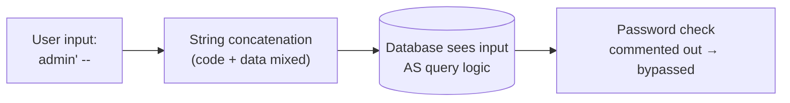

# SQL Injection — Why Hackers Love Login Pages

## The Hook

> "Why do hackers love login pages?"

Because a login page is a public form that talks directly to your database — and most of the time, it's built by trusting whatever the user typed. A login form is an attacker's favorite door precisely because it's *meant* to be used by strangers, and behind it sits the one thing they actually want: your users table.

To see the attack, you first have to see how the backend checks a password. The naive version looks reasonable, ships fast, and works perfectly in every demo. It's also the single most exploited bug in the history of the web.

---

## How a Login Check Actually Works

When you submit a username and password, the backend asks the database: *is there a row that matches?* The naive implementation builds that question by gluing your input into a string:

```python
# 🚨 vulnerable — user input concatenated straight into SQL
query = "SELECT * FROM users WHERE username = '" + username + "' AND password = '" + password + "'"
```

Type `alice` / `hunter2` and the database receives exactly what you'd expect:

```sql
SELECT * FROM users WHERE username = 'alice' AND password = 'hunter2'
```

One row comes back, the passwords match, you're in. Looks fine. The problem is that the database has no idea which parts of that string were *your code* and which parts were *the user's data*. It's all just one string of text — and that confusion is the entire vulnerability.

---

## The Attack: Breaking Out of the Quotes

An attacker doesn't type a username. They type a username **plus SQL syntax**. Watch what happens when the username field gets this:

```
admin' --
```

Glue it into the template and the database now sees:

```sql
SELECT * FROM users WHERE username = 'admin' --' AND password = 'anything'
```

Two characters did all the damage:

- The **`'`** closes the username string early — the attacker has "broken out" of the data and is now writing query *logic*.
- The **`--`** starts a SQL comment, so everything after it — *including the entire password check* — is ignored by the database.

The query the database actually runs is just:

```sql
SELECT * FROM users WHERE username = 'admin'
```

If the `admin` user exists, a row comes back, and the attacker is logged in as admin **without knowing the password.** That's SQL injection. And it gets worse — the classic that doesn't even need a valid username:

```
' OR '1'='1
```

→ `WHERE username = '' OR '1'='1'` → `1=1` is always true → returns *every* row, often logging the attacker in as the first user in the table.



---

## The Root Cause (Say This in the Interview)

SQL injection is not a "bad input" problem. It's a **code-versus-data confusion** problem.

When you concatenate, the SQL command and the user's data arrive at the database as **one inseparable string**. The database parses the whole thing as instructions, so any SQL the attacker smuggles into the "data" gets executed as **code**. The flaw isn't that the user typed a quote — it's that your code gave the user's text the authority to *become* part of the query.

That reframing matters because it tells you which fixes are real and which are theater.

---

## The Fix: Parameterized Queries (Not Escaping)

The instinct is to hunt for dangerous characters — strip quotes, block `--`, escape apostrophes. **Don't make this your defense.** Blacklists are leaky (encodings, Unicode look-alikes, comment variations all slip through), and escaping by hand is exactly the manual step you'll eventually get wrong.

The actual cure is **parameterized queries** (a.k.a. prepared statements). You send the query *structure* and the *data* to the database **separately**:

```python
# ✅ safe — query and data travel on separate channels
query = "SELECT * FROM users WHERE username = %s AND password = %s"
cursor.execute(query, (username, password))
```

Here's why this kills the attack at the root: the database **compiles the query plan first**, with `%s` as fixed placeholders. The values you pass are then bound *into those slots as pure data* — never re-parsed as SQL. Now `admin' --` is treated as a literal username string: the database goes looking for a user literally named `admin' --`, finds nobody, and rejects the login. The attacker's quotes and dashes are just characters in a search, because **data can no longer cross into the code channel.**

| | **Escaping / blacklisting input** | **Parameterized queries** |
|---|---|---|
| What it does | Tries to neutralize bad characters | Separates code from data entirely |
| Fails when | A new encoding/edge case slips the filter | Never — data can't become code |
| Effort | Manual, per-query, easy to forget | Built into every DB driver |
| Verdict | Theater | **The fix** |

---

## Defense in Depth (Belt *and* Suspenders)

Parameterized queries stop injection. These limit the blast radius if something else slips:

| Layer | What it buys you |
|---|---|
| **Use an ORM / query builder** | SQLAlchemy, Prisma, Hibernate parameterize by default. (But raw/`text()` queries reintroduce the risk — stay parameterized even there.) |
| **Least-privilege DB user** | The app's DB account shouldn't be able to `DROP TABLE` or read other schemas. If injected, the damage is capped. |
| **Input validation** | Reject obviously-wrong input (a username with 2,000 chars). A *sanity* check, never your *security* boundary. |
| **Hash passwords** | This query shouldn't compare plaintext passwords at all — store bcrypt/argon2 hashes, so a dumped table isn't a list of usable passwords. |
| **WAF** | A web application firewall catches known injection patterns at the edge — a net under the tightrope, not the rope. |

The mental model: **parameterized queries are the cure; everything else is damage control for the day a raw query sneaks in.**

---

## It's Bigger Than Login Bypass

Auth bypass is the demo, not the ceiling. The same flaw lets an attacker:

- **Exfiltrate data** — `UNION SELECT credit_card FROM payments` bolts a second query onto yours and returns data from tables the login page never meant to expose.
- **Blind SQLi** — even when no data is shown, the attacker asks true/false questions (`AND 1=1` vs `AND 1=2`) and reads the answers from response timing or behavior, extracting the database one bit at a time.
- **Destroy data** — on misconfigured setups, `'; DROP TABLE users; --` (the famous "Bobby Tables").

One concatenated query is the difference between a working login and your entire user table for sale online.

---

## TL;DR

- **SQL injection is code-vs-data confusion.** When you concatenate user input into a query string, the database can't tell your SQL from their input — so their input runs as SQL.
- **The attack:** `admin' --` closes the string and comments out the password check; `' OR '1'='1` makes the `WHERE` always true. Either way, in without a password.
- **The fix is parameterized queries**, not escaping. The DB compiles the query first and binds your values as pure data — input can never become code. Escaping/blacklisting is leaky theater.
- **Defense in depth:** ORM by default, least-privilege DB user, hashed passwords, input validation as a sanity check, WAF at the edge. None replace parameterization — they cap the damage.
- **It's not just login bypass:** the same hole leaks whole tables (`UNION SELECT`), works blind, and can delete data.

When the interview asks how you'd prevent SQL injection, don't say "sanitize the input." Say: "Parameterized queries — separate the code channel from the data channel so user input is never parsed as SQL. Then least-privilege and hashing to contain anything that slips."

---

## Related

- [Authentication vs Authorization](../authentication-vs-authorization/) — the other half of why login pages are a target; even a fixed login still needs per-request authorization
- [Backend Engineer Roadmap](../backend-engineer-roadmap/) — where secure database access fits into the bigger backend skill set
- [Pre-Deployment Checklist](../pre-deployment-checklist/) — "no raw concatenated queries" belongs on every ship-it list

---

## Resources

### YouTube
- [SQL Injection — Explained — PwnFunction](https://www.youtube.com/watch?v=ciNHn38EyRc)

### Docs
- [OWASP — SQL Injection](https://owasp.org/www-community/attacks/SQL_Injection)
- [OWASP — SQL Injection Prevention Cheat Sheet](https://cheatsheetseries.owasp.org/cheatsheets/SQL_Injection_Prevention_Cheat_Sheet.html)
- [OWASP Top 10 — A03: Injection](https://owasp.org/Top10/A03_2021-Injection/)
- [xkcd 327 — "Exploits of a Mom" (Bobby Tables)](https://xkcd.com/327/)
