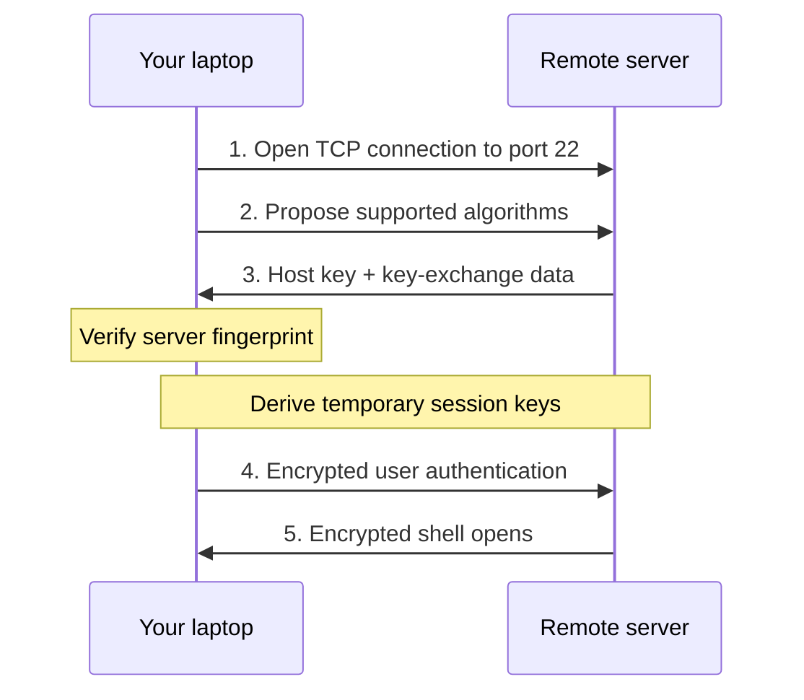

# SSH: The Secure Remote Control for Servers

## The Interview Question

> "What is SSH, and what actually happens when you connect to a server?"

Saying "SSH stands for Secure Shell" is correct, but it only expands the acronym.

The useful answer is this: **SSH gives you a secure terminal on another computer, even when that computer is hundreds of kilometers away on an untrusted network.**

## Your Keyboard, 700 Kilometers Away

You are sitting in a cafe in Austria. Your application server is in a data center in Germany.


Run this on your laptop:

```bash
ssh deploy@example.com
```

A terminal opens. The commands you type now run on the server in Germany:

```bash
hostname
systemctl status api
tail -f /var/log/api.log
```

It feels as if your keyboard and screen were plugged directly into that distant machine. That is the core SSH experience.

But the commands cross cafe Wi-Fi, routers, internet providers, and data-center networks. SSH has to solve three problems before that remote keyboard is safe to use.

| Problem | SSH's answer |
|---|---|
| Can someone read my commands? | Encrypt the connection |
| Am I talking to the real server? | Verify the server's host key |
| How does the server know I am allowed in? | Authenticate my user with a key or password |

**SSH is not just encryption. It encrypts the conversation and checks both ends of it.**

## Without SSH: Passwords on a Postcard

Imagine sending this across the internet as readable text:


```text
username: deploy
password: SuperSecret123
command: cat /etc/app/secrets.env
```

That is a postcard. Anyone handling it can read it, copy it, or change the command before it arrives.

Old remote-login protocols such as Telnet worked this way. SSH replaced that postcard with an encrypted channel. An observer can still see your laptop communicating with the server's IP address, but not your password, commands, or the server's responses.

## What Happens During an SSH Connection

SSH normally connects over TCP port `22`. Then five things happen:



### 1. Connect

Your laptop opens a normal TCP connection to the SSH server process, usually `sshd`, listening on port `22`.


### 2. Agree on encryption

The client and server agree on algorithms and perform a key exchange. They independently derive the same temporary **session keys** without sending those keys across the network.

Those fast symmetric keys encrypt the actual connection. New keys are created for each session.

### 3. Verify the server

The server signs the exchange with its long-term **host private key**. Your laptop verifies that signature using the server's host public key.

This answers: *"Is this the same server I connected to before, or did someone intercept me?"*

### 4. Verify your user

Inside the encrypted channel, the server asks you to authenticate. You might use a password, but a public/private key pair is the stronger default.

### 5. Open channels

After authentication, SSH can open a shell, execute one command, transfer files, or carry network traffic through a tunnel. One encrypted SSH connection can carry multiple channels.

## There Are Two Different Key Pairs

This is where most explanations get blurry.

| Key pair | Stored where? | What it proves |
|---|---|---|
| **Server host key** | Private key on server; fingerprint remembered by client | "This is the expected server" |
| **Your user key** | Private key on your laptop; public key on server | "This user is allowed to log in" |

The server proves itself first. Then you prove yourself.

## How SSH Key Authentication Works

The padlock analogy is useful, but signatures are more accurate.

Think of your **private key** as a stamp only you possess. Your **public key** is a signature checker that anyone can use.

You put the public key on the server:

```text
Server: ~/.ssh/authorized_keys
        contains your PUBLIC key

Laptop: ~/.ssh/id_ed25519
        contains your PRIVATE key
```

When you connect:

1. Your laptop tells the server which public key it wants to use.
2. The server checks whether that key appears in `authorized_keys`.
3. Your laptop signs session-specific data with the private key.
4. The server verifies the signature with the public key.
5. A valid signature proves you possess the private key.

**Your private key never leaves your laptop.** It is not uploaded, sent in the request, or revealed to the server.

That is why stealing the public key is harmless. It verifies signatures; it cannot create them.

## The Scary First-Connection Message

The first time you connect, SSH may show this:

```text
The authenticity of host 'example.com' can't be established.
ED25519 key fingerprint is SHA256:abc123...
Are you sure you want to continue connecting (yes/no/[fingerprint])?
```

SSH has never seen this server, so it cannot know whether the host key is legitimate. Verify the fingerprint through a trusted source such as your cloud console or infrastructure administrator, then accept it.

SSH saves the host key in `~/.ssh/known_hosts`. On later connections, it compares the presented key with the saved one.

If the key unexpectedly changes, SSH throws a large warning because one of three things happened:

- The server was rebuilt and received a new host key
- DNS or the IP address now points to a different machine
- Someone may be intercepting the connection

**Do not delete the warning and reconnect blindly. Verify why the key changed.**

## Create and Install an SSH Key

Generate a modern Ed25519 key pair:

```bash
ssh-keygen -t ed25519 -C "you@example.com"
```

Use a strong passphrase. It encrypts the private key on disk, so a stolen laptop does not immediately become a stolen server login.

Install the public key on a server where `ssh-copy-id` is available:

```bash
ssh-copy-id deploy@example.com
```

Then connect:

```bash
ssh deploy@example.com
```

For multiple servers, give them memorable names in `~/.ssh/config`:

```sshconfig
Host production-api
    HostName 203.0.113.10
    User deploy
    IdentityFile ~/.ssh/id_ed25519
```

Now this is enough:

```bash
ssh production-api
```

## SSH Is More Than a Remote Shell

| Job | Command |
|---|---|
| Run one remote command | `ssh server "systemctl status api"` |
| Copy a file to the server | `scp release.tar.gz server:/tmp/` |
| Transfer files interactively | `sftp server` |
| Forward a local port | `ssh -L 8080:localhost:3000 server` |
| Forward a remote port | `ssh -R 8080:localhost:3000 server` |

Port forwarding turns SSH into an encrypted tunnel for other traffic. Local forwarding can expose a private database or dashboard only to your laptop. Remote forwarding can expose a local service through another machine, which is the mechanism used in [Sharing localhost](../share-localhost/).

For a deeper look at where that traffic goes, see [Port Forwarding](../port-forwarding/).

## Production Rules That Matter

1. **Use keys instead of passwords.** Keys resist guessing and credential stuffing.
2. **Protect private keys with passphrases.** The file alone should not grant access.
3. **Never copy your private key onto the server.** Only copy the `.pub` file.
4. **Verify host fingerprints.** Especially on the first connection and after warnings.
5. **Use a non-root account.** Log in as a limited user and elevate only when needed.
6. **Disable password and root login only after testing key access.** Otherwise you can lock yourself out.
7. **Remove old public keys.** Access survives until its line is removed from `authorized_keys`.
8. **Do not share one key across a team.** Give every person an individual, revocable identity.

SSH protects data in transit. It cannot save you from a compromised laptop, a stolen unlocked private key, an overly privileged account, or a hacked server.

## The Interview Answer

> SSH is a protocol for securely controlling a remote computer over an untrusted network. It encrypts the connection, verifies the server with a host key, and authenticates the user, usually with a public/private key pair. The private key never travels to the server; it signs a challenge that the server verifies with the public key.


That answer explains the mechanism, not just the acronym.

## TL;DR

- Use SSH when you need a secure remote shell, command execution, file transfer, or encrypted tunnel.
- Use Ed25519 key authentication, keep the private key on your device, and protect it with a passphrase.
- Verify the server's host fingerprint; key authentication is useless if you confidently authenticate to an impostor.
- Give each person a separate key and remove its public key when access should end.
- Treat SSH as a secure transport, not magic armor. Account permissions and endpoint security still matter.

---

## Resources

### Docs

- [OpenSSH client manual](https://man.openbsd.org/ssh)
- [OpenSSH server manual](https://man.openbsd.org/sshd)
- [Generating a new SSH key - GitHub Docs](https://docs.github.com/en/authentication/connecting-to-github-with-ssh/generating-a-new-ssh-key-and-adding-it-to-the-ssh-agent)