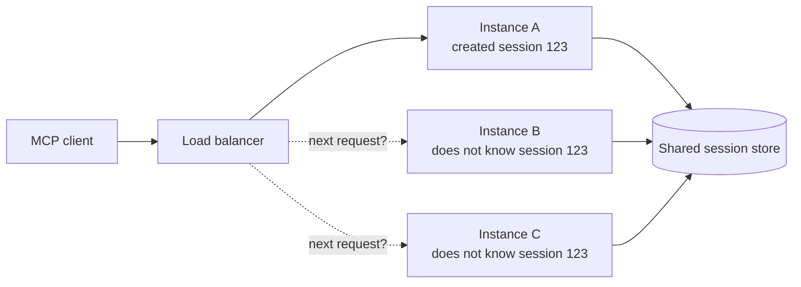
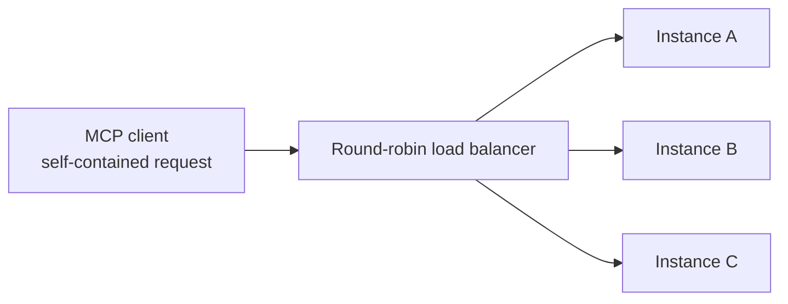

# MCP Went Stateless: The Update That Fixed Its Biggest Scaling Problem

## The Question That Exposed Old MCP

> "Why does calling one AI tool need sticky sessions, shared storage, and sometimes Redis?"

That question followed MCP from laptops into production.

The original protocol made sense when one AI application launched one local server and talked to it over `stdio`. But when remote MCP servers started handling traffic across multiple containers, the same connection-oriented design became expensive infrastructure.

The `2026-07-28` specification changes that foundation: **MCP is now stateless at the protocol layer.**

This is not a small optimization. It changes how MCP requests are started, routed, recovered, cached, and scaled.

## The Restaurant Analogy

Imagine a restaurant where your waiter keeps your entire order in their head.

You cannot ask another waiter for dessert because they do not know your table's state. If your waiter goes home, your order is lost. If the restaurant gets busy, the manager must either route every request back to the same waiter or give every waiter access to a shared notebook.

That was legacy MCP: the client and server established context first, then later messages depended on that relationship.

Stateless MCP puts the information needed for each action on the order ticket. Any available waiter can read it and handle the request. If the meal itself has state, the ticket carries an explicit identifier such as `order_id`.

**The restaurant still has state. The conversation protocol no longer hides it inside one waiter's memory.**

## MCP in One Minute

MCP standardizes how an AI **host** discovers and calls external capabilities. The host creates a **client** for each **server**, and that server exposes tools, resources, and prompts.

The model does not call your database or service directly. It selects a tool described by the server, and the host routes that call through an MCP client.

For a hands-on introduction, see [Build Your First MCP Server with FastMCP](../mcp-server-fastmcp/). This guide focuses on what changed in the protocol underneath that experience.

## Before: Initialize, Remember, Route Back

In the `2025-11-25` protocol, initialization had to be the first interaction.

The client sent its protocol version, identity, and capabilities:

```http
POST /mcp
Content-Type: application/json

{"jsonrpc":"2.0","id":1,"method":"initialize",
 "params":{"protocolVersion":"2025-11-25",
 "capabilities":{},"clientInfo":{"name":"my-app","version":"1.0"}}}
```

The server replied with its own capabilities, and the client sent an `initialized` notification. Over Streamable HTTP, the server could also create a protocol session:

```http
Mcp-Session-Id: 1868a90c-3a3f-4f5b
```

Every later request in that session had to carry the ID:

```http
POST /mcp
Mcp-Session-Id: 1868a90c-3a3f-4f5b

{"jsonrpc":"2.0","id":2,"method":"tools/call",
 "params":{"name":"search","arguments":{"q":"stateless MCP"}}}
```

The initialization handshake was mandatory. The HTTP session ID was optional, but once a server issued one, the client had to keep sending it.

That distinction matters: legacy MCP did **not** require every remote request to hold one physical socket open. The scaling problem was the logical relationship. A server using sessions had to remember what that ID meant.

### The infrastructure tax

Put three server instances behind a normal round-robin load balancer:



You now need at least one workaround:

- **Sticky routing** to keep the client pinned to Instance A
- **Shared session storage** so every instance can reconstruct the session
- **Reconnect logic** when Instance A crashes or deploys

Server-initiated requests added another layer. If a tool needed confirmation from the user, legacy MCP could send a request back over an SSE stream, which meant preserving an in-flight interaction while waiting.

For a local `stdio` server, the client also launches and manages a child process. Multiple clients can therefore create multiple local server processes. That process model still exists in the new specification; stateless MCP makes restart and request handling simpler, but it does not make `stdio` subprocesses disappear.

## After: One Request Carries Its Own Context

In `2026-07-28`, the handshake and `Mcp-Session-Id` are gone.

The same tool call can be the first request:

```http
POST /mcp
MCP-Protocol-Version: 2026-07-28
Mcp-Method: tools/call
Mcp-Name: search
Content-Type: application/json

{"jsonrpc":"2.0","id":1,"method":"tools/call",
 "params":{"name":"search","arguments":{"q":"stateless MCP"},
 "_meta":{"io.modelcontextprotocol/protocolVersion":"2026-07-28",
 "io.modelcontextprotocol/clientCapabilities":{},
 "io.modelcontextprotocol/clientInfo":{"name":"my-app","version":"1.0"}}}}
```

The protocol version and client capabilities travel with every request. Client identity should travel with it too. If a client wants to inspect the server first, it can call `server/discover`, but discovery is optional.

Now any healthy instance can handle any request:



No protocol session needs to be found. A crashed instance does not erase the client's relationship with the server. Serverless workers can start for one request and scale back to zero when idle.

**This is the version of remote MCP new systems should build on. Do not add sticky sessions to new MCP infrastructure unless your application itself genuinely needs them.**

## Before vs After

| Concern | Legacy MCP (`2025-11-25`) | Stateless MCP (`2026-07-28`) |
|---|---|---|
| Startup | Required `initialize` / `initialized` handshake | Any request can go first; discovery is optional |
| Metadata | Negotiated at initialization | Version and capabilities ride on every request |
| Protocol session | Server could issue `Mcp-Session-Id` | No protocol-level session |
| Load balancing | Sessions may need affinity or shared storage | Any request can reach any instance |
| Server-to-client input | Server sent requests over an active stream | Server returns `input_required`; client retries |
| Gateway routing | Often required parsing the JSON-RPC body | `Mcp-Method` and `Mcp-Name` are HTTP headers |
| Catalog freshness | Notifications or repeated list calls | List results include cache hints |
| Recovery | Reconnect and reconstruct session/stream state | Retry an independent request |

## Stateless Protocol, Stateful Application

Stateless does not mean your shopping cart, browser session, or database transaction must forget everything between calls.

It means MCP no longer stores that state implicitly in the transport relationship.

For example:

```text
create_basket()                -> { "basket_id": "basket_42" }
add_item(basket_id="basket_42", item="coffee")
checkout(basket_id="basket_42")
```

`basket_42` is application state. It can live in a database, durable object, or another appropriate store. Because the handle is explicit, the model can pass it between tools and any server instance can use it.

This is the same pattern ordinary HTTP APIs have used for years: keep the protocol stateless and make domain state visible through authenticated identifiers.

## What Else Changed

Statelessness required several connected changes:

| Change | Why it matters |
|---|---|
| **Multi Round-Trip Requests (MRTR)** | A server can return `input_required` for confirmation or missing data; the client gathers it and retries without a held session |
| **Header-based routing** | Gateways can route, authorize, rate-limit, and measure calls without parsing arbitrary JSON bodies |
| **Cacheable catalogs** | Tool, prompt, and resource results include `ttlMs` and `cacheScope`, reducing repeated discovery calls |
| **Trace context** | Standard `_meta` keys let OpenTelemetry traces follow a call through clients, servers, and downstream services |
| **Authorization hardening** | Issuer validation and token audience binding reduce OAuth mix-up and confused-deputy risks |
| **Extensions** | Tasks and MCP Apps can evolve outside the core protocol and be adopted only when both sides support them |

MRTR is the clever part. Suppose `delete_files` needs approval. The server returns the question plus an opaque `requestState`; the client asks the user, then retries the original call with the answer and that state. Any instance can finish the retry.

The server must treat `requestState` as attacker-controlled input, protect its integrity, bind it to the user and operation, and give it a short expiry. Stateless is simpler infrastructure, not permission to trust client-supplied state.

## The Production Proof: GitHub Removed Redis Sessions

GitHub upgraded its MCP server before the final specification shipped. The migration removed:

- A Redis write on every `initialize`
- A Redis read on every subsequent request
- Payload inspection that existed only to extract routing and security metadata

The new guaranteed HTTP headers provide the gateway metadata, while each request carries what the MCP server needs.

That is the practical win: not "zero infrastructure," but fewer protocol-specific moving parts on the critical path.

## The Compatibility Catch

`2026-07-28` is a breaking wire-protocol change. A legacy-only client sends `initialize`; a modern-only server expects per-request metadata. Neither side can magically reinterpret the other.

| Client | Server | Result |
|---|---|---|
| Modern-only | Modern | Works |
| Modern-only | Legacy-only | Fails |
| Legacy-only | Modern-only | Fails |
| Dual-era | Modern or legacy | Probes, negotiates, and uses the matching behavior |

The good news is that the official Tier 1 SDKs for TypeScript, Python, Go, and C# support the new specification and provide compatibility paths. A dual-era implementation can serve modern stateless requests while falling back to the legacy handshake for older peers.

Servers that depended on pushed requests, replayable SSE streams, or protocol session storage need a deliberate migration. The safe rollout is to serve modern and legacy lanes together, monitor legacy use, drain old sessions, and only then remove the legacy path.

So the catch is real, but "everything that says MCP is now incompatible" is too dramatic. **Check the protocol version and SDK behavior, not just the MCP logo.**

## MCP vs CLI: Which One Should an Agent Use?

Stateless MCP does not make command-line tools obsolete.

| Choose MCP when... | Choose a CLI or shell when... |
|---|---|
| The agent should receive a narrow, auditable set of operations | A trusted coding agent needs broad, exploratory control |
| Multiple hosts must use one integration | A mature CLI already solves the workflow |
| Smaller models need structured schemas | The model is strong at discovering and composing commands |
| Permissions should be scoped per service or operation | The environment is disposable and tightly sandboxed |
| A remote integration must scale across customers | The tool runs locally for one developer |

MCP makes capabilities easier to enumerate, restrict, and observe. It does not automatically make a dangerous tool safe: an MCP tool named `run_any_shell_command` is still arbitrary command execution wearing a schema.

**Use MCP to create a deliberate capability boundary. Use the shell when broad capability is the point.**

## TL;DR

- Build new remote MCP servers against `2026-07-28`; do not recreate protocol sessions and sticky routing by default.
- Keep real application state behind explicit, authenticated handles such as `basket_id` instead of hiding it in transport state.
- Use dual-era SDK support while clients and servers migrate; "supports MCP" is not enough without a supported protocol version.
- Prefer MCP for bounded, auditable integrations, especially in sensitive applications. Keep CLIs for trusted, open-ended workflows.
- Remember that stateless MCP still has processes, HTTP connections, optional subscription streams, authentication, and normal backend responsibilities. It removes protocol state, not engineering.

---

## Resources

### Official MCP

- [The 2026-07-28 Specification](https://blog.modelcontextprotocol.io/posts/2026-07-28/)
- [Specification Changelog](https://modelcontextprotocol.io/specification/2026-07-28/changelog)
- [Versioning and Compatibility](https://modelcontextprotocol.io/specification/2026-07-28/basic/versioning)
- [Streamable HTTP Transport](https://modelcontextprotocol.io/specification/2026-07-28/basic/transports/streamable-http)
- [Multi Round-Trip Requests](https://modelcontextprotocol.io/specification/2026-07-28/basic/patterns/mrtr)

### Further Reading

- [Stateless MCP Has Recaptured My Interest — Simon Willison](https://simonwillison.net/2026/Jul/31/stateless-mcp/)
- [The Next Generation of MCP — Cloudflare](https://blog.cloudflare.com/mcp-v2/)
- [Scaling AI Agent Infrastructure with Stateless MCP — Google](https://developers.googleblog.com/scaling-ai-agent-infrastructure-with-the-mcp-stateless-updates/)
- [GitHub MCP Server Supports the Next MCP Specification — GitHub](https://github.blog/changelog/2026-07-23-github-mcp-server-supports-the-next-mcp-specification/)