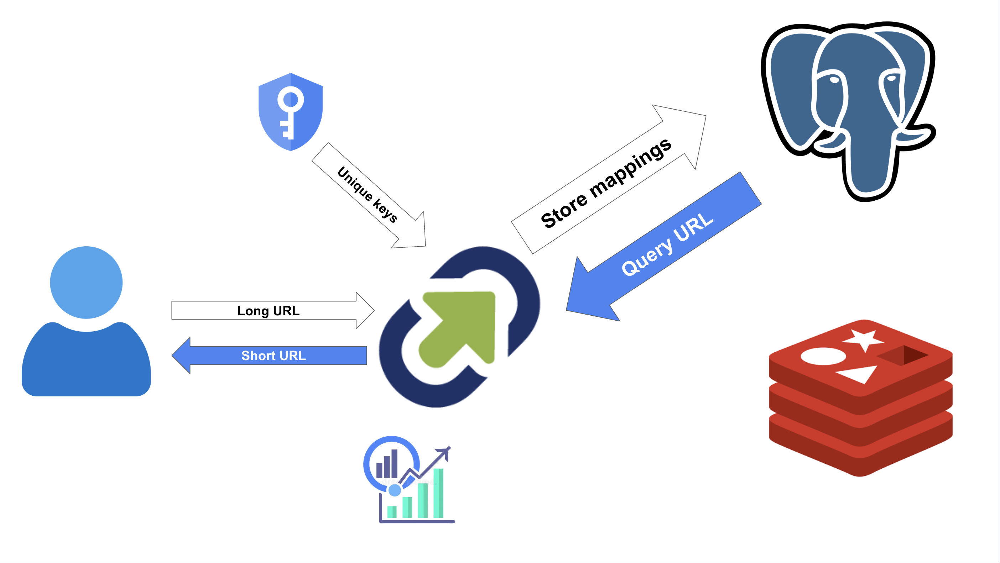
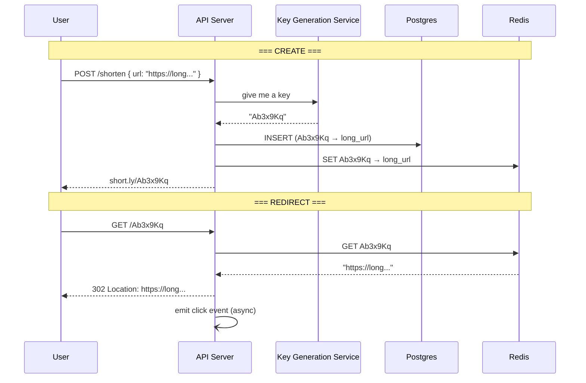

# Designing a URL Shortener (TinyURL)

## The Interview Question

> "Design a URL shortener like TinyURL."

Everyone nails the happy path:

> "Hash the long URL into a 7-character code, store the mapping, redirect on click."

Then the interviewer pushes:

> "You used a 301 redirect. The browser caches it permanently — you'll never see that user again. How do you track clicks? How do you disable an expired link?"

And then:

> "Now you're getting 100 million redirects per day. Every click hits your relational database?"

A URL shortener has exactly **two operations** — create a short link and resolve one. The system design is about what goes wrong when both happen billions of times.

---

## The Architecture at a Glance



User submits a long URL → the service grabs a pre-generated key → stores the mapping in Postgres → returns `short.ly/Ab3x9Kq`. On click, the service checks Redis first (fast), falls back to Postgres, and responds with an HTTP redirect.

---

## The Coat Check Analogy

A URL shortener is a **coat check** at a concert venue.

You hand over your bulky winter coat (the long URL). The attendant gives you a small numbered ticket (the short code). Later, *anyone* with that ticket walks up, hands it in, and gets your coat back instantly.

The attendant doesn't stuff the coat into the ticket. The ticket is just a **lookup key** — small, unique, easy to pass around. That's all `Ab3x9Kq` is: a ticket that retrieves `https://docs.google.com/spreadsheets/d/1BxiMVs0XRA5n...`.

Two things make or break a coat check:

1. **No two tickets can have the same number** — or someone gets the wrong coat (collision).
2. **Retrieval must be instant** — the line behind you is 10,000 people long (millions of redirects/day).

Both of these map directly to the two real problems in the interview.

---

## Problem 1: Generating Short Codes Without Collisions

A 7-character **Base62** string (a–z, A–Z, 0–9) gives you:

$$62^7 = 3.5 \text{ trillion possible codes}$$

More than enough. The question is *how* you pick them without two servers handing out the same ticket at the same time.

### The naive approach — hash and pray

```python
code = base62(md5(long_url))[:7]
```

Two problems:
- Different URLs can produce the same 7-character prefix → **collision**
- You only find out *after* a failed INSERT → retry loops under load

### The real approach — a Key Generation Service (KGS)

Pre-compute millions of unique keys **offline**, store them in a table marked `unused`. When your API server needs a key, it grabs one atomically and marks it `used`.

```
┌──────────────────────────────┐
│   Key Generation Service     │
│                              │
│  ┌────────────────────────┐  │
│  │  unused_keys table     │  │
│  │  Ab3x9Kq  ← grab next │  │
│  │  Zk8mW2p              │  │
│  │  q9Fn3Lb              │  │
│  │  ...millions more     │  │
│  └────────────────────────┘  │
└──────────────────────────────┘
           │
           ▼  one key per request, zero collisions
┌──────────────────────────────┐
│       API Server             │
│  POST /shorten               │
│  { url: "https://long..." }  │
│  → returns short.ly/Ab3x9Kq │
└──────────────────────────────┘
```

**Why this wins:** collisions are impossible by construction — every key is unique *before* it's ever assigned. No retry loops, no locking, no race conditions between servers. The KGS can replenish the pool in the background during off-peak hours.

Each API server can even grab a **batch** of keys (say 1,000) into local memory and hand them out without hitting the KGS on every request. If that server crashes, you lose 1,000 keys — out of 3.5 trillion. That's nothing.

---

## Problem 2: 301 vs 302 — One Number That Changes Everything

When someone clicks `short.ly/Ab3x9Kq`, your server responds with an HTTP redirect. The status code you choose has massive consequences:

| | **301 — Permanent** | **302 — Temporary** |
|---|---|---|
| Browser behaviour | Caches it forever, **never asks your server again** | Asks your server **every time** |
| Analytics | ❌ You lose all repeat visits | ✅ Every click flows through you |
| Link expiration | ❌ Can't disable — browser won't check | ✅ You can reject or rotate at any time |
| Speed for the user | Faster after first visit (no round trip) | Tiny extra latency (~10ms with cache) |

**Use 302.** You're building a URL shortener, not a DNS record. Analytics and the ability to expire links are core features — `301` surrenders control to the browser's local cache.

The redirect itself is dead simple:

```http
HTTP/1.1 302 Found
Location: https://docs.google.com/spreadsheets/d/1BxiMVs0XRA5n...
```

One header. The browser follows it. Done.

---

## Problem 3: Millions of Redirects Crushing Your Database

Reads **massively** outnumber writes. People share short links on social media — one viral tweet can generate millions of clicks on the same code in minutes. If every click queries Postgres, you're dead.

### Redis as the read cache

The mapping `Ab3x9Kq → https://long-url...` is:
- **Tiny** (~200 bytes)
- **Immutable** (once created, it never changes)
- **Read thousands of times more than it's written**

That's the textbook use case for an **in-memory cache**:

```
Click arrives → check Redis
                    │
              found? ──yes──▶ return 302 redirect  (sub-1ms)
                    │
                   no
                    │
                    ▼
              query Postgres ──▶ return 302 + write to Redis for next time
```

Redis handles **hundreds of thousands of lookups per second** on a single node. A small Redis cluster trivially handles your read traffic while Postgres stays quiet.

The numbers tell the story:

| | Without cache | With Redis |
|---|---|---|
| Postgres reads/sec | 100M/day ÷ 86,400 ≈ **1,157/sec avg** (peaks 10–50×) | Only cache misses — maybe **10–50/sec** |
| P99 latency | ~5–15ms (disk) | **<1ms** (memory) |
| Can Postgres die under viral load? | Yes | No — Redis absorbs it |

---

## The Data Model

Simple. Two tables and a cache:

```sql
CREATE TABLE urls (
    short_code  CHAR(7) PRIMARY KEY,     -- the ticket
    long_url    TEXT NOT NULL,            -- the coat
    created_at  TIMESTAMPTZ DEFAULT now(),
    expires_at  TIMESTAMPTZ,             -- NULL = never expires
    user_id     UUID                     -- who created it (optional)
);
```

```sql
CREATE TABLE clicks (
    id          BIGINT GENERATED ALWAYS AS IDENTITY,
    short_code  CHAR(7),
    clicked_at  TIMESTAMPTZ DEFAULT now(),
    ip          INET,
    user_agent  TEXT,
    referer     TEXT
);
```

**Writes to `clicks` are async** — fire an event to a queue, let a background worker batch-insert. Never make the user wait for analytics.

---

## Putting It All Together



---

## Production Considerations

| Concern | What to say |
|---|---|
| **Custom aliases** | Let users pick `short.ly/my-brand`. Just check the key isn't already taken — same uniqueness constraint. |
| **Expiration** | `expires_at` column + a cron/TTL that evicts from Redis. On click, check the timestamp *before* redirecting. |
| **Rate limiting** | Without it, one bad actor exhausts your key pool creating spam links. Rate limit `POST /shorten` by IP or API key. |
| **Abuse / phishing** | Shortened links hide the destination — scan long URLs against a blocklist before storing. |
| **Global latency** | Put Redis + API servers in multiple regions. The mapping is immutable so cross-region replication is trivial — no conflicts. |
| **Analytics at scale** | Clicks are append-only, high-volume, and never updated. Stream to Kafka → warehouse (ClickHouse / BigQuery), not your OLTP database. |

---

## TL;DR

- A URL shortener is a **coat check** — a small ticket (7-char code) maps to a bulky item (long URL). Two operations: create the mapping, resolve it.
- **Use a Key Generation Service** that pre-computes unique codes offline. Collisions become impossible by construction — no hashing, no retry loops.
- **Use 302, not 301.** A permanent redirect surrenders control to the browser. You lose analytics, you lose expiration, you lose the ability to disable a link.
- **Put Redis in front of Postgres.** The mapping is tiny, immutable, and read thousands of times more than it's written. Redis absorbs viral traffic; Postgres stays quiet.
- **Log clicks asynchronously.** Emit an event, let a worker batch-insert. The user gets their redirect in <1ms, not after your analytics pipeline finishes.

When the interviewer asks you to design TinyURL, don't start with the hash function. Start with: **"It's a read-heavy key-value lookup with two constraints — codes must be globally unique and every click must flow through us. A pre-generated key pool solves the first, a 302 redirect with a Redis cache solves the second."**

---

## Related

- [Designing Google Drive](../design-google-drive/) — same pattern of separating metadata (what you query) from payload (what you store)
- [Database Indexes](../database-indexes/) — why a `PRIMARY KEY` lookup on a 7-char code is O(log n) and fast
- [UUID](../uuid/) — the alternative to a KGS when you need distributed ID generation without coordination

---

## Resources

### Docs
- [HTTP Redirections — MDN](https://developer.mozilla.org/en-US/docs/Web/HTTP/Guides/Redirections)
- [Redis GET/SET — Redis.io](https://redis.io/docs/latest/commands/get/)
- [Base62 Encoding — Wikipedia](https://en.wikipedia.org/wiki/Base62)
