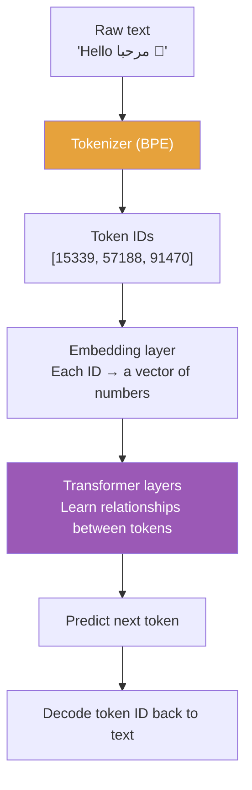

# How ChatGPT Understands Every Language — Tokenization & BPE

## The Interview Question

> "How does ChatGPT understand Arabic, Japanese, and English — all at once?"

Most candidates say something about "training on multilingual data." That's technically correct and practically useless. The real answer is one level deeper: **ChatGPT doesn't see languages at all. It sees tokens.**

---

## The LEGO Analogy

Imagine you're a child who's never heard of "English" or "Arabic." Someone dumps a trillion LEGO bricks in front of you — some red, some blue, some yellow — and asks you to build whatever comes next in a pattern.

You don't care that the red bricks "came from English" and the blue ones "came from Arabic." You just learn which bricks tend to follow which. After seeing enough patterns, you can continue *any* sequence, in *any* color, because you never learned to separate them in the first place.

That's exactly how ChatGPT works. Text from every language gets broken into small pieces called **tokens**. The model learns patterns between tokens — not between languages. Languages are a human concept. The model just sees token IDs: numbers.

```
English:  "Hello world"    → [15339, 1917]
Arabic:   "مرحبا بالعالم"   → [57188, 38174, 75052]
Japanese: "こんにちは世界"     → [90115, 80220]
Mixed:    "Hello مرحبا 🚀"  → [15339, 57188, 11, 91470]
```

Same pipeline. Same numbers. No language switch. The model doesn't "switch to Arabic mode" — it just predicts the next token based on the ones before it.

---

## What Is a Token, Really?

A token is a piece of text — sometimes a full word, sometimes a part of a word, sometimes a single character. The **tokenizer** decides how to split text before the model ever sees it.

| Input | Tokens | Why |
|---|---|---|
| `"hello"` | `["hello"]` | Common word → single token |
| `"tokenization"` | `["token", "ization"]` | Less common → split into known parts |
| `"Pneumonoultramicroscopic"` | `["Pne", "umon", "oul", "tram", "icro", "scopic"]` | Rare word → many small pieces |
| `"🚀"` | `["🚀"]` | Emoji → single token (it's seen a lot on the internet) |
| `"xqzfw"` | `["x", "q", "z", "fw"]` | Gibberish → character-level fallback |

The tokenizer is **not hard-coded**. It learns which pieces to use by analyzing patterns in massive text datasets. The algorithm that teaches it is called **Byte Pair Encoding (BPE)**.

---

## How BPE Builds the Vocabulary

BPE is surprisingly simple. It starts with individual characters and repeatedly merges the most common pair until it reaches a target vocabulary size.

**Step-by-step with a tiny example:**

Say our training text contains these words (with frequencies):

```
"hug"  × 10    "pug"  × 5    "pun"  × 12    "bun"  × 4    "hugs" × 5
```

**Round 0 — Start with individual characters:**

```
Vocabulary: [b, g, h, n, p, s, u]

"h" "u" "g"  × 10
"p" "u" "g"  × 5
"p" "u" "n"  × 12
"b" "u" "n"  × 4
"h" "u" "g" "s" × 5
```

**Round 1 — Find the most frequent pair:**

| Pair | Count |
|---|---|
| `(h, u)` | 15 (hug + hugs) |
| `(u, g)` | **20** (hug + pug + hugs) |
| `(u, n)` | 16 (pun + bun) |
| `(g, s)` | 5 |

Winner: `(u, g)` → merge into `"ug"`

```
Vocabulary: [b, g, h, n, p, s, u, ug]

"h" "ug"  × 10
"p" "ug"  × 5
"p" "u" "n"  × 12
"b" "u" "n"  × 4
"h" "ug" "s" × 5
```

**Round 2 — Next most frequent pair:**

`(u, n)` appears 16 times → merge into `"un"`

```
Vocabulary: [b, g, h, n, p, s, u, ug, un]

"h" "ug"  × 10
"p" "ug"  × 5
"p" "un"  × 12
"b" "un"  × 4
"h" "ug" "s" × 5
```

**Round 3:**

`(h, ug)` appears 15 times → merge into `"hug"`

```
Vocabulary: [b, g, h, n, p, s, u, ug, un, hug]

"hug"   × 10
"p" "ug"  × 5
"p" "un"  × 12
"b" "un"  × 4
"hug" "s" × 5
```

Keep going until you hit your target vocabulary size. GPT-4 stops at **~100,000 tokens**. GPT-4o goes up to **~200,000 tokens**.

---

## Why This Works for Every Language

Here's the key insight: BPE doesn't know what a "language" is. It just finds frequent byte patterns.

```
English text:  "the" appears millions of times  → "the" becomes one token
Arabic text:   "ال" appears millions of times   → "ال" becomes one token
Code:          "def" appears millions of times   → "def" becomes one token
```

The algorithm treats all text the same way. If a pattern is common enough — in *any* language — it gets merged into a single token. This is why the model can handle a prompt like:

> "Translate 'hello' to Arabic: مرحبا"

It doesn't switch modes. It just sees a sequence of token IDs and predicts what comes next, the same way it always does.

### Byte-Level BPE: The Secret to Universal Coverage

But what about characters the tokenizer has never seen? Old approaches would replace them with an `[UNK]` (unknown) token — effectively throwing away information.

Modern models like GPT-2, GPT-3, GPT-4, and GPT-4o use **byte-level BPE**. Instead of starting from characters, they start from **raw bytes** (the UTF-8 encoding of text). Since UTF-8 can represent every character in every writing system using just 256 byte values, the base vocabulary is tiny (256 entries) but covers literally everything — Chinese, Arabic, emojis, mathematical notation, even new scripts that didn't exist when the model was trained.


No unknown tokens. No language-specific preprocessing. Everything goes through the same pipe.

---

## The Token Efficiency Gap

There's one catch. BPE is **not equally efficient** across languages.

English dominates the training data, so English patterns get merged aggressively. Common English words become single tokens. But text in underrepresented languages gets split into more pieces — meaning the same idea costs more tokens.

| Text | Meaning | Tokens |
|---|---|---|
| `"Hello, how are you?"` | English greeting | ~5 tokens |
| `"مرحبًا، كيف حالك؟"` | Same in Arabic | ~12 tokens |
| `"こんにちは、お元気ですか？"` | Same in Japanese | ~8 tokens |

This matters because:
- **Cost** — you pay per token on the API
- **Context window** — the same conversation uses more tokens in Arabic than in English, so you hit the limit faster
- **Speed** — more tokens = more computation = slower responses

GPT-4o improved this significantly by expanding the vocabulary from ~100k to ~200k tokens, adding more multilingual merges. But the gap hasn't fully closed.

---

## The Full Picture



1. **Tokenize** — BPE splits text into token IDs (numbers)
2. **Embed** — each token ID maps to a vector (a list of numbers that captures meaning)
3. **Attend** — the transformer learns which tokens relate to which across the entire context
4. **Predict** — output the most likely next token
5. **Decode** — convert the token ID back to text

The model never sees "English" or "Arabic." It sees vectors. It learns that certain vectors tend to follow certain other vectors. That's how it "understands" every language — by never learning the concept of language in the first place.

---

## TL;DR

ChatGPT doesn't learn languages — it learns token patterns. BPE breaks all text (English, Arabic, Japanese, emojis, code) into small reusable pieces by merging the most frequent byte pairs. The model sees numbers, not letters. Same pipeline, same neural network, every language. That's literally it. The only catch: English gets better token efficiency because it dominates the training data, so the same sentence costs fewer tokens in English than in Arabic or Japanese.

---

## Resources

### Docs
- [OpenAI Tokenizer — interactive playground](https://platform.openai.com/tokenizer)
- [tiktoken — OpenAI's open-source BPE tokenizer](https://github.com/openai/tiktoken)
- [Hugging Face NLP Course — BPE Tokenization](https://huggingface.co/learn/nlp-course/en/chapter6/5)

### Deep Reads
- [Byte Pair Encoding — Wikipedia](https://en.wikipedia.org/wiki/Byte_pair_encoding)
- [GPT-4o System Card — Underrepresented Languages section](https://openai.com/index/gpt-4o-system-card/)
